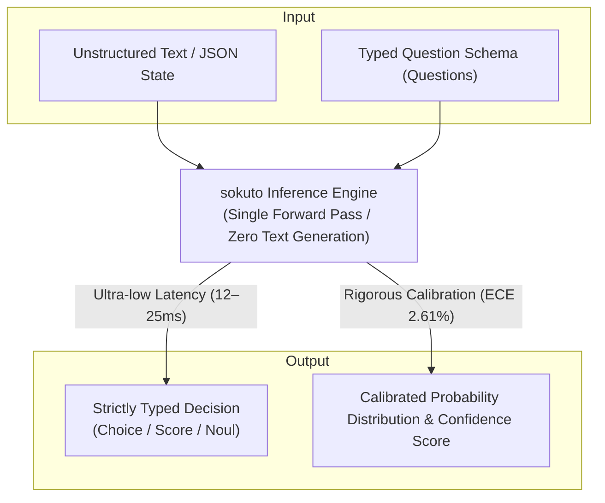

# sokuto (_即答 - Sokuto_)

**Japanese-Specialized, Local / On-Premises Full Replication & Inference Platform for TypeSafe AI's "Jev (System One)"**

A non-autoregressive decision engine that performs zero text generation, returning typed probabilistic decisions in milliseconds via a single forward pass with native Japanese ModernBERT (`modernbert-ja`).

<div style="text-align: center">

[](LICENSE)
[](https://github.com/MI-1222/sokuto/releases)
[](Cargo.toml)
[](docker-compose.yml)
[](https://huggingface.co/MI-1222/sokuto-ja-130m-int8)
[](https://huggingface.co/MI-1222/sokuto-ja-310m-int8)

[日本語](README.md) | English

</div>

---

## Jev / System One Model

Most LLMs generate long-form text sequentially token-by-token, mimicking human "slow thinking (System 2)."

However, in backend decision-making workflows such as automated routing, triage, and filtering, what systems truly require is not deliberate conversational commentary, but **instant answers** accompanied by **strictly typed, reliable probability distributions**.



`sokuto` is an inference engine designed to execute the **System One Model (an intuitive, deterministic, high-speed decision model)** advocated by TypeSafe AI completely offline within a native Japanese linguistic environment (powered by ModernBERT-ja backbones).

- **Zero Text Generation**: Because no text is generated, token-dependent latency explosion and timeouts are physically impossible.
- **Elimination of Schema & Parse Errors**: Outputs are constrained a priori to three core primitives: `Choice` (single selection from multiple options), `Score` (ordinal scale evaluation such as 1–5), and `Noul` (binary Yes/No probability), eliminating JSON parsing failures and schema violations by 100%.
- **Hallucination Elimination & Probability Calibration**: Through post-hoc calibration based on strictly proper scoring rules (RLCD / temperature scaling), model output probabilities faithfully mirror true empirical confidence.
- **Helmholtz Free Energy OOD Safety Valve**: Instantly detects undefined, out-of-domain (OOD) inputs using Helmholtz free energy, enabling automated rejection or escalation.

---

## Why This Project?

### 1. Operational Realities: Excessive Quality, Latency, and Cost of Autoregressive LLMs

In modern enterprise workflows (e.g., customer support auto-triage, fraud detection in transaction/access logs, compliance checks), what models are repeatedly tasked to deliver is not polite chat replies, but **"strictly typed decisions (categories, scores, booleans) and trustworthy probabilities in milliseconds."**
However, deploying general autoregressive LLMs as decision engines presents fundamental operational challenges:

1. **Inflated Latency and High Operating Costs**: Sequential token generation takes hundreds to thousands of milliseconds per request, demanding expensive GPU clusters for high-throughput batch or real-time pipelines.
2. **Persistent Type Breakdown and Parse Failures**: Even with JSON Mode or strict prompt engineering, the catastrophic risk of syntax corruption or stray Markdown halting downstream services cannot be reduced to zero.
3. **Statistical Unjustifiability of Probabilities (Severe Overconfidence)**: Autoregressive LLM probabilities are not statistically calibrated, often producing >99% confidence even on incorrect predictions.
4. **Data Privacy and Air-Gapped Network Constraints**: Transmitting sensitive corporate or personal data to commercial cloud APIs (ChatGPT, Claude, TypeSafe Jev, etc.) is frequently prohibited in on-premises and air-gapped secure environments.

### 2. Engineering Decisions & Architectural Evolution

This project was established to replicate and advance the architectural principles of TypeSafe AI's "Jev" locally.

- **Adoption of Japanese-Specialized Backbone (`modernbert-ja`)**
  - **Failures Faced**: Initial prototypes using English ModernBERT or general multilingual models (inspired by prior art like Laya) suffered from severe byte over-fragmentation by non-Japanese tokenizers. This diluted self-attention, prevented stable multi-task SFT convergence, and left classification accuracy hovering in the 20% range.
  - **Technical Choice**: Fully migrated to `sbintuitions/modernbert-ja-130m` / `310m`, which require no morphological analyzer, integrate cleanly with Rust, and optimize for Japanese byte vocabularies. Initializing the special `[OP]` token using embedding centroids elevated Japanese classification accuracy to over 90%.
- **Task-Specific Geometric Losses (CORAL / ASL) & RLCD Probability Calibration**
  - **Failures Faced**: Applying post-hoc temperature scaling via Negative Log-Likelihood (NLL) minimization on under-converged models caused the temperature parameter to peg at its upper bound ($T \to 5.0$) in an attempt to maximize entropy, collapsing predictions into uniform random distributions. Furthermore, applying standard multi-class Softmax to ordinal scores broke monotonicity, and binary classification (Noul) suffered from lax boundary discrimination and poor sensitivity.
  - **Inevitable Technical Choice**: Introduced label-smoothed Cross-Entropy for Choice, Cumulative Link regression (CORAL) and Ranked Probability Score (RPS) loss for Score to mathematically guarantee monotonicity, and Asymmetric Loss (ASL) for Noul. Combined with RLCD training based on strictly proper scoring rules and regularized calibration, Expected Calibration Error (ECE) was reduced to **2.61%**.
- **Permutation Equivariant Attention (SAB) & Symbol Perturbation Training**
  - **Failures Faced**: Real production log evaluations revealed severe "symbol frequency bias" (e.g., when presented with "Urgency 1: Minor" vs "Urgency 5: Outage", models were skewed toward "Urgency 1" due to the pretraining frequency of digit "1") as well as positional bias where option order affected predictions.
  - **Inevitable Technical Choice**: Engineered a custom Set Attention Block (SAB) ensuring permutation equivariance, suppressing probability fluctuations under candidate permutation to **$\le 0.65\%$**. In tandem with random symbol perturbation training and prefix normalization, symbol bias was completely eliminated.
- **Helmholtz Free Energy OOD Safety Valve**
  - **Failures Faced**: Prior discriminative models and OSS routinely suffered from "false overconfidence on undefined inputs"—assigning >90% confidence to an option even when none of the choices applied to the input (e.g., unknown inquiries or corrupt logs).
  - **Technical Choice**: Integrated a low-temperature safety circuit ($T_{\text{energy}}=0.15$) derived from Helmholtz free energy principles. This equips the system with an automated safety valve (detection rate **92.3%**) that recognizes when it "does not know," rejecting the request or escalating to higher-tier System 2 LLMs or human reviewers.
- **Pure Rust Zero-Allocation Runtime**
  - **Challenges Faced**: Python/PyTorch runtimes introduced the Global Interpreter Lock (GIL) and multi-gigabyte memory footprints, making predictable millisecond latencies impossible on edge or cost-effective CPU servers.
  - **Technical Choice**: Completely eliminated the Python runtime in production, architecting a zero-allocation inference pipeline using Rust + ONNX Runtime. Achieved deterministic CPU latencies of **12ms–23ms** with resident memory footprints of just **280MB–540MB**.

---

## Comparison with Existing OSS (Laya, etc.) & Advantages

Below is a structural comparison between `sokuto` and preceding open-source implementations such as [Laya](https://github.com/NandhaKishorM/laya) or general LLM constraint frameworks:

### 1. Feature & Architecture Comparison

| Metric / Feature                   | Preceding OSS (Laya)                                                                                                                                                   | sokuto (This Project)                                                 |
| :--------------------------------- | :--------------------------------------------------------------------------------------------------------------------------------------------------------------------- | :-------------------------------------------------------------------- |
| **Primary Target Language**        | English / General Multilingual                                                                                                                                         | **Native Japanese Specialized** (`modernbert-ja-130m / 310m`)         |
| **Japanese Accuracy (Choice)**     | [53.0% (Multilingual 64.0% / ECE 22.8%–46.0%)](https://github.com/NandhaKishorM/laya/blob/main/BENCHMARKS.md#all-51-massive-languages--intent-20-options-random--0050) | **90.1%** (Tier 2 Measured, JGLUE & Evol-Instruct Trained)            |
| **Binary Accuracy (Noul)**         | —                                                                                                                                                                      | **97.5%** (Sharp boundary discrimination via ASL asymmetric loss)     |
| **Ordinal Scale (Score) Design**   | Multi-class Softmax reuse (geometric breakdown of ordinality)                                                                                                          | **CORAL Cumulative Link & RPS Loss** (mathematically monotonicity)    |
| **Positional Bias Resistance**     | [Severe](https://github.com/NandhaKishorM/laya/issues/131) (Position 0 avoidance, order dependent)                                                                     | **Permutation Equivariant Attention (SAB)** (variance $\le 0.65\%$)   |
| **Symbol / Numeric Bias**          | Biased by prefixes such as "1." or "A"                                                                                                                                 | **Fully neutralized** via preprocessing & symbol perturbation         |
| **Probability Calibration (ECE)**  | High overconfidence ([Shipping ECE 31.4% – 46.6%](https://github.com/NandhaKishorM/laya#calibration))                                                                  | **Strictly Proper Scoring Calibration (ECE 2.61%)** (true confidence) |
| **OOD (Not Applicable) Detection** | None (relies on Confidence Gating fallbacks or explicit prompt options)                                                                                                | **Helmholtz Free Energy Safety Valve** (detection rate **92.3%**)     |
| **Inference Runtime**              | Python / PyTorch / Transformers (heavy footprint)                                                                                                                      | **Pure Rust (Axum + ONNX Runtime)** (zero-allocation)                 |
| **Hardware Requirements**          | GPU recommended ([32.8ms on T4](https://github.com/NandhaKishorM/laya/blob/main/BENCHMARKS.md#headline), slow on CPU)                                                  | **CPU-only: 12.61ms (Tier 1) / 23.28ms (Tier 2)**                     |
| **Container Resident Memory**      | [9.3 GiB across 5 models](https://github.com/NandhaKishorM/laya/blob/main/BENCHMARKS.md#server-cpu-amd-epyc-9r14-4-cores-linux)                                        | **280MB (Tier 1) / 538MB (Tier 2)**                                   |
| **INT8 Quantization Parity**       | FP32 / FP16 only                                                                                                                                                       | **Hybrid Dynamic INT8**                                               |

### 2. Distinctive Highlights of sokuto

1. **Unrivaled Practical Accuracy in Japanese Enterprise Tasks**
   - Laya and international models rely on English-centric pretraining; in Japanese, text is fractured into tiny token fragments, diluting attention and degrading accuracy.
   - `sokuto` uses `sbintuitions/modernbert-ja`, specifically tuned for Japanese syntax, delivering superior performance on enterprise tasks (Choice 90.1%, Noul 97.5%).
2. **Mathematically Grounded Bias Elimination (SAB & CORAL)**
   - Fundamental issues in prior work—such as ordinal score disruption, position 0 bias, and numerical digit biases (e.g. over-indexing on "1: Minor")—are resolved from first principles using Set Attention Blocks (SAB), CORAL cumulative links, and symbol perturbation training.
3. **Free Energy OOD Safety Valve Capable of Saying "I Don't Know"**
   - Traditional classification models and Laya force a choice with high confidence even when inputs are completely out-of-domain.
   - `sokuto` incorporates a low-temperature Helmholtz free energy circuit ($T_{\text{energy}}=0.15$), identifying undefined inputs with 92.3% accuracy to trigger rejection or escalation to System 2 LLMs and human experts.
4. **Pure Rust Zero-Allocation Infrastructure Running in Milliseconds on CPUs**
   - Eliminates the Python GIL and PyTorch runtime overhead entirely.
   - Using Rust and ONNX Runtime, it operates reliably on standard CPU servers or edge nodes with 280MB–540MB resident RAM and deterministic 12ms–23ms latencies.

---

## Comparison with Autoregressive LLMs

| Evaluation Metric           | Autoregressive LLMs (GPT-4o, Claude, Llama-3, etc.)  | `sokuto`                                                  |
| :-------------------------- | :--------------------------------------------------- | :-------------------------------------------------------- |
| **Inference Paradigm**      | Autoregressive sequential token generation           | **Non-autoregressive single forward pass**                |
| **Inference Latency**       | Seconds to tens of seconds (length-dependent)        | **12ms – 25ms (deterministic, complexity-invariant)**     |
| **Generated Tokens**        | Tens to hundreds of tokens (`completion_tokens > 0`) | **0 tokens (`completion_tokens = 0`)**                    |
| **Schema & Type Guarantee** | Probabilistic (occasional failures in JSON Mode)     | **100% Guaranteed by structural constraint heads**        |
| **Probability Calibration** | Uncalibrated (overconfidence / ECE 15–30%)           | **Strictly Calibrated (ECE 2.61% – 6.29%)**               |
| **Hardware Requirements**   | Expensive high-end GPUs (A100 / H100, etc.)          | **Standard commodity CPUs / edge hardware**               |
| **Memory Footprint**        | 8GB – 80GB+                                          | **280MB – 750MB (ultra-lightweight container)**           |
| **Operating Cost**          | Hundreds to thousands of dollars per 1M queries      | **Cents in server electricity per 1M queries (~1/1000x)** |
| **Offline / Airgap Ready**  | External API dependency or massive infrastructure    | **Fully self-contained, air-gap ready**                   |

---

## Dual-Tier Specifications

`sokuto` provides two pre-optimized tiers out of the box.
By utilizing hybrid dynamic quantization (quantizing only the backbone to INT8 while preserving the decision head layers in FP32), it maintains a **100% Top-1 decision parity** against FP32.

| Metric / Spec                        | Tier 1 (130M-INT8)                                  | Tier 2 (310M-INT8)                                           |
| :----------------------------------- | :-------------------------------------------------- | :----------------------------------------------------------- |
| **Backbone**                         | `sbintuitions/modernbert-ja-130m`                   | `sbintuitions/modernbert-ja-310m`                            |
| **Quantization Method**              | Hybrid Dynamic INT8 (Backbone INT8 only)            | Hybrid Dynamic INT8 (Backbone INT8 only)                     |
| **Model Size**                       | 278.4 MB (44.95% reduction vs FP32)                 | 537.5 MB (55.62% reduction vs FP32)                          |
| **Top-1 Decision Parity**            | **100.0%** (Identical to FP32)                      | **100.0%** (Identical to FP32)                               |
| **CPU Latency (p50)**                | **12.61 ms** (Peak 146.7 dps, Scratchpad 156.9 dps) | **23.28 ms** (Peak 72.8 dps)                                 |
| **Container Resident RAM**           | < 350 MB                                            | < 750 MB (Stable under 1GB memory limit)                     |
| **Classification (Choice)**          | 87.84%                                              | **90.09%**                                                   |
| **Binary Accuracy (Noul)**           | 96.20%                                              | **97.50%**                                                   |
| **Expected Calibration Error (ECE)** | 6.29%                                               | **2.61%** (High-precision calibration)                       |
| **OOD Detection Rate**               | 92.3% (AUROC 97.63%)                                | 92.3% (AUROC 80.47%, hybrid safety valve)                    |
| **Recommended Use Cases**            | Edge/IoT, event filtering, low-latency routing      | Policy compliance, legal/finance triage, core classification |

---

## 🚀 Quick Start

Choose from:
**Method A: Standalone Binary (Recommended, fastest, no Docker or git clone required)**,
**Method B: Pre-built Docker Image via GHCR (No git clone required)**, or
**Method C: Clone Repository & Run with Docker Compose (Recommended for development & testing)**.

---

### Method A: Standalone Binary (Recommended, No Docker / No Clone Required)

Recommended for the fastest startup without Docker. Download and extract the platform-specific archive with bundled ONNX Runtime shared libraries from [GitHub Releases](https://github.com/MI-1222/sokuto/releases) (no `git clone` or Docker required).

- Distribution Targets:
  - Linux x86_64: `sokuto-*-x86_64-unknown-linux-gnu.tar.gz`
  - Linux aarch64 (ARM64 / AWS Graviton): `sokuto-*-aarch64-unknown-linux-gnu.tar.gz`
  - macOS Apple Silicon (M1/M2/M3/M4): `sokuto-*-aarch64-apple-darwin.tar.gz`

```bash
# Example: macOS Apple Silicon
VERSION="v0.3.6"
curl -sSL -O "https://github.com/MI-1222/sokuto/releases/download/${VERSION}/sokuto-${VERSION}-aarch64-apple-darwin.tar.gz"
tar -xzf "sokuto-${VERSION}-aarch64-apple-darwin.tar.gz"
cd "sokuto-${VERSION}-aarch64-apple-darwin"

# 1. Download model artifacts (from Hugging Face Hub)
./download_models.sh tier2

# (If macOS Gatekeeper blocks unsigned binaries)
# xattr -d com.apple.quarantine ./bin/sokuto

# 2. Start the native binary server (port 3000)
./bin/sokuto serve --model-dir ./models/modernbert-310m-int8 --port 3000
```

> [!NOTE]
> The release archive includes the executable binary `bin/sokuto`, ONNX Runtime shared libraries `lib/`, and the model download script `download_models.sh`.
> Container build definitions (e.g., `docker/` directory) are not included.
> Execute `./bin/sokuto serve` directly from the extracted archive folder.

---

### Method B: Pre-built Docker Image via GHCR (No Clone Required)

Run directly as a Docker container without cloning the source repository:

```bash
# 1. Create and enter working directory
mkdir -p sokuto && cd sokuto

# 2. Download model artifacts to the host directory
hf download MI-1222/sokuto-ja-310m-int8 \
  --local-dir models/modernbert-310m-int8

# 3. Run container directly from GHCR image (port 3000)
docker run -d \
  --name sokuto \
  -p 3000:3000 \
  -v ./models/modernbert-310m-int8:/models/default:ro \
  -e SOKUTO_MODEL_DIR=/models/default \
  ghcr.io/mi-1222/sokuto:latest
```

---

### Method C: Clone Repository & Run with Docker Compose (Development & Testing)

Ideal for inspecting the codebase, contributing, or building locally using the included Docker definitions:

```bash
# 1. Clone repository and navigate inside
git clone https://github.com/MI-1222/sokuto.git
cd sokuto

# 2. Fetch model artifacts using repository script
./scripts/download_models.sh tier2

# 3. Launch container with Docker Compose (port 3000)
docker compose up -d sokuto-cpu
```

> [!TIP]
> Verify server health using the readiness probe:
>
> ```bash
> curl -s http://localhost:3000/ready
> # {"status":"ready","model":"modernbert-310m-int8"}
> ```
>
> To deploy the ultra-low-latency Tier 1 (130M-INT8) via Docker Compose, execute `./scripts/download_models.sh tier1` and launch with `docker compose --profile tier1 up -d sokuto-tier1` (port 3001).

---

### 3. Sending an Inference Request (`POST /v1/systemone`)

Submit unstructured text (`state`) alongside typed question definitions (`questions`) formatted as JSON:

```bash
curl -X POST http://localhost:3000/v1/systemone \
  -H "Content-Type: application/json" \
  -d '{
    "state": "注文番号 #10492 の商品が未着です。配送ステータスが3日前から更新されておらず、早急に対応を求めます。",
    "questions": {
      "intent": {
        "type": "choice",
        "instructions": "問い合わせ内容の意図を1つ選択してください。",
        "criteria": {
          "delivery_status": "配送状況の確認や遅延の調査",
          "cancellation": "注文のキャンセルや返品の申請",
          "technical_support": "製品の使い方や不具合の問い合わせ",
          "other": "その他の問い合わせ"
        }
      },
      "urgency": {
        "type": "score",
        "instructions": "対応の緊急度を評価してください。",
        "criteria": [
          "低 (通常営業日内に対応)",
          "中 (当日中に確認)",
          "高 (優先的な調査が必要)",
          "緊急 (即時エスカレーション要)"
        ]
      },
      "requires_human": {
        "type": "noul",
        "instructions": "人間オペレーターによる直接介入が必要である。"
      }
    }
  }'
```

### 4. Example Response

The response contains zero generative text tokens—returning strictly typed decisions, calibrated probabilities, and confidence scores:

```json
{
  "answers": {
    "intent": {
      "choice": "delivery_status",
      "probabilities": {
        "delivery_status": 0.6582546176775596,
        "cancellation": 0.13302314239776405,
        "technical_support": 0.05012881390077335,
        "other": 0.158593426023903
      },
      "confidence": 0.14439466872871431
    },
    "urgency": {
      "score": 2.818188185321464,
      "probabilities": {
        "低 (通常営業日内に対応)": 0.037560237431054834,
        "中 (当日中に確認)": 0.02542925627019023,
        "高 (優先的な調査が必要)": 0.01827258984499057,
        "緊急 (即時エスカレーション要)": 0.9187379164537643
      },
      "confidence": 0.811121681845092
    },
    "requires_human": { "noul": 0.104548343005757 }
  },
  "usage": { "prompt_tokens": 211, "completion_tokens": 0, "total_tokens": 211 }
}
```

---

## Documentation Navigation

Comprehensive architecture guides, mathematical definitions, training procedures, and operational manuals are organized under `docs/`:

| Section                                                 | Key Topics                                                                                                                                                                                                                                                                                                                         | Target Audience    |
| :------------------------------------------------------ | :--------------------------------------------------------------------------------------------------------------------------------------------------------------------------------------------------------------------------------------------------------------------------------------------------------------------------------- | :----------------- |
| **[Getting Started](docs/getting-started/overview.md)** | [Principles & Value](docs/getting-started/overview.md) / [5-Min Quickstart](docs/getting-started/quickstart.md) / [Installation Guide](docs/getting-started/installation.md)                                                                                                                                                       | All Developers     |
| **[Architecture](docs/architecture/index.md)**          | [Overview](docs/architecture/index.md) / [Decision Primitives Math](docs/architecture/primitives.md) / [SAB Permutation Equivariance](docs/architecture/attention-sab.md) / [Uncertainty Gating](docs/architecture/gating.md) / [OOD Safety Valve](docs/architecture/ood-safety.md) / [Rust Runtime](docs/architecture/runtime.md) | Architects         |
| **[API Reference](docs/api/index.md)**                  | [Common API Specs](docs/api/index.md) / [POST /v1/systemone](docs/api/systemone.md) / [Guardrails Spec](docs/api/guardrails.md) / [Metrics & Monitoring](docs/api/monitoring.md)                                                                                                                                                   | App Developers     |
| **[Benchmarks](docs/benchmarks/index.md)**              | [Evaluation Summary](docs/benchmarks/index.md) / [Accuracy & Calibration (ECE)](docs/benchmarks/accuracy-calibration.md) / [Latency & Throughput](docs/benchmarks/latency-throughput.md) / [OOD Detection](docs/benchmarks/ood-evaluation.md) / [Quantization Parity](docs/benchmarks/quantization-parity.md)                      | Model Evaluators   |
| **[Training](docs/training/index.md)**                  | [Training Pipeline](docs/training/index.md) / [Dataset Curation](docs/training/datasets.md) / [Multi-Task SFT](docs/training/sft.md) / [RLCD (Listwise DPO)](docs/training/rlcd.md) / [Post-hoc Calibration](docs/training/calibration.md) / [ONNX Quantization](docs/training/quantization.md)                                    | ML Engineers       |
| **[Operations](docs/operations/index.md)**              | [Production Strategy](docs/operations/index.md) / [Docker Operations](docs/operations/docker.md) / [Air-Gapped Deployment](docs/operations/airgap.md) / [CPU Optimization](docs/operations/optimization.md) / [CI/CD Matrix](docs/operations/cicd.md)                                                                              | SRE / DevOps       |
| **[Recipes](docs/recipes/index.md)**                    | [Practical Recipes](docs/recipes/index.md) / [Support Triage](docs/recipes/support-triage.md) / [Fraud Detection Routing](docs/recipes/fraud-detection.md) / [System 1/2 Cascade](docs/recipes/cascade-routing.md) / [Jev Ecosystem Notes](docs/recipes/ecosystem-notes.md)                                                        | Solution Designers |
