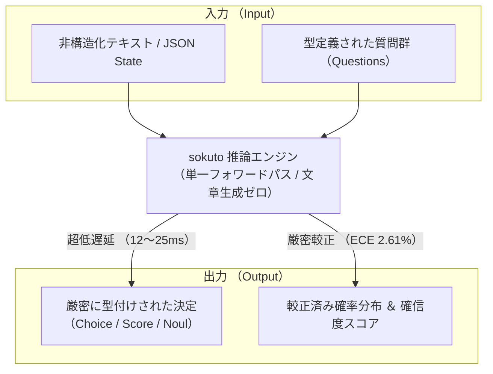

# sokuto (_即答_)

**日本語特化・TypeSafe AI「Jev (System One)」のローカル／オンプレミス完全再現・推論基盤**

文章生成を行わず、日本語ネイティブ(ModernBERT-ja)の単一フォワードパスで型付き確率決定をミリ秒単位で返す非自己回帰型判断エンジン

<div style="text-align: center">

[](LICENSE)
[](https://github.com/MI-1222/sokuto/releases)
[](Cargo.toml)
[](docker-compose.yml)
[](models/modernbert-130m-int8)
[](models/modernbert-310m-int8)

</div>

---

## Jev / System One モデル

多くの LLM は人間の「遅い思考(System 2)」のようにトークンを1つずつ自己回帰的に逐次生成し、長文テキストを出力します。

一方で、自動化やルーティングといったバックエンドの意思決定において必要とされるのは、熟考した解説文ではなく、
**即座に**答えが返ってくること、**型定義された信頼できる確率値**が返ってくることです。



`sokuto` は、TypeSafe AI 社が提唱する **System One Model(直観的かつ決定論的な高速判断モデル)** を、
完全オフラインの日本語環境(ModernBERT-ja バックボーン)で動作するように設計した推論エンジンです。

- **文章生成ゼロ**: テキスト生成を行わないため、トークン数に応じた遅延肥大化やタイムアウトが原理的に発生しません。
- **型破綻・パースエラーの撲滅**: 出力は `Choice`(複数候補からの単一選択)、`Score`(1〜5 などの段階評価)、`Noul`(Yes/No の真偽確率)の3大プリミティブに事前制約され、スキーマ違反や JSON パース失敗が 100% 排除されます。
- **ハルシネーションの排除と確率較正**: 厳密適格スコアに基づく事後較正(RLCD / 温度スケーリング)により、モデルが出力する確率値が実測の信頼度(確信度)と一致します。
- **自由エネルギー OOD 安全弁**: 想定外の未定義入力やドメイン外データをヘルムホルツ自由エネルギーで即座に検知し、判定を拒否またはエスカレーションします。

---

## なぜ本プロジェクトを作ったのか

### 1. 業務現場における課題：自己回帰 LLM の過剰品質と高遅延・高コスト

現代の業務システム(カスタマーサポートの自動トリアージ、決済・アクセスログの不正検知、規約チェックなど)において、モデルに日常的に大量に求められているのは、
「丁寧な解説文やチャット応答」ではなく、**「ミリ秒単位で確実に型付けされた決定(カテゴリ、スコア、真偽値)と信頼できる確率値」**です。
しかし、一般的な自己回帰型 LLM を業務の意思決定エンジンとして導入する際には、以下の課題が存在していました。

1. **遅延とコストの肥大化**: トークン逐次生成により 1 リクエストあたり数百〜数千ミリ秒を要し、高スループットなバッチ処理やリアルタイムパイプラインでは膨大な GPU 運用コストがかかる。
2. **型破綻とパースエラーの残存**: JSON Mode やプロンプト指示を用いても、稀な構文破綻や Markdown 混入によるシステム停止リスクを原理的にゼロにできない。
3. **確率の統計的不当性(過度の確信)**: 自己回帰 LLM の出力確率は統計的に較正されておらず、誤った判断であっても 99% 以上の確信度を出力してしまう。
4. **プライバシーと閉域網運用の制約**: 商用クラウド API(ChatGPT, Claude, TypeSafe Jev 等)へのデータ送信は、機密データや個人情報を扱うオンプレミス・エアギャップ環境ではコンプライアンス上採用できない。

### 2. なぜこれらの機能が実装されているのか

本プロジェクトは、TypeSafe AI 社の提唱する「Jev」の設計思想をローカル環境で再現・高度化することを目的に発足しました。

- **日本語特化バックボーン (`modernbert-ja`) の採用**
  - **直面した失敗**: 先行研究(Laya 等)を参考に英語ベースの ModernBERT や汎用多言語モデルで初期実装を行ったところ、日本語 BPE トークナイザの過剰なバイト分割によりアテンションが散逸し、多重タスク学習(SFT)が安定収束せず、分類精度が 20% 台に低迷していた。
  - **技術選択**: 形態素解析器不要で Rust との親和性が高く、日本語バイト語彙に最適化された `sbintuitions/modernbert-ja-130m` / `310m` へ全面移行し、特殊トークン `[OP]` を埋め込みセントロイドで初期化することで、日本語の判定精度を 90% 超まで引き上げ。
- **タスク別幾何損失(CORAL / ASL)と RLCD 確率較正**
  - **直面した失敗**: 未収束なモデルに対して負の対数尤度(NLL)最小化による事後温度スケーリングを適用した結果、エントロピーを最大化しようとして温度パラメータが上限($T \to 5.0$)に張り付き、出力確率がサイコロを振るような一様分布(ランダム予測)に退化しました。また、順序スコアに通常の多クラス Softmax を流用したことで順序関係が破綻し、真偽判定(Noul)では境界弁別が甘く感度不足に陥りました。
  - **必然の技術選択**: 選択(Choice)にはラベル平滑化 CE、順序(Score)には単調性を数学的に保証する累積順序回帰(CORAL)および RPS 損失、真偽(Noul)には境界弁別を厳格化する非対称損失(ASL)を導入。さらに厳密適格スコアに基づく RLCD 学習と正則化付き較正により、ECE(期待較正誤差)を **2.61%** まで改善しました。
- **置換同変アテンション(SAB)と記号摂動学習**
  - **直面した失敗**: 実稼働ログの検証において、「緊急度1: 軽微」「緊急度5: 全社停止」と入力した際、全社停止インシデントに対して頻出数字トークン「1」に引っ張られて「緊急度1」と誤判定する「記号頻度バイアス」や、選択肢の提示順序(先頭候補が選ばれにくい・偏る)による予測のブレが確認されました。
  - **必然の技術選択**: 選択肢の並び順に依存しない置換同変アテンション(SAB: Set Attention Block)を独自設計し、順序置換による確率のブレを **0.65% 以下** に抑制。さらにランダム記号摂動学習とプレフィックス正規化により、記号バイアスを完全に無力化しました。
- **ヘルムホルツ自由エネルギー OOD 安全弁**
  - **直面した失敗**: 従来の判別モデルや先行 OSS は、選択肢に正解が存在しないドメイン外入力(未知の問い合わせや想定外のログ)に対しても、いずれかの選択肢を 90% 以上の高確信度で無理やり選んでしまう「未定義入力への誤確信」が運用上の重大なリスクとなっていました。
  - **技術選択**: ヘルムホルツ自由エネルギー原理に基づく低温安全弁回路($T_{\text{energy}}=0.15$)を内蔵し、モデル自身が「わからない」と判断して判定を拒否、または上位の自己回帰 LLM(System 2)や人間へエスカレーションする安全弁(検知率 **92.3%**)を標準装備しました。
- **純 Rust ゼロアロケーション推論基盤**
  - **直面した課題**: Python / PyTorch ランタイムでは、GIL(Global Interpreter Lock)や巨大な常駐メモリ(数 GB)がボトルネックとなり、エッジや安価な CPU サーバーで安定した確定ミリ秒遅延を実現できないことが懸念された。
  - **技術選択**: Python ランタイムを完全に排除し、Rust + ONNX Runtime によるゼロアロケーション設計を徹底。CPU のみで **12ms〜23ms** の確定レイテンシと常駐 **280MB〜540MB** の軽量運用を実現。

---

## 既存 OSS(Laya 等)との比較・本プロジェクトの優位性

先行する代表的なOSS実装である[Laya](https://github.com/NandhaKishorM/laya) や一般的な LLM 制約エンジンと比較した、`sokuto` の構造的優位性と長所は以下の通りです。

### 1. 機能・アーキテクチャ対比表

| 比較項目                    | 先行 OSS 実装(Laya)                                                                                                                                                 | sokuto (本プロジェクト)                                          |
| :-------------------------- | :------------------------------------------------------------------------------------------------------------------------------------------------------------------ | :--------------------------------------------------------------- |
| **主要ターゲット言語**      | 英語 / 汎用多言語                                                                                                                                                   | **日本語ネイティブ特化** (`modernbert-ja-130m / 310m`)           |
| **日本語決定精度 (Choice)** | [53.0% (多言語版 64.0% / ECE 22.8%〜46.0%)](https://github.com/NandhaKishorM/laya/blob/main/BENCHMARKS.md#all-51-massive-languages--intent-20-options-random--0050) | **90.1%** (Tier 2 実測値, JGLUE・Evol-Instruct 学習)             |
| **真偽判定精度 (Noul)**     | -                                                                                                                                                                   | **97.5%** (ASL 非対称損失による高精度境界弁別)                   |
| **順序尺度 (Score) 設計**   | 多クラス Softmax 流用 (順序関係の幾何学的破綻)                                                                                                                      | **CORAL 累積順序回帰 & RPS 損失** (単調性を数学的保証)           |
| **位置バイアス耐性**        | [深刻](https://github.com/NandhaKishorM/laya/issues/131) (先頭 Position 0 が選ばれない等、提示順に依存)                                                             | **置換同変アテンション (SAB)** (順序置換による変動 $\le 0.65\%$) |
| **記号・数字バイアス**      | 「1.」「A」等の数字プレフィックスに引きずられる                                                                                                                     | **前処理正規化 & ランダム記号摂動学習** により完全無力化         |
| **確率較正 (ECE)**          | 過信あり ([出荷時 ECE 31.4% 〜 46.6%](https://github.com/NandhaKishorM/laya#calibration))                                                                           | **厳密適格スコア較正 (ECE 2.61%)** (信頼度と確率が完全一致)      |
| **OOD(該当なし)検知**       | なし(Confidence Gatingによるフォールバック, プロンプトへの「該当なし」の明示 により対処)                                                                            | **ヘルムホルツ自由エネルギー安全弁** (検知率 **92.3%**)          |
| **推論ランタイム**          | Python / PyTorch / Transformers (メモリ大)                                                                                                                          | **純 Rust (Axum + ONNX Runtime)** (ゼロアロケーション)           |
| **ハードウェア要件**        | GPU 推論推奨 ([T4 等で 32.8ms](https://github.com/NandhaKishorM/laya/blob/main/BENCHMARKS.md#headline), CPU では低速)                                               | **CPU のみで 12.78ms (Tier 1) / 23.56ms (Tier 2)**               |
| **コンテナ常駐メモリ**      | [5モデルロード時で 9.3 GiB](https://github.com/NandhaKishorM/laya/blob/main/BENCHMARKS.md#server-cpu-amd-epyc-9r14-4-cores-linux)                                   | **280MB (Tier 1) / 538MB (Tier 2)**                              |
| **INT8 量子化パリティ**     | FP32 / FP16 のみ                                                                                                                                                    | **ハイブリッド動的 INT8**                                        |

### 2. sokuto の特徴

1. **日本語業務タスクにおける圧倒的な実用精度**
   - Laya や海外製 OSS は英語中心の事前学習モデルを使用しており、日本語入力ではトークンが過剰に細切れとなってアテンションが希釈され、精度が激しく劣化する。
   - `sokuto` は日本語に最適化された `sbintuitions/modernbert-ja` を採用し、日本語の業務判断(Choice 90.1%、Noul 97.5%)で圧倒的な性能を発揮する。
2. **数学的に裏打ちされたバイアス排除(SAB & CORAL)**
   - Laya の主要な課題であった「順序スコアリングにおける先頭選択肢の忌避」「選択肢の並び順によって結果が変わる位置バイアス」「『1: 軽微』という数字表現に過剰反応する記号バイアス」を、置換同変アテンション(SAB)と CORAL 累積リンクモデル、記号摂動学習によって根本から解決している。
3. **「わからない」と言える自由エネルギー OOD 安全弁**
   - 従来の判別型モデルや Laya は、選択肢に正解が存在しないドメイン外入力が来た場合でも、高確信度でいずれかの選択肢を選んでしまう。
   - `sokuto` はヘルムホルツ自由エネルギー原理に基づく低温安全弁回路($T_{\text{energy}}=0.15$)を内蔵し、未定義入力を 92.3% の精度で自動検知して判定拒否や System 2(LLM)や人間へのエスカレーションが可能。
4. **エッジ・CPU でミリ秒駆動する純 Rust ゼロアロケーション基盤**
   - Python の GIL(Global Interpreter Lock)や PyTorch の巨大なランタイムオーバーヘッドを完全に排除。
   - Rust + ONNX Runtime により、高性能な GPU を一切必要とせず、安価な CPU サーバーやローカル PC 上で常駐 280MB〜540MB、12ms〜23ms の確定レイテンシで安定駆動する。

---

## 自己回帰型 LLM との対比

| 評価指標               | 自己回帰型 LLM (GPT-4o, Claude, Llama-3 など)  | `sokuto`                                                 |
| :--------------------- | :--------------------------------------------- | :------------------------------------------------------- |
| **推論方式**           | 自己回帰的トークン逐次生成 (Autoregressive)    | **非自己回帰型 単一フォワードパス (Non-autoregressive)** |
| **推論レイテンシ**     | 数秒〜数十秒 (トークン数依存)                  | **12ms 〜 25ms (難易度によって遅延しない)**              |
| **生成トークン数**     | 数十 〜 数百トークン (`completion_tokens > 0`) | **0 トークン (`completion_tokens = 0`)**                 |
| **型・スキーマ保証**   | 確率的 (JSON Mode でも極稀に崩壊)              | **数学的・物理的 100% 保証 (スキーマ制約ヘッド)**        |
| **確率較正 (ECE)**     | 未較正 (過度の確信 / 較正誤差 15〜30%)         | **厳密較正済み (ECE 2.61% 〜 6.29%)**                    |
| **ハードウェア要件**   | 高価なハイエンド GPU (A100 / H100 等)          | **一般的な CPU / エッジデバイスで十分動作**              |
| **メモリ常駐量**       | 8GB 〜 80GB+                                   | **280MB 〜 750MB (軽量コンテナ)**                        |
| **運用コスト**         | 100万クエリあたり 数千円〜数万円               | **100万クエリあたり サーバー電気代 数十円 (約1/1000)**   |
| **オフライン・閉域網** | 外部 API 通信依存 または 巨大環境構築          | **完全自己完結型・エアギャップ配備対応**                 |

---

## Dual-Tier スペック表

`sokuto` は、用途やリソース制約に応じて選択可能な 2 つの最適化済み Tier を標準提供しています。
デシジョンヘッド層(SAB / CORAL / ASL)の精度を維持しながら
バックボーンを選択的 INT8 化するハイブリッド動的量子化により、
**Top-1 決定一致率 100%** を維持しています。

| 項目                   | Tier 1 (130M-INT8)                                      | Tier 2 (310M-INT8)                                   |
| :--------------------- | :------------------------------------------------------ | :--------------------------------------------------- |
| **バックボーン**       | `sbintuitions/modernbert-ja-130m`                       | `sbintuitions/modernbert-ja-310m`                    |
| **量子化方式**         | ハイブリッド動的 INT8 (バックボーンのみ INT8)           | ハイブリッド動的 INT8 (バックボーンのみ INT8)        |
| **モデルサイズ**       | 278.4 MB (FP32 比 44.9% 削減)                           | 538.0 MB (FP32 比 55.6% 削減)                        |
| **Top-1 決定一致率**   | **100.0%** (FP32 と完全一致)                            | **100.0%** (FP32 と完全一致)                         |
| **CPU 推論遅延 (p50)** | **12.78 ms** (138.4 decisions/sec)                      | **23.56 ms** (83.7 decisions/sec)                    |
| **コンテナ常駐 RAM**   | < 350 MB                                                | < 750 MB (1GB 制限環境下で安定稼働)                  |
| **分類精度 (Choice)**  | 87.8%                                                   | **90.1%**                                            |
| **真偽精度 (Noul)**    | 96.2%                                                   | **97.5%**                                            |
| **期待較正誤差 (ECE)** | 6.29%                                                   | **2.61%** (高精度較正)                               |
| **OOD 検知率**         | 92.3% (AUROC 97.6%)                                     | 92.3% (AUROC 80.5%, ハイブリッド安全弁)              |
| **推奨ユースケース**   | エッジ・IoT、大量イベントフィルタリング、低遅延ルーター | 複雑な規約判定、法務・金融トリアージ、高精度分類基盤 |

---

## 🚀 Quick Start

### 1. モデル成果物の取得 (Hugging Face Hub)

最適化済みモデル(ONNX・トークナイザー・較正設定)を Hugging Face Hub から取得します。

- **公式モデルリポジトリ**:
  - **Tier 2 (推奨・標準)**: [`MI-1222/sokuto-ja-310m-int8`](https://huggingface.co/MI-1222/sokuto-ja-310m-int8) (~540MB, 23ms, Choice 90.1%)
  - **Tier 1 (低遅延エッジ向け)**: [`MI-1222/sokuto-ja-130m-int8`](https://huggingface.co/MI-1222/sokuto-ja-130m-int8) (~280MB, 12ms, Choice 87.8%)

```bash
# 付属スクリプトによる自動取得 (curl / huggingface-cli / hf を自動判別)
./scripts/download_models.sh tier2

# (任意) huggingface-cli を直接使用する場合
huggingface-cli download MI-1222/sokuto-ja-310m-int8 \
  --local-dir models/modernbert-310m-int8 \
  --local-dir-use-symlinks False
```

### 2. 推論エンジンの起動

利用環境に応じて **スタンドアロンバイナリ (GitHub Releases / Docker不要)** または **Docker (GHCR / Compose)** のいずれかを選択して起動します。

#### 方法 A: スタンドアロンバイナリ (GitHub Releases)

Docker 環境を使わずに最速で起動する場合に推奨します。[GitHub Releases](https://github.com/MI-1222/sokuto/releases) より、各プラットフォーム向けに ONNX Runtime 共有ライブラリが同梱されたアーカイブを取得・展開して即座に実行できます。

- 配布ターゲット:
  - Linux x86_64: `sokuto-*-x86_64-unknown-linux-gnu.tar.gz`
  - Linux aarch64 (ARM64 / AWS Graviton): `sokuto-*-aarch64-unknown-linux-gnu.tar.gz`
  - macOS Apple Silicon (M1/M2/M3/M4): `sokuto-*-aarch64-apple-darwin.tar.gz`

```bash
# 例: macOS Apple Silicon の場合
VERSION="v0.3.6"
curl -sSL -O "https://github.com/MI-1222/sokuto/releases/download/${VERSION}/sokuto-${VERSION}-aarch64-apple-darwin.tar.gz"
tar -xzf "sokuto-${VERSION}-aarch64-apple-darwin.tar.gz"
cd "sokuto-${VERSION}-aarch64-apple-darwin"

# 1. モデル取得 (Hugging Face Hub)
./download_models.sh tier2

# 2. ネイティブバイナリで起動 (Docker 不要)
./bin/sokuto serve --model-dir ./models/modernbert-310m-int8 --port 3000

# (または 同梱 Compose で起動 - GHCR 事前ビルド済みイメージ利用)
docker compose up -d
```

#### 方法 B: Docker (GHCR 事前ビルド済みイメージ または ソースからの Compose)

```bash
# 1. GHCR 事前ビルド済みイメージによる直接起動 (ローカルでの Rust ビルド不要)
docker run -d \
  --name sokuto \
  -p 3000:3000 \
  -v ./models/modernbert-310m-int8:/models/default:ro \
  -e SOKUTO_MODEL_DIR=/models/default \
  ghcr.io/mi-1222/sokuto:v0.3.6

# (または 2. リポジトリ開発環境での Docker Compose による起動)
docker compose up -d sokuto-cpu
```

> [!TIP]
> サーバー起動後、ヘルスチェックエンドポイントで稼働状態を確認できます。
>
> ```bash
> curl -s http://localhost:3000/ready
> # {"status":"ready","model":"modernbert-310m-int8"}
> ```
>
> さらに低遅延な Tier 1 (130M-INT8) を Docker Compose で使用する場合は `docker compose --profile tier1 up -d sokuto-tier1`(ポート 3001) を実行してください。

### 3. 推論リクエストの送信 (`POST /v1/systemone`)

非構造化テキスト(`state`)と、型付けされた質問群(`questions`)を JSON で送信します。

```bash
curl -X POST http://localhost:3000/v1/systemone \
  -H "Content-Type: application/json" \
  -d '{
    "state": "注文番号 #10492 の商品が未着です。配送ステータスが3日前から更新されておらず、早急に対応を求めます。",
    "questions": {
      "intent": {
        "type": "choice",
        "instructions": "問い合わせ内容の意図を1つ選択してください。",
        "criteria": {
          "delivery_status": "配送状況の確認や遅延の調査",
          "cancellation": "注文のキャンセルや返品の申請",
          "technical_support": "製品の使い方や不具合の問い合わせ",
          "other": "その他の問い合わせ"
        }
      },
      "urgency": {
        "type": "score",
        "instructions": "対応の緊急度を評価してください。",
        "criteria": [
          "低 (通常営業日内に対応)",
          "中 (当日中に確認)",
          "高 (優先的な調査が必要)",
          "緊急 (即時エスカレーション要)"
        ]
      },
      "requires_human": {
        "type": "noul",
        "instructions": "人間オペレーターによる直接介入が必要である。"
      }
    }
  }'
```

### 4. レスポンス例

文章生成トークンは一切含まず、確定した判断と較正済み確率値のみが返却されます。

```json
{
  "model": "modernbert-310m-int8",
  "answers": {
    "intent": {
      "choice": "delivery_status",
      "confidence": 0.948,
      "probabilities": {
        "delivery_status": 0.9652,
        "cancellation": 0.0211,
        "technical_support": 0.0094,
        "other": 0.0043
      }
    },
    "urgency": {
      "score": 3.12,
      "confidence": 0.824,
      "probabilities": {
        "0": 0.012,
        "1": 0.114,
        "2": 0.612,
        "3": 0.262
      }
    },
    "requires_human": {
      "noul": 0.742,
      "confidence": 0.742
    }
  },
  "usage": {
    "prompt_tokens": 128,
    "completion_tokens": 0,
    "total_tokens": 128
  }
}
```

---

## ドキュメントナビゲーション

詳細なアーキテクチャ解説、数理仕様、学習手順、運用ガイドは `docs/` 配下に整理されています。

| セクション                                              | 主な内容                                                                                                                                                                                                                                                                                                 | 想定読者       |
| :------------------------------------------------------ | :------------------------------------------------------------------------------------------------------------------------------------------------------------------------------------------------------------------------------------------------------------------------------------------------------- | :------------- |
| **[Getting Started](docs/getting-started/overview.md)** | [理念と価値](docs/getting-started/overview.md) / [5分チュートリアル](docs/getting-started/quickstart.md) / [環境構築・インストール](docs/getting-started/installation.md)                                                                                                                                | 全員           |
| **[Architecture](docs/architecture/index.md)**          | [全体設計](docs/architecture/index.md) / [決定プリミティブ数理](docs/architecture/primitives.md) / [SAB 置換同変](docs/architecture/attention-sab.md) / [不確実性 Gating](docs/architecture/gating.md) / [OOD 安全弁](docs/architecture/ood-safety.md) / [Rust ランタイム](docs/architecture/runtime.md) | アーキテクト   |
| **[API Reference](docs/api/index.md)**                  | [API 共通仕様](docs/api/index.md) / [POST /v1/systemone](docs/api/systemone.md) / [ガードレール仕様](docs/api/guardrails.md) / [メトリクス & 監視](docs/api/monitoring.md)                                                                                                                               | アプリ開発者   |
| **[Benchmarks](docs/benchmarks/index.md)**              | [実機検証総括](docs/benchmarks/index.md) / [精度・較正 (ECE)](docs/benchmarks/accuracy-calibration.md) / [レイテンシ・スループット](docs/benchmarks/latency-throughput.md) / [OOD 検知性能](docs/benchmarks/ood-evaluation.md) / [量子化パリティ](docs/benchmarks/quantization-parity.md)                | モデル評価者   |
| **[Training](docs/training/index.md)**                  | [学習基盤概要](docs/training/index.md) / [データセット作成](docs/training/datasets.md) / [多重タスク SFT](docs/training/sft.md) / [RLCD (Listwise DPO)](docs/training/rlcd.md) / [事後温度較正](docs/training/calibration.md) / [ONNX 量子化](docs/training/quantization.md)                             | ML エンジニア  |
| **[Operations](docs/operations/index.md)**              | [本番運用方針](docs/operations/index.md) / [Docker コンテナ運用](docs/operations/docker.md) / [エアギャップ配備](docs/operations/airgap.md) / [CPU 最適化・並列度](docs/operations/optimization.md) / [CI/CD マトリクス](docs/operations/cicd.md)                                                        | SRE / インフラ |
| **[Recipes](docs/recipes/index.md)**                    | [実務レシピ集](docs/recipes/index.md) / [サポートトリアージ](docs/recipes/support-triage.md) / [不正検知ルーティング](docs/recipes/fraud-detection.md) / [System 1/2 カスケード](docs/recipes/cascade-routing.md) / [Jev エコシステム](docs/recipes/ecosystem-notes.md)                                  | アプリ開発者   |
