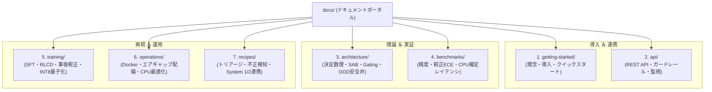

# sokuto ドキュメントポータル

日本語特化型・非自己回帰判断エンジン `sokuto` の設計思想、数理仕様、API リファレンス、学習・運用手順、実務レシピを体系的にまとめたドキュメントポータル

---

## ドキュメント体系マップ

`sokuto` のドキュメントは、読者の関心やユースケースに合わせて全 7 カテゴリ(計 32 ドキュメント)で構成されています。

---

## 目的・対象読者別おすすめルート

| あなたの目的                                | おすすめの閲覧順序                       | 主な対象ドキュメント                                                                                                                                          |
| :------------------------------------------ | :--------------------------------------- | :------------------------------------------------------------------------------------------------------------------------------------------------------------ |
| **まず動かしてみたい**                      | 概要理解 → 起動 → 疎通確認               | [理念と価値](getting-started/overview.md) → [クイックスタート](getting-started/quickstart.md)                                                                 |
| **自社アプリ / バックエンドに組み込みたい** | API 仕様 → スキーマ定義 → ガードレール   | [API 共通仕様](api/index.md) → [POST /v1/systemone](api/systemone.md) → [入力ガードレール](api/guardrails.md)                                                 |
| **なぜ動くのか？数理と構造を知りたい**      | 全体設計 → プリミティブ数理 → 安全弁     | [アーキテクチャ全体像](architecture/index.md) → [プリミティブ数理](architecture/primitives.md) → [OOD 安全弁](architecture/ood-safety.md)                     |
| **実測性能とベンチマークを精査したい**      | 総括 → 較正性能 (ECE) → CPU 遅延         | [ベンチマーク総括](benchmarks/index.md) → [精度・較正 ECE](benchmarks/accuracy-calibration.md) → [レイテンシ・スループット](benchmarks/latency-throughput.md) |
| **自社独自データで再学習・最適化したい**    | 環境構築 → データセット → SFT/RLCD       | [学習基盤概要](training/index.md) → [データセット作成](training/datasets.md) → [多重タスク SFT](training/sft.md)                                              |
| **閉域網・オンプレミス環境へ配備したい**    | コンテナ選定 → エアギャップ配備 → 最適化 | [Docker 運用](operations/docker.md) → [エアギャップ配備](operations/airgap.md) → [CPU 最適化](operations/optimization.md)                                     |
| **実際のユースケースに沿って実装したい**    | レシピ選定 → パイプライン実装            | [サポートトリアージ](recipes/support-triage.md) / [不正検知](recipes/fraud-detection.md) / [カスケード連携](recipes/cascade-routing.md)                       |

---

## 各カテゴリの詳細とドキュメント一覧

### 1. [Getting Started](getting-started/overview.md)(導入編)

**対象**: 全員、新規導入検討者

`sokuto` の基本的な理念、なぜ自己回帰 LLM ではなく System One モデルが必要なのか、ローカル環境でミリ秒判定を体験するための最短ステップを解説

- [overview.md](getting-started/overview.md): プロジェクトの理念、決定論的バックエンドの必要性、ローカル運用のメリット
- [quickstart.md](getting-started/quickstart.md): リポジトリクローンから Docker Compose による起動チュートリアルと基本リクエスト疎通
- [installation.md](getting-started/installation.md): スタンドアロンバイナリ、Docker Compose、GHCR コンテナ、ソースビルド(Cargo)の導入手順

### 2. [API Reference](api/index.md)(インターフェース仕様編)

**対象**: アプリケーション開発者、バックエンドエンジニア

RESTful な推論エンドポイントの詳細仕様、型定義スキーマ、堅牢な本番運用のための入力サニタイズ・ガードレール、ヘルスチェックおよび Prometheus メトリクス仕様を網羅的に記載

- [index.md](api/index.md): API 共通仕様、認証方針、HTTP ステータスコード、エラーレスポンス構造
- [systemone.md](api/systemone.md): `POST /v1/systemone` の完全仕様(State, Questions, Criteria, Answers, Gating レスポンス)
- [guardrails.md](api/guardrails.md): 実務入力ロバスト化(記号正規化、Noul 補正、バイモーダル検知)の動作原理と設定
- [monitoring.md](api/monitoring.md): `/health`, `/ready` によるプローブ設定と Prometheus メトリクス(レイテンシ・確信度分布)仕様

### 3. [Architecture](architecture/index.md)(設計思想 & 数理仕様編)

**対象**: システムアーキテクト、研究開発者、コア開発者

Python による学習基盤と Rust によるゼロアロケーション推論基盤の責務分離、3 大プリミティブ(Choice, Score, Noul)の数理モデル、位置バイアスを解消する SAB、ヘルムホルツ自由エネルギーに基づく OOD 安全弁の理論的根拠を詳細に解説

- [index.md](architecture/index.md): 全体設計、Python 学習境界と Rust 本番ランタイムの責務分離アーキテクチャ
- [primitives.md](architecture/primitives.md): Choice(Softmax)、Score(CORAL / RPS)、Noul(Asymmetric BCE)の幾何学的数理定義
- [attention-sab.md](architecture/attention-sab.md): 特殊トークン `[OP]` セントロイド初期化と置換同変アテンション(SAB: Set Attention Block)
- [gating.md](architecture/gating.md): 正規化エントロピー $\tilde{H}$ と Top-Margin $M$ による複合確信度スコアリングと Gating 機構
- [ood-safety.md](architecture/ood-safety.md): ヘルムホルツ自由エネルギー原理、低温安全弁回路($T_{\text{energy}}=0.15$)、ハイブリッド安全弁
- [runtime.md](architecture/runtime.md): ONNX Runtime 物理コア並列制御、スタック配列バッファ、mimalloc チューニング

### 4. [Benchmarks](benchmarks/index.md)(実機検証 & 性能評価編)

**対象**: モデル評価者、AI パフォーマンスエンジニア

Tier 1 (130M-INT8) と Tier 2 (310M-INT8) のスペック対比、JGLUE および実務タスクにおける分類精度、事後温度スケーリングによる ECE 2.61% の較正性能、CPU 単一／バッチ推論遅延の実測データを公開します。

- [index.md](benchmarks/index.md): Tier 1 (130M) vs Tier 2 (310M) 完全スペック対比表、ハードウェア環境、検証プロトコル
- [accuracy-calibration.md](benchmarks/accuracy-calibration.md): JGLUE 判定精度(Choice 90.09%, Noul 97.50%)、事後較正 ECE(2.61%)、信頼性ダイアグラム
- [latency-throughput.md](benchmarks/latency-throughput.md): CPU 推論レイテンシ(p50 12.61ms / 23.28ms)、スループット(146.7 dps / 72.8 dps、Scratchpad 156.9 dps)
- [ood-evaluation.md](benchmarks/ood-evaluation.md): 自由エネルギー OOD 検知性能(AUROC 97.63% / 80.47%、検知率 92.3%)の実測評価
- [quantization-parity.md](benchmarks/quantization-parity.md): FP32 vs INT8 決定一致率(100.0%)、コサイン類似度(0.9993)、容量 45%〜56% 削減実証

### 5. [Training](training/index.md)(学習・量子化パイプライン編)

**対象**: 機械学習エンジニア、データサイエンティスト

自社ドメインの独自タスクに対応させるためのデータセット準備、多重タスク SFT、厳密適格スコアに基づく RLCD(Listwise DPO)学習、事後温度較正、および動的 INT8 量子化パイプラインの完全再現手順を提供します。

- [index.md](training/index.md): `train/` ディレクトリ構成、`uv` による Python 仮想環境構築、学習ワークフロー概要
- [datasets.md](training/datasets.md): JGLUE 変換パイプライン、Evol-Instruct 合成データ生成、ハードネガティブ混入レシピ
- [sft.md](training/sft.md): 3 系統 Differential LR、幾何学的複合損失(EMD / LS-CE / CORAL / RPS / ASL)の実装
- [rlcd.md](training/rlcd.md): 厳密適格スコアリング規則(Log / Spherical / Brier / RPS)に基づく Listwise DPO 訓練
- [calibration.md](training/calibration.md): 候補数バケット別正則化付き温度最適化と `calibration.json` 生成手順
- [quantization.md](training/quantization.md): ONNX エクスポート(動的バッチ・シーケンス)と Head FP32 保護ハイブリッド動的 INT8 量子化

### 6. [Operations](operations/index.md)(本番運用 & インフラ編)

**対象**: SRE、インフラエンジニア、セキュリティ担当者

本番環境への安全なデプロイメントパターン、Docker コンテナの運用、完全閉域網(エアギャップ)配備手順、CPU コア・メモリチューニング、CI/CD パイプラインを解説

- [index.md](operations/index.md): 推論基盤のデプロイメントパターン一覧、可用性設計、セキュリティ境界
- [docker.md](operations/docker.md): マルチステージビルド(`Dockerfile.cpu`, `Dockerfile.dist`, `Dockerfile.allinone`)の使い分けと運用
- [airgap.md](operations/airgap.md): `package_release.sh` によるオフライン配布パッケージ作成と `test_airgap.sh` 検証手順
- [optimization.md](operations/optimization.md): 物理コア自動検出、`SOKUTO_POOL_SIZE`、1GB メモリ制限環境下での安定運用チューニング
- [cicd.md](operations/cicd.md): GitHub Actions クロスプラットフォームビルドマトリクス(Linux/macOS、x86_64/arm64)

### 7. [Recipes](recipes/index.md)(実務ユースケース & 統合パターン編)

**対象**: ソリューションアーキテクト、アプリ開発者

業務システムへの具体的な組み込みパターン、複数プリミティブを組み合わせた実践例、および自己回帰型 LLM(Claude / GPT-4o)と連携した System 1/2 ハイブリッドアーキテクチャのレシピ集

- [index.md](recipes/index.md): レシピ集概要、実装パターンの選定基準、サンプルコードの構成
- [support-triage.md](recipes/support-triage.md): カスタマーサポートチケットの自動トリアージ(問い合わせ分類 + 緊急度スコア + 人間介入要否)
- [fraud-detection.md](recipes/fraud-detection.md): EC 取引リスク判定、不審アクセス判定、および OOD 安全弁による未知不正検知
- [cascade-routing.md](recipes/cascade-routing.md): System 1(`sokuto`)即時判定と System 2(LLM)CoT フォールバックのハイブリッドカスケード
- [ecosystem-notes.md](recipes/ecosystem-notes.md): `awesome-jev`, `laya` 等の先行 OSS エコシステム分析とアーキテクチャ設計フィードバック
