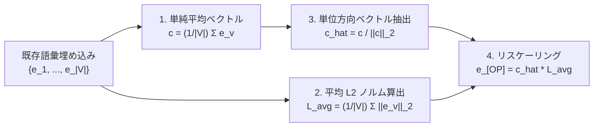
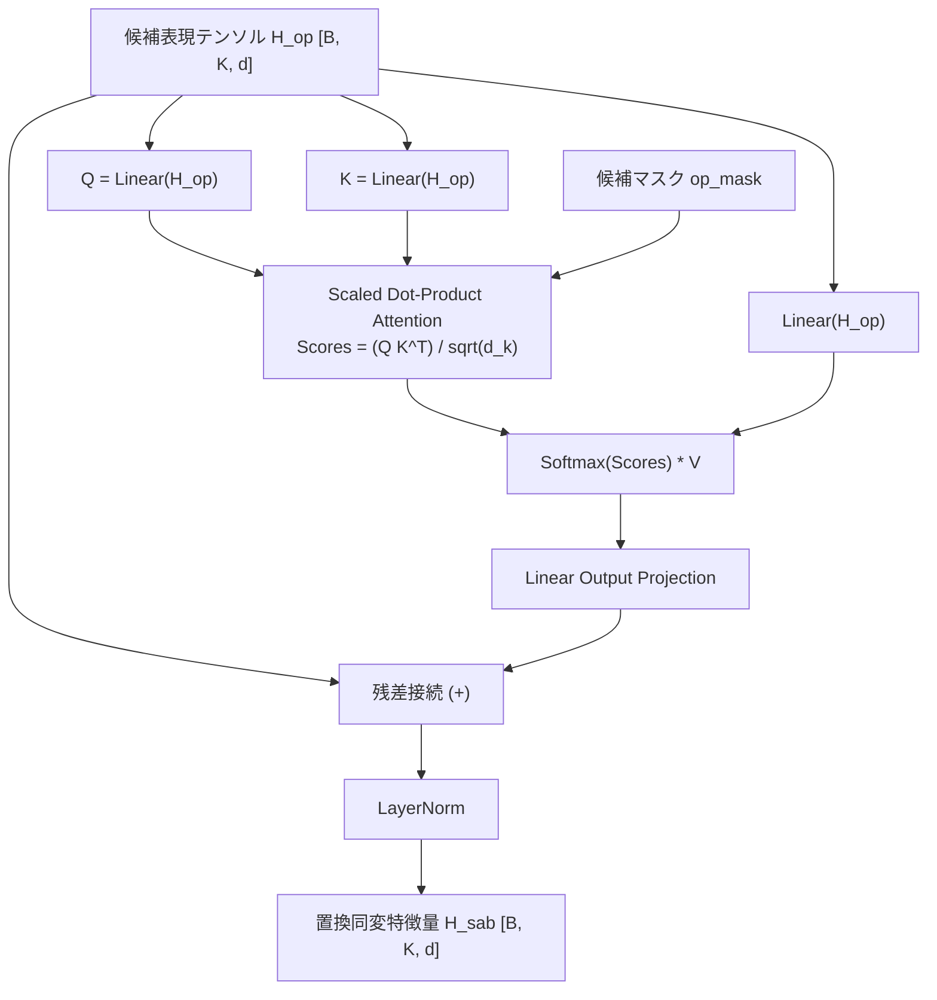

# 特殊トークン `[OP]` と置換同変アテンション (SAB)

決定論的判断モデルにおいて、
「選択肢の提示順序によって判定がブレないこと(位置不変性・置換同変性)」、および「候補表現を安全かつ高精度に抽出すること」
は不可欠の数理的要件です。

本ドキュメントでは、
決定アンカーとなる特殊マーカートークン `[OP]` のセントロイド初期化の数理と、
候補提示順序バイアスを幾何学的に中和する置換同変アテンション(Set Attention Block: SAB)の仕様を解説します。

---

## 1. 特殊マーカートークン `[OP]` と Gather 抽出層

### 1.1 `[OP]` トークンの役割

`sokuto` では、入力プロンプト内の各選択肢(または評価基準、命題)の直前に
特殊マーカートークン `[OP]`(Option Marker)を動的に挿入します。

```text
指示: 以下の問い合わせの優先度を選択してください。
[OP] 低: 通常対応
[OP] 中: 24時間以内対応
[OP] 高: 至急対応
```

バックボーンエンコーダ(ModernBERT)が文脈全体を双方向アテンションで符号化した後、
出力される全隠れ状態系列 $H_{\text{all}} \in \mathbb{R}^{B \times L \times d}$ から、
各 `[OP]` トークンが存在する系列位置インデックス $\mathbf{idx}_{\text{op}} \in \mathbb{Z}^{B \times K}$ を用いて
候補表現をピンポイントで並列抽出します。

これを担うのが [`OptionGatherLayer`](../../train/models/decision_head.py#L31-L63) です。

$$H_{\text{op}} = \text{Gather}(H_{\text{all}}, \mathbf{idx}_{\text{op}}) \in \mathbb{R}^{B \times K \times d}$$

ここで $B$ はバッチサイズ、$L$ は入力系列長(プロンプトをトークナイズした際の全トークン数)、$K$ は質問の有効候補数、$d$ は隠れ層次元数(130M モデルでは $768$、310M モデルでは $1024$)です。

---

## 2. セントロイド正規化初期化の数理

### 2.1 課題の本質: `[OP]` トークンが直面する構造的リスク

`sokuto` では、入力系列内の各選択肢の先頭に `[OP]` マーカーを挿入し、バックボーン出力から [`OptionGatherLayer`](../../train/models/decision_head.py#L31-L63) で隠れベクトルをピンポイント抽出して後続の SAB(自己注意層)および 2層 MLP デシジョンヘッドへ直結させます。
つまり、`[OP]` の埋め込みベクトルは **「事前学習済みの多層 Transformer(アテンション層と残差ストリーム)を最初から最後まで通過し、最終層の決定ヘッドへ直接情報を受け渡す唯一の決定アンカー」** です。

この特殊トークンの初期化には、理論的・実装的に以下の 2 つの「落とし穴」が存在します。

---

### 2.2 第 1 の落とし穴: ランダム初期化による連鎖的破綻

事前学習済みモデルに新規トークンを追加する際、一般的なフレームワークで行われる正規分布乱数($\mathcal{N}(0, \sigma^2)$)による初期化は、深層 Transformer の信号伝播と最適化の理論において致命的な破綻を引き起こします。

1. **アテンションの初期化ミスマッチと指数関数的勾配スパイク**:
   事前学習済みの単語埋め込みは原点中心の等方的な球ではなく、狭い円錐状の多様体(異方性: Anisotropy)を形成しています。ここにスケールや分散の異なる正規乱数を注入すると、信号伝播理論(Signal Propagation Theory, [Kedia et al., ICML 2024](https://arxiv.org/abs/2403.09635))が解明したように、Query/Key 射影の分散ミスマッチが Softmax 入力の分散を層の深さとともに指数関数的に肥大化させます。結果としてアテンションが特定トークンへ極端に集中する尖った(peaky)分布を形成し、逆伝播時に勾配が指数関数的に爆発(Gradient Spikes)します("Spike No More", [arXiv:2312.16903](https://arxiv.org/abs/2312.16903))。
2. **残差接続の累積と LayerNorm 直前での出力歪み**:
   Pre-LN 型 Transformer では、各サブレイヤーの出力が残差接続を通じてそのまま累積されます([Xiong et al., ICML 2020](https://arxiv.org/abs/2002.04745))。初期化の不整合による異常な分散は深層に向かって蓄積し、最終層の OptionGatherLayer 直後にある LayerNorm および MLP ヘッドに過大な勾配が逆流します。この結果、バックボーンが長時間の事前学習で獲得した言語表現そのものが破壊的に更新(Catastrophic Updates)される事象が報告されています([NVIDIA/TransformerEngine #709](https://github.com/NVIDIA/TransformerEngine/issues/709))。
3. **Cold/Warm 最適化速度の不一致と初期ノイズへのトラップ**:
   事前学習済みの「Warm」な重みと新規追加された「Cold」な重みでは、適切な最適化ステップのスケールが根本的に異なります。初期の英語モデル微調整時(2エポック)において検証精度が $28.8\%$ に留まった事象は、3〜4択タスクにおけるランダムウォーク期待値の信頼区間内に合致しており、新設パラメータが解探索を開始した直後に Cosine 減衰で学習率が絞られ、初期ノイズ状態から脱せなかった物理的限界を実証しています([PR #2](https://github.com/MI-1222/sokuto/pull/2))。

---

### 2.3 第 2 の落とし穴: 単純な重心平均(Centroid)の欠陥(高次元ノルム消失)

「ランダム初期化が分布乖離を起こすなら、既存の全単語ベクトルの平均(重心) $\mathbf{c} = \frac{1}{|V|} \sum_{v \in V} \mathbf{e}_v$ で初期化すれば安全ではないか」という発想が自然に浮かび、開発初期にも試行されました([`a80dfe3`](https://github.com/MI-1222/sokuto/commit/a80dfe3) 以前の実装)。
しかし、ここには**高次元幾何(大数の法則)の罠**が存在します。

#### 数理的根拠(高次元相殺)

高次元ベクトル空間($d=768$、語彙数 $|V| \approx 102,400$)において、各単語ベクトルは空間全体に多方向に分散しています。単純平均を計算すると成分同士が激しく相殺し合い、平均ベクトルの L2 ノルム期待値はおよそ以下に縮退します:

$$\mathbb{E}[\|\mathbf{c}\|_2] \approx \frac{\bar{L}}{\sqrt{|V|}}$$

(ここで $\bar{L} = \frac{1}{|V|} \sum_{v \in V} \|\mathbf{e}_v\|_2$ は既存単語ベクトルの平均 L2 ノルム)

$|V| = 102,400$ の場合、$\sqrt{|V|} = 320$ となるため、単純平均ベクトルのノルムは通常トークンの **約 $1/320$ (約 $0.3\%$)という極小値にまで消失** します。
この極小ベクトルを Transformer に入力すると、Self-Attention の Key/Query 内積で実質的なゼロベクトルとして振る舞い、LayerNorm による微小値の増幅とも相まって数値的不安定性やアテンションの機能不全を招きます。

---

### 2.4 解決策: セントロイド正規化アルゴリズム

この「ランダム初期化による勾配爆発」と「単純平均によるノルム消失」の双方を同時に克服するため、
sokuto では [`train/models/backbone.py`](../../train/models/backbone.py#L40-L74) において
**「方向の正規化と平均ノルムによるリスケーリング」** を行うセントロイド正規化初期化を採用しています。



#### 数理的定義

1. 既存語彙 $V$ の重心ベクトル $\mathbf{c}$ を算出:
   $$\mathbf{c} = \frac{1}{|V|} \sum_{v \in V} \mathbf{e}_v \in \mathbb{R}^d$$
2. 既存単語ベクトルの平均 L2 ノルム $\bar{L}$ を算出:
   $$\bar{L} = \frac{1}{|V|} \sum_{v \in V} \|\mathbf{e}_v\|_2$$
3. 重心ベクトルの方向を取り出し、平均ノルム $\bar{L}$ でスケーリングして `[OP]` の初期重みとする:
   $$\mathbf{e}_{\text{[OP]}} = \left( \frac{\mathbf{c}}{\|\mathbf{c}\|_2 + \epsilon} \right) \cdot \bar{L}$$

#### 本アルゴリズムの幾何学的・学習的利点

- **語彙多様体への適応**: 既存語彙空間のグローバルな重心方向を指向するため、分布ミスマッチによるアテンションの異常ピークや勾配スパイクを回避します。
- **健全なエネルギーの確保**: 通常の単語と全く同一の平均ノルム $\bar{L}$ を付与するため、高次元ノルム消失を起こさず、Self-Attention の内積演算が初手から健全に機能します。
- **最初期ステップからの安定性**: バックボーンの既学習重みを破壊することなく、新設ヘッドとともに最初期ステップから極めて滑らかに収束へ向かうことが保証されます。

---

## 3. 候補提示順序バイアス(Position Bias)の解明

### 3.1 現象の観察

双方向エンコーダ(BERT や ModernBERT)は、
入力系列内の各トークンに位置情報(絶対位置埋め込み、または Rotary Position Embedding: RoPE)を付与します。

これにより、選択肢群 $[c_1, c_2, c_3]$ をプロンプト内に並べた場合、
先頭に置かれた選択肢 $c_1$ と末尾に置かれた選択肢 $c_3$ とでは、
バックボーンが出力する表現に構造的な位置バイアス(Primacy Effect や Recency Effect)が混入します。

#### 実測された変動幅の推移

開発初期において選択肢順序をランダムにシャッフルしたところ、特定のサンプルにおいて **予測確率が最大 41.92% も変動する** 深刻な不安定性が確認されました([PR #3](https://github.com/MI-1222/sokuto/pull/3))。
訓練時の Criteria 候補順序動的シャッフル学習([PR #3](https://github.com/MI-1222/sokuto/pull/3))により最大変動幅を 16.80% まで抑制した後、提示順序依存性を幾何学的に根本解消するため SAB([PR #5](https://github.com/MI-1222/sokuto/pull/5))を導入しました。

---

## 4. 置換同変アテンション(Set Attention Block: SAB)

### 4.1 置換同変性(Permutation Equivariance)とは

数学的に、候補集合 $C = \{c_1, c_2, \dots, c_K\}$ に対する決定モデル $f$ が置換同変であるとは、
任意の置換行列 $\Pi \in \mathbb{R}^{K \times K}$ に対して以下が成立することを意味します。

$$f(\Pi X) = \Pi f(X)$$

すなわち、選択肢の提示順序をシャッフルした場合、
出力されるロジットや確率分布も「全く同じ順序でシャッフルされたもの」でなければならず、
順序の変更によって特定候補の確率自体が増減してはなりません。

### 4.2 SAB のアーキテクチャ

sokuto では、候補マーカーベクトル列 $H_{\text{op}} \in \mathbb{R}^{B \times K \times d}$ に対し、
**位置エンコーディングを一切持たない自己注意ブロック(SAB)** を適用します。



#### 数理仕様

1. 線形射影($Q, K, V$):
   $$Q = H_{\text{op}} W_Q, \quad K = H_{\text{op}} W_K, \quad V = H_{\text{op}} W_V \quad (W_Q, W_K, W_V \in \mathbb{R}^{d \times d})$$
2. 注意重みの計算とパディングマスク遮断:
   $$A = \text{Softmax}\left( \frac{Q K^T}{\sqrt{d_k}} + M_{\text{padding}} \right)$$
   ここで $M_{\text{padding}}$ は無効候補スロットに対する負の無限大代替値($-10^4$)です。
3. 出力射影と残差・正規化:
   $$\text{MHA}(H_{\text{op}}) = (A V) W_O$$
   $$H_{\text{sab}} = \text{LayerNorm}\left( H_{\text{op}} + \text{Dropout}(\text{MHA}(H_{\text{op}})) \right)$$

### 4.3 なぜ SAB で位置バイアスが中和されるのか

バックボーンを通過した時点のベクトル $H_{\text{op}}$ には微小な位置情報が含まれています。
しかし、SAB は位置埋め込みを持たない All-to-All の完全結合自己注意として機能するため、
各候補表現 $h_i$ は「他のすべての候補表現 $h_j$ との相対的な意味的類似度・差異」のみを基準として表現を相互更新します。

この相互参照プロセスにより、バックボーン由来の絶対位置ノイズが幾何学的に洗い流され、
候補集合全体のトポロジーに基づいた純粋な比較表現が得られます。

---

## 5. ONNX 互換性と実証結果

### 5.1 ONNX エクスポート互換性の徹底

一般的な PyTorch の `nn.MultiheadAttention` は、
エクスポート先ランタイムによって特殊なカスタムオペレータ(FlashAttention 等)に変換され、
CPU 環境や軽量ランタイムで実行不能になるトラブルが多発します。

sokuto の SAB([`train/models/decision_head.py`](../../train/models/decision_head.py#L64-L174))は、
標準的な `torch.matmul`、`transpose`、`softmax`、`view` のみで自己注意を構築しており、
ONNX 標準 Ops に 100% 準拠しています。
これにより、エクスポートされた ONNX グラフはあらゆる環境の ONNX Runtime でゼロ例外で動作します。

### 5.2 導入後の実測効果

| 評価指標                                                                       | SAB 導入前 ([PR #3](https://github.com/MI-1222/sokuto/pull/3)) | SAB 導入後 ([PR #5](https://github.com/MI-1222/sokuto/pull/5)) | 改善効果 / 判定            |
| :----------------------------------------------------------------------------- | :------------------------------------------------------------- | :------------------------------------------------------------- | :------------------------- |
| **提示順序シャッフル時の平均確率変動幅**                                       | $0.68\%$                                                       | **$0.65\%$** (目標: $\le 1.0\%$)                               | **合格 (平均変動幅)**      |
| **境界サンプルでの最大確率変動幅**                                             | $16.80\%$                                                      | $27.17\%^{※1}$                                                 | 一部拮抗サンプルに残存     |
| **Choice 分類精度 (130M)**                                                     | $87.52\%$                                                      | **$87.84\%$**                                                  | 安定向上                   |
| **Choice 分類精度 (310M / [PR #6](https://github.com/MI-1222/sokuto/pull/6))** | -                                                              | **$90.09\%$** (Tier 2 / ModernBERT-ja)                         | バックボーン拡張による突破 |

> [!NOTE]
> ※1: SAB 導入により平均変動幅は $0.65\%$ と目標($\le 1.0\%$)をクリアしたものの、確率が拮抗する一部の境界サンプルで最大 $27.17\%$ の変動が残存しました。このため後続フェーズ([PR #4](https://github.com/MI-1222/sokuto/pull/4), [PR #6](https://github.com/MI-1222/sokuto/pull/6))において、複合確信度マージン判定(Gating)および Coarse-to-Fine 粗密探索の足切りマージン設計によって安全弁制御を行っています。

SAB の導入により、候補間の細やかな相互比較が可能となり、提示順序に左右されない極めて堅牢な推論結果が保証されています。
