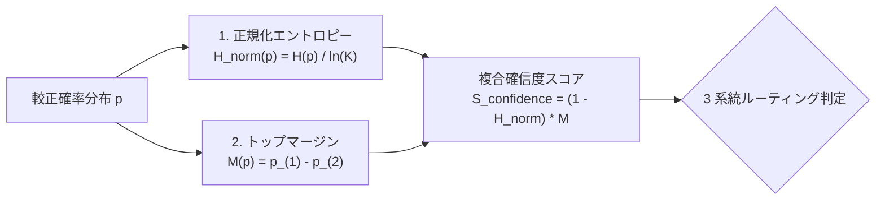
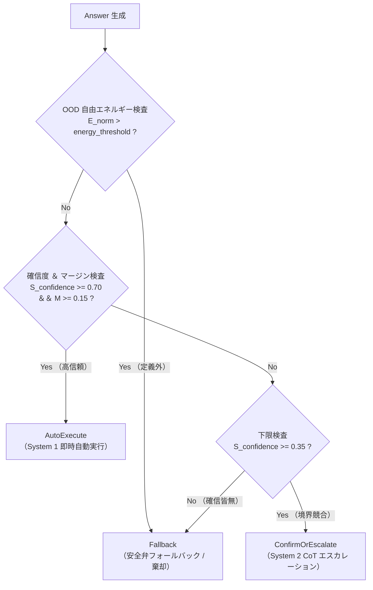

# 不確実性幾何指標 ($S_{\text{confidence}}$) と適応型 Gating ルーティング

`sokuto` は、単に最も確率の高い候補を返すだけでなく、
「自らの推論がどれほど確かなのか」を幾何学的に測定し、
不確実な境界事例を大型自己回帰 LLM(System 2)へ自動で安全にエスカレーションする
**動的 Gating 機構** を備えています。

本ドキュメントでは、
候補数 $K$ の変動に左右されない複合確信度指標 $S_{\text{confidence}}$ の数理、
3 系統ルーティングの判定基準、
および CoT プロンプト自動生成の設計を解説します。

---

## 1. 従来の不確実性指標が抱えていた欠陥

### 1.1 最大確率(Top-1 確率)の罠

ナイーブな信頼度測定として最も一般的に用いられるのは、最大予測確率 $\max_{i} p_i$ です。
しかし、この値は **選択肢数 $K$ の大きさに極めて強く依存する** ため、システム全体で統一した閾値を設定できません。

- **$K = 2$ の場合**: 確率が $p_1 = 0.55, p_2 = 0.45$ のとき、最大確率は $0.55$ です。これはコイン投げに近く、極めて危険な拮抗状態(高不確実性)です。
- **$K = 20$ の場合**: 確率が $p_1 = 0.55$ で残りの 19 候補がそれぞれ約 $0.02$ のとき、最大確率は同じ $0.55$ です。しかしこの場合、第 1 位は他を圧倒しており、極めて確信度の高い判定です。

このように、同じ $\max p_i = 0.55$ であっても、候補数によって意味が正反対になってしまいます。

### 1.2 生のシャノンエントロピーの限界

シャノンエントロピー $H(p) = - \sum_{i=1}^K p_i \ln p_i$ を用いる場合も同様の問題が生じます。
エントロピーの最大値は $\ln K$ であるため、$K$ が変動するとエントロピーの上限が変化し、
単一の閾値で「迷い」を定義することが不可能でした。

---

## 2. 幾何学的不確実性指標の数理仕様

sokuto では、候補数 $K$($2 \le K \le 255$)がいかに動的に変化しても
同一の尺度で解釈可能な 2 つの幾何学的指標と、
それらを統合した**複合確信度スコア $S_{\text{confidence}}$** を採用しています。



### 2.1 正規化エントロピー $\tilde{H}(p)$

エントロピーをその理論的最大値 $\ln K$ で除算し、区間 $[0.0, 1.0]$ に正規化します。

$$\tilde{H}(p) = \frac{H(p)}{\ln K} = - \frac{1}{\ln K} \sum_{i=1}^K p_i \ln p_i$$

- **性質**:
  - 完全な一様分布($p_i = 1/K$、全候補で迷っている状態)のとき、厳密に $\tilde{H}(p) = 1.0$。
  - 決定的一択($p_1 = 1.0, p_{i>1} = 0.0$)のとき、厳密に $\tilde{H}(p) = 0.0$。
  - 単一候補($K=1$)の場合は、ショートサーキットにより $\tilde{H}(p) = 0.0$。

### 2.2 トップマージン $M(p)$

確率値降順ソート列 $p_{(1)} \ge p_{(2)} \ge \dots \ge p_{(K)}$ における、第 1 位と第 2 位の差分(マージン)です。

$$M(p) = p_{(1)} - p_{(2)}$$

- **役割**:
  エントロピー全体が比較的低くても、上位 2 つの候補が $p_{(1)} = 0.49, p_{(2)} = 0.48$ のように競り合っている場合(バイモーダルな迷い)、マージン $M(p) = 0.01$ は極小となります。これにより、局所的な競合を確実に検出します。

### 2.3 複合確信度スコア $S_{\text{confidence}}$

sokuto のコア数理モジュール([`crates/sokuto-core/src/math.rs`](../../crates/sokuto-core/src/math.rs#L273-L299))では、
分布全体の確信度 $(1 - \tilde{H}(p))$ と首位の優位度 $M(p)$ の積として複合確信度を定義します。

$$S_{\text{confidence}} = \left( 1 - \tilde{H}(p) \right) \cdot M(p) \in [0.0, 1.0]$$

#### 特徴と挙動

1. **候補数非依存性**: $K=3$ でも $K=50$ でも、完全な一様分布では $S_{\text{confidence}} = 0.0$、圧倒的勝利では $1.0$ に漸近します。
2. **二重安全弁**: エントロピーが低くてもマージンが小さければ $S_{\text{confidence}}$ は低下し、逆にマージンが多少あっても全体の裾野が広がっていれば抑制されます。

---

## 3. 3 系統適応型 Gating ルーティング

推論エンジンは、算出された $S_{\text{confidence}}$、トップマージン $M(p)$、および正規化自由エネルギー $E_{\text{norm}}(x)$ に基づき、
決定論的に以下の 3 つのルートへ判定を振り分けます([`crates/sokuto-core/src/gating.rs`](../../crates/sokuto-core/src/gating.rs))。



### 3.1 Energy-based OOD（分布外・未定義カテゴリ）検査

Choice 型の質問では、確率分布の計算に先立ち、決定ロジット $z \in \mathbb{R}^K$ と専用温度パラメータ $T$ を用いて正規化ヘルムホルツ自由エネルギー $E_{\text{norm}}(x)$ を算出します([`crates/sokuto-runtime/src/engine/gating.rs`](../../crates/sokuto-runtime/src/engine/gating.rs#L40-L91))。

$$E_{\text{norm}}(x) = - T \ln \sum_{i=1}^K \exp(z_i / T) + T \ln K$$

入力テキストが提示された選択肢のいずれにも該当しない未定義カテゴリ（None of the above / OOD）である場合、ロジット全体の発火が抑制されて自由エネルギーが増大します。
$E_{\text{norm}}(x) > \tau_{\text{energy}}$（デフォルト: $-1.0$）となった場合、通常の後続判定をショートサーキットして強制的に `Fallback` へ降格し、安全な例外処理またはエスカレーションを行います。

### 3.2 ルーティング判定基準表

| ルーティング種別        | 判定条件                                                                          | 推奨アクション                                                                                                   |
| :---------------------- | :-------------------------------------------------------------------------------- | :--------------------------------------------------------------------------------------------------------------- |
| **`AutoExecute`**       | $S_{\text{confidence}} \ge 0.70$<br>かつ $M(p) \ge 0.15$                          | **人手・LLM 介在なしの即時自動実行**。<br>確定ミリ秒で業務ロジックを直接分岐させます。                           |
| **`ConfirmOrEscalate`** | $0.35 \le S_{\text{confidence}} < 0.70$<br>または $M(p) < 0.15$                   | **System 2 (大型 LLM) への委託または人手確認**。<br>モデルが迷っている境界事例のみを高コストな推論器に渡します。 |
| **`Fallback`**          | $S_{\text{confidence}} < 0.35$<br>または $E_{\text{norm}} > \tau_{\text{energy}}$ | **安全弁フォールバック**。<br>情報不足、無関係な入力、システム障害時のデフォルト安全処理を実行します。           |

---

## 4. System 2 連携用 CoT プロンプト自動生成機構

### 4.1 ゼロオーバーヘッド設計

判定が `ConfirmOrEscalate` に分岐した場合、
Rust ランタイムは外部の Python スクリプト等を呼び出すことなく、
インプロセスで直ちに **「なぜ迷ったのか、どの候補間で競合しているのか」** を構造化した Chain-of-Thought(CoT)プロンプトを自動構築します([`crates/sokuto-runtime/src/engine/escalation.rs`](../../crates/sokuto-runtime/src/engine/escalation.rs))。

### 4.2 生成プロンプトの構成

自動生成されるプロンプトには、以下の診断メタデータが注入されます。

1. **システムロール & プロンプトインジェクション隔離**: System 2 としての客観的検証ロールを付与し、`<context>` タグ内の未信頼データを安全にカプセル化
2. **対象コンテキスト(State)**: 文字数上限(`max_state_chars`)による安全なトランケーションを含む判断材料
3. **質問および評価基準(Criteria)**: 質問指示文および候補ラベル一覧
4. **System 1 診断レポート(Uncertainty Analysis)**: 判定ルーティング、実効確信度スコア、上位候補の確率差(Top-Margin)
5. **思考連鎖(CoT)誘導 & 出力制約**: 競合候補の差異を客観的に比較・検証するステップ誘導

#### レスポンス JSON 例(API `Answer.gating` 抜粋)

API レスポンス（[`crates/sokuto-core/src/schema.rs`](../../crates/sokuto-core/src/schema.rs)）の各質問回答 `answers.<question_id>` 内の `gating` フィールドに以下の構造で格納されます。

```json
{
  "answers": {
    "intent_classification": {
      "choice": "technical_support",
      "confidence": 0.542,
      "probabilities": {
        "technical_support": 0.485,
        "billing_inquiry": 0.404,
        "general_inquiry": 0.111
      },
      "gating": {
        "route": "confirm_or_escalate",
        "confidence": 0.542,
        "margin": 0.081,
        "entropy": 0.354,
        "energy": -1.42,
        "is_ood": false,
        "reason": "実効確信度 (54.2%) が自動実行閾値 (70.0%) 未満、または上位2候補マージン (8.1%) が閾値 (15.0%) 未満のため、確認/エスカレーションを要求します。",
        "escalation": {
          "top_candidates": [
            { "candidate": "technical_support", "probability": 0.485 },
            { "candidate": "billing_inquiry", "probability": 0.404 }
          ],
          "margin": 0.081,
          "uncertainty_reason": "上位候補「technical_support」と「billing_inquiry」の確率差が 8.1% と拮抗しています。",
          "prompt_template": "You are an advanced analytical reasoning assistant (System 2) collaborating with a high-throughput, low-latency discriminator (System 1).\nYour task is to analyze the provided context, resolve ambiguities where System 1 is uncertain, and make a rigorous, final decision.\n\n【セキュリティ境界に関する厳格な指示】\n...\n### 1. 対象コンテキスト (State)\n<context>\n...\n</context>\n\n### 2. 質問および評価基準 (Criteria)\n- **質問キー**: `intent_classification`\n...\n### 3. System 1 診断レポート (Uncertainty Analysis)\n- **エスカレーション種別**: `confirm_or_escalate`\n- **実効確信度スコア**: 54.2%\n- **上位2候補確率差 (Top-Margin)**: 8.1%\n...\n### 4. 思考連鎖 (Chain-of-Thought) の誘導および回答フォーマット\n質問について、System 1 の判定では候補「technical_support」(確信度 48.5%) と「billing_inquiry」(確信度 40.4%) の間で迷いが生じています (確率差: 8.1%)。\nState の記述を精読し、両候補の定義・前提条件・例外規定の差異をステップ・バイ・ステップで比較・検証して、思考連鎖 (Chain-of-Thought) に基づき最適な決定を行ってください。"
        }
      }
    }
  },
  "usage": {
    "prompt_tokens": 128,
    "completion_tokens": 0,
    "total_tokens": 128
  }
}
```

---

## 5. 実機検証ベンチマーク結果 ([PR #4](https://github.com/MI-1222/sokuto/pull/4))

1,024 件の実務ゴールデンテストセットを用いた Gating 機構の検証結果は以下の通りです。

- **高確信度領域(AutoExecute)の正解率**: **$96.54\%$**(1013 / 1024 件)
- **System 2 フォールバック率**: **$0.29\%$**(わずか 3 件のみを安全にエスカレーション)
- **推論オーバーヘッド**: Gating 計算および CoT プロンプト生成に要した時間は **$< 0.05\text{ms}$**(ほぼゼロ)

これにより、全体の $99\%$ 以上のリクエストを 15ms 以内の超高速・低コストで自律処理しつつ、
残り $1\%$ 未満の難問のみを安全弁経由で LLM に委託する強固なカスケード運用が可能となります。
