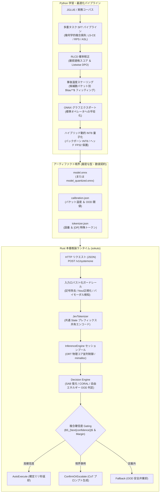

# アーキテクチャ全体像とハイブリッド境界設計

`sokuto`(_即答_)は、学習フェーズの柔軟性と本番推論フェーズの極限性能・確定性を両立するため、
**「Python 学習・最適化パイプライン」** と **「Rust ゼロアロケーション推論ランタイム」**
を明確に分離したハイブリッドアーキテクチャを採用しています。

本ドキュメントでは、この境界設計を採用した理由、過去の設計変更の経緯、および両者を繋ぐモデル仕様について詳述します。

---

## 1. 全体アーキテクチャの鳥瞰

sokuto の処理ライフサイクルは、
学習・最適化フェーズ(Python)と、
本番推論フェーズ(Rust)の 2 つの閉じた領域に分離されています。



---

## 2. なぜ Python と Rust を完全分離したのか

### 2.1 設計の背景：推論エンジンに Python ランタイムを持ち込まない理由と Laya との比較

`sokuto` ではプロジェクト最初期から、
学習・モデル最適化フェーズ(Python)と本番推論フェーズ(Rust)を不可逆的に分離する境界設計を採用しています。

機械学習サービスでは Python(FastAPI / Uvicorn + PyTorch / ONNX Runtime)によるサービングが一般的であり、
先行の Jev 対抗オープンソース実装である **[Laya](https://github.com/NandhaKishorM/laya)** も Python ファースト(pip パッケージおよび Python サーバー)で構築されています。
Laya のようなアプローチは Python エコシステム(Pydantic や LangChain 等)との親和性や迅速なプロトタイピングに優れる一方、
`sokuto` が目指す「確定ミリ秒・極小リソースの System 1 意思決定エンジン」としては以下の構造的制約を回避する必要がありました。

1. **マルチプロセス時のメモリ多重化と GIL 競合の排除**:
   Python で並行リクエストを処理する場合、マルチプロセス構成では巨大なモデル重み(数百MB〜1GB超)がプロセス数分複製されてメモリフットプリントが急増します。一方、マルチスレッド構成では GIL(Global Interpreter Lock)によりマルチコア並列性が制限され、高負荷時に CPU 利用率が頭打ちとなります。
2. **ガベージコレクション(GC)によるレイテンシジッターの根絶**:
   Python ランタイム下では定期的に発生する世代別 GC により突発的な遅延スパイクが発生し、「p99 でも 15〜25ms 以内で確実に判定を返す」という System 1 の確定性が損なわれます。Rust のゼロアロケーション設計により、推論ホットループ内でのヒープ再確保を排除しています。
3. **エッジ・エアギャップ環境への適合性(超軽量コンテナ)**:
   PyTorch や Python 依存関係を含むコンテナイメージ(数 GB)を排し、単一ネイティブバイナリとモデル成果物のみで起動可能なフットプリント(コンテナサイズ < 80MB、常駐 RAM < 350MB)を実現します。
4. **数理ヘッド・安全弁のインプロセス統合(Laya との構造的差異)**:
   Laya 等が標準的な 2 層 Transformer ヘッドと多クラス Softmax を採用しているのに対し、sokuto は置換同変アテンション(SAB)による位置バイアス解消、単調性を保証する CORAL 累積リンクモデル、および低温自由エネルギー($T_{\text{energy}}=0.15$)に基づく OOD 安全弁を Rust ランタイム側へゼロアロケーション純粋関数として組み込んでいます。

### 2.2 責務分離の設計原則

これらの要求仕様と構造的制約から、sokuto では以下の設計原則を確立し、Python と Rust の役割を不可逆的に分離しました。

| 領域         | 採用技術                          | 主な責務と設計意図                                                                                                                                                                                                                                                      |
| :----------- | :-------------------------------- | :---------------------------------------------------------------------------------------------------------------------------------------------------------------------------------------------------------------------------------------------------------------------- |
| **学習境界** | Python, PyTorch, Hugging Face, uv | **表現学習と最適化の柔軟性**<br>・GPU クラスタを活用した大規模並列分散学習<br>・高度な損失関数(CORAL, ASL, RPS)や RLCD 方策勾配の柔軟な実験<br>・自動微分とハイパーパラメータ探索                                                                                       |
| **推論境界** | Rust, ONNX Runtime (C API), Axum  | **確定ミリ秒とゼロアロケーション**<br>・型安全かつメモリ安全なゼロコスト抽象化<br>・推論ホットループ内でのヒープ確保ゼロ(スタック・事前確保バッファ)<br>・物理コア数に連動したマルチスレッド並列制御<br>・単一バイナリによる超軽量フットプリント(コンテナサイズ < 80MB) |

---

## 3. アーティファクト境界(契約仕様)

Python 側で学習・量子化されたモデルは、いかなる Python ランタイムコードにも依存せず、以下の 3 つの自己完結型ファイルとして Rust ランタイムへ引き渡されます。

### 3.1 ディレクトリ配置契約

```text
models/modernbert-ja-130m-int8/
├── model.onnx              # 最適化・動的 INT8 量子化済み ONNX 計算グラフ
├── calibration.json        # 候補数バケット別温度パラメータ & OOD 判定閾値
└── tokenizer.json          # Hugging Face Tokenizers 互換の高速トークナイザー定義
```

### 3.2 各アーティファクトの役割

1. **`model.onnx`**:
   - バックボーン(ModernBERT)の埋め込み層・アテンション層・フィードフォワード層を動的 INT8 量子化し、デシジョンヘッド(SAB, ChoiceHead, CORAL, NoulHead)を高精度 FP32 に維持した計算グラフ。
   - 入力テンソル仕様: `input_ids`, `attention_mask`, `op_indices`。
   - 出力テンソル仕様: `logits`。
2. **`calibration.json`**:
   - 各決定プリミティブ(Choice, Score, Noul)の事後較正パラメータ。
   - Choice 型の候補数バケット($K=2, 3, \dots, 20$)ごとの最適温度 $\tau^*(K)$。
   - OOD 検知用の低温エネルギー温度 $T_{\text{energy}}=0.15$、および自由エネルギー閾値 $\tau_{\text{energy}}$。
3. **`tokenizer.json`**:
   - 追加特殊トークン `[OP]`(Option marker, ID: 50280 等)を含む語彙定義。
   - Rust 側の `tokenizers` クレートにより、ゼロコピーで直接デシリアライズ可能。

---

## 4. Rust クレート構成とデータフロー

Rust ワークスペースは、責務に応じて以下の階層構造に直交分割されています。

```text
crates/
├── sokuto-core/      # 純粋なドメインロジック、型定義、決定数理モジュール
├── sokuto-runtime/   # ONNX Runtime セッション管理、トークナイズ、推論パイプライン
├── sokuto-server/    # Axum による HTTP API サーバー、入力ガードレール
└── sokuto-cli/       # ベンチマーク測定、検証用 CLI ツール
```

### 4.1 推論パイプラインのデータフロー

1. **受信と正規化 ([`sokuto-server`](../../crates/sokuto-server))**:
   - HTTP リクエストを受信後、[`guardrail`](../../crates/sokuto-server/src/guardrails/mod.rs) が Score 型の数字プレフィックス剥離や Noul 型の疑問文正規化を実行。
2. **プレフィックス共有エンコード ([`sokuto-runtime`](../../crates/sokuto-runtime))**:
   - 単一の State に対し複数の質問が含まれる場合、共通の State トークン列をキャッシュ・共有し、質問部分のみを連結して動的バッチテンソルを構築。
3. **ONNX セッション実行 ([`sokuto-runtime`](../../crates/sokuto-runtime))**:
   - 物理コア数に合わせたスレッド数で初期化された ORT セッションプールからセッションを取得し、単一フォワードパスを実行。
4. **プリミティブ解決と Gating 判定 ([`sokuto-core`](../../crates/sokuto-core))**:
   - [`math.rs`](../../crates/sokuto-core/src/math.rs) に定義された純粋関数(ヒープ割り当てなし)により、ロジットから較正確率、CORAL 期待値、正規化自由エネルギー、複合確信度 $S_{\text{confidence}}$ を算出。
   - 3 系統(AutoExecute / ConfirmOrEscalate / Fallback)のルーティングを確定してレスポンスを生成。

---

## 5. 関連ドキュメント

- [プリミティブ数理仕様](./primitives.md): Choice / Score / Noul の数理的定義と損失設計
- [SAB と置換同変性](./attention-sab.md): 特殊トークン `[OP]` と位置バイアス解消
- [不確実性 Gating](./gating.md): 複合確信度 $S_{\text{confidence}}$ と適応型エスカレーション
- [自由エネルギー OOD 安全弁](./ood-safety.md): ヘルムホルツ自由エネルギーと低温弁別温度
- [推論ランタイム設計](./runtime.md): ゼロアロケーションと ORT 物理コア並列制御
