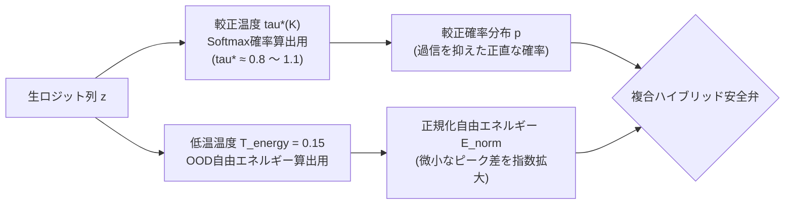

# 自由エネルギー OOD 安全弁回路と低温エネルギー温度

分類モデルや意思決定エンジンを本番環境へ配備する際、最大の脅威となるのが
**「定義されていない入力(Out-Of-Distribution: OOD)や無関係なノイズ」に対するサイレントな誤判定** です。

`sokuto` は、統計物理学のヘルムホルツ自由エネルギー理論を導入し、
候補数補正を施した「正規化自由エネルギー」と「低温エネルギー温度($T_{\text{energy}}=0.15$)」に基づく
**OOD 安全弁回路(Free Energy Safety Gating)** をランタイムに統合しています。

本ドキュメントでは、
従来の Softmax が抱える本質的欠陥、
自由エネルギーの数理的導出、
および INT8 量子化モデルにおける低温弁別のメカニズムを解説します。

---

## 1. 従来の Softmax が抱える本質的欠陥

### 1.1 閉世界仮説(Closed-World Assumption)の弊害

一般的なニューラルネットワークの Softmax 出力層は、
すべての候補確率の総和が厳密に 1.0 になるよう制約されています($\sum_{i=1}^K p_i = 1$)。

$$p_i = \frac{\exp(z_i)}{\sum_{j=1}^K \exp(z_j)}$$

この構造は「入力は必ず事前に定義された $K$ 個の選択肢のいずれかに該当する」という閉世界仮説を前提としています。

そのため、
全く無関係な文章(例：問い合わせ分類モデルに「今日の天気を教えて」と入力する等)や、
悪意ある敵対的ノイズが入力された場合でも、
**「総和が 1 にならなければならない」という数学的強制力により、いずれかの選択肢に過剰な確信度($80\% \sim 95\%$ 等)を割り振ってしまう**
という致命的な弱点を抱えています。

### 1.2 なぜ確率値(Probability)だけでは OOD を弾けないのか

確率値 $p_i$ は、ロジットベクトル $\mathbf{z}$ の
**相対的な比率** のみを表しており、
**「そもそも入力がこのタスクの分布内に存在するか」という絶対的な適合度(親和性)**
の情報を完全に失っています。

- 分布内データ(ID: In-Distribution): ロジットが $\mathbf{z} = [12.0, 4.0, 3.0]$ $\to$ Top-1 確率は $99.9\%$
- 分布外データ(OOD): ロジットが $\mathbf{z} = [-2.0, -10.0, -11.0]$ $\to$ Top-1 確率は同じく $99.9\%$

後者のように、すべての選択肢に対して否定的な負のロジットしか得られていない場合であっても、
Softmax 正規化を通すと「$99.9\%$ の高確信度で候補 1」と判定されてしまいます。

---

## 2. ヘルムホルツ自由エネルギーの数理的導出

### 2.1 統計物理学からのアプローチ

統計物理学において、
エネルギー準位 $\epsilon_i$ を持つカノニカル分布の分配関数 $Z$ とヘルムホルツ自由エネルギー $F$ は、
温度 $T$ を用いて以下のように定義されます。

$$Z = \sum_{i} \exp\left( - \frac{\epsilon_i}{T} \right), \quad F = - T \ln Z$$

ディープラーニングの分類モデルにおいて、
ロジット $z_i$ を負のエネルギー(親和度)$-\epsilon_i$ とみなすと([Liu et al., NeurIPS 2020](https://arxiv.org/abs/2010.03759v4))、
入力データ $x$ に対する自由エネルギー $E(x; T)$ は
以下の対数和指数関数(Log-Sum-Exp)として自然に導出されます。

$$E(x; T) = - T \ln \sum_{i=1}^K \exp\left( \frac{z_i}{T} \right)$$

### 2.2 自由エネルギーが OOD を弁別できる理由

1. **分布内データ(In-Distribution)**:
   入力 $x$ が既知のパターンに適合している場合、特定のロジット $z_{\text{target}}$ が大きな正の値をとります。その結果、$\sum \exp(z_i / T)$ は非常に巨大な値となり、符号が反転した自由エネルギー $E(x; T)$ は **極めて低い負の値(例: $-15 \sim -5$)** をとります。
2. **分布外データ(OOD / 該当なし)**:
   入力 $x$ がどの選択肢にも当てはまらない場合、エンコーダはいかなる特徴量も活性化できず、すべてのロジット $z_i$ は低い値に留まります。その結果、対数和は小さくなり、自由エネルギー $E(x; T)$ は **高い値(例: $-2 \sim +5$)** をとります。

このように、自由エネルギーは確率のような「相対比」ではなく、
モデルの入力に対する「絶対的な確信の総量」を直接反映するため、
確信度が高そうに見える OOD を明瞭に分離できます。

---

## 3. 候補数バイアスを排除する「正規化自由エネルギー」

### 3.1 候補数 $K$ による基底エネルギー偏向

単純な自由エネルギーの数式には、実務上の重大な課題がありました。

仮に全ロジットが同一の定数 $c$(完全な迷い)である場合を考えると、自由エネルギーは以下のようになります。

$$E(x; T) = - T \ln \sum_{i=1}^K \exp\left(\frac{c}{T}\right) = -c - T \ln K$$

すなわち、**候補数 $K$ が増加するだけで、自由エネルギーは理論的に $-T \ln K$ だけ自然低下** してしまいます。
これでは、質問ごとに選択肢数 $K$($2 \le K \le 50$)が動的に変動する sokuto において、
単一の固定閾値で OOD を判定することができません。

### 3.2 正規化自由エネルギー $E_{\text{norm}}$ の定式化

sokuto([`crates/sokuto-core/src/math.rs`](../../crates/sokuto-core/src/math.rs#L654-L681))では、
候補数による自然低下分 $T \ln K$ を補正した
**正規化自由エネルギー $E_{\text{norm}}$**
を採用しています。

$$E_{\text{norm}}(x; C) = E(x; T) + T \ln K = - T \ln\left( \frac{1}{K} \sum_{i=1}^K \exp\left(\frac{z_i}{T}\right) \right)$$

#### 数値安定な実装(Max-Trick)

極端に大きなロジットによる浮動小数点のオーバーフローを防ぐため、
最大ロジット $z_{\max} = \max_j z_j$ を用いて計算されます。

$$E_{\text{norm}}(x; C) = - z_{\max} - T \ln\left( \frac{1}{K} \sum_{i=1}^K \exp\left(\frac{z_i - z_{\max}}{T}\right) \right)$$

- 全ロジットが $0.0$ のとき、厳密に $E_{\text{norm}} = 0.0$。
- 候補数 $K$ に左右されず、単一の閾値 $\tau_{\text{energy}}$(デフォルト: $-1.0$)で安定して OOD を棄却可能。

---

## 4. 低温エネルギー温度 $T_{\text{energy}}=0.15$ の導出

### 4.1 INT8 量子化によるロジットスケール圧縮の罠 ([PR #6](https://github.com/MI-1222/sokuto/pull/6))

sokuto の開発過程([PR #6](https://github.com/MI-1222/sokuto/pull/6))において、
モデルを動的 INT8 量子化(特に Tier 2: 310M)した際、深刻な問題に直面しました。

FP32 モデルでは良好に機能していた OOD 検知が、INT8 量子化モデルでは
**分布内データの自由エネルギーと OOD データの自由エネルギーの差(分離マージン)が極端に縮小し、AUROC(判別能)が 58.2% へ急落する** 現象が発生しました。

#### 原因：Softmax 較正温度の流用と量子化による圧縮

根本原因は、**「Softmax 確率較正用の温度($T_{\text{calib}} \approx 1.0 \sim 1.4$)をそのまま自由エネルギー計算に流用していたこと」** にありました。

1. **温度の役割の不一致**:
   確率較正用温度 $T_{\text{calib}}$ の役割は、モデルの過信(Overconfidence)を緩和して予測確率を実際の確信度に近づけること(ECE 最小化)です。そのため $T \ge 1.0$ と高めに設定されます。
   しかし、この高温を自由エネルギー計算に流用すると、対数和(Log-Sum-Exp)の中でロジットが過剰に平滑化されてしまい、エントロピー項($-T \ln K$)が支配的になってしまいます。
2. **モデル規模と INT8 量子化の固有差**:
   12層の Tier 1 (130M) では量子化後も十分なロジットマージンが保たれ $T \approx 1.0$ で AUROC 97.6% を達成できていました。
   一方、24層の Tier 2 (310M) では表現力が高い反面、INT8 動的量子化に伴う重みクリッピングと丸め誤差が層間で蓄積し、出力される生ロジットのダイナミックレンジ(絶対値スケール)が圧縮されやすい特性があります。
   この平坦化したロジット空間に $T \ge 1.0$ を適用したことで、ID の単一突出ピークとOOD の全候補平坦ロジットのエネルギー差が完全に均されてしまっていました。

### 4.2 低温弁別温度の導入と関心事の分離(Decoupling)

この問題を解決するため、sokuto では
**「確率較正用温度 $T_{\text{calib}}$」** と **「OOD 弁別用エネルギー温度 $T_{\text{energy}}$」** を物理的・型レベルで完全に切り離す **関心事の分離(Decoupling)** を行い、
OOD 判定専用の **「低温エネルギー温度」 $T_{\text{energy}} = 0.15$** を導入しました。



#### 2系統に分離すべき理由(相反する要請)

| 比較項目             | Softmax 確率算出用 ($T_{\text{calib}}$)                     | OOD 自由エネルギー算出用 ($T_{\text{energy}} = 0.15$)    |
| :------------------- | :---------------------------------------------------------- | :------------------------------------------------------- |
| **主目的**           | 確率の正直さ(期待較正誤差 ECE の最小化)                     | 分布内・分布外の峻別(AUROC の最大化)                     |
| **温度の要請**       | ロジットを適度に平滑化するため **$T \approx 1.0 \sim 1.1$** | ロジットの微小差を急峻に拡大するため **$T \le 0.2$**     |
| **仮に統一した場合** | $T=0.15$ を使うと確率が One-hot 化し、重度の過信が発生      | $T=1.0$ を使うと ID/OOD 間のエネルギー差が均され検知不能 |

### 4.3 低温化がもたらす数理的メカニズム

温度パラメータ $T \to 0$ の極限において、正規化自由エネルギーの対数和指数関数は**急峻な最大ロジット($\max_i z_i$)の近似関数**へと遷移します。

$$\lim_{T \to 0^+} \left[ - T \ln\left( \frac{1}{K} \sum_{i=1}^K \exp\left(\frac{z_i}{T}\right) \right) \right] = - \max_{1 \le i \le K} z_i$$

$T_{\text{energy}} = 0.15$ という極めて低い温度を分母に置くことで、指数関数 $\exp(z_i / 0.15)$ を通じて上位候補の微小な差が急激に拡大されます。

- **適合入力 (ID: In-Distribution)**:
  いずれか 1 つの候補がタスクに適合して突出($z_{\max} > 0$)している場合：
  $$\exp\left(\frac{z_{\max}}{0.15}\right) \gg \sum_{j \ne \max} \exp\left(\frac{z_j}{0.15}\right)$$
  対数和が巨大化し、符号反転によって **$E_{\text{norm}} \approx -z_{\max}$ (低エネルギー・負の大きな値、例: $-5 \sim -1$)** となります。
- **未定義・未知入力 (OOD: Out-of-Distribution)**:
  すべての選択肢が不適合であり、全ロジットが沈んでいる($z_i \le 0$)場合：
  指数関数による拡大が起きず、対数和が小さいため **$E_{\text{norm}} \approx -\max z_i$ (高エネルギー・正またはゼロ近傍の値、例: $+0.5 \sim +2.0$)** に留まります。

この効果により、INT8 量子化によって圧縮されていたロジット空間においても、
ID と OOD の間に **圧倒的なエネルギー分離マージン($\Delta E$)が再構築** され、
Tier 2 (310M-INT8) の AUROC を 58.2% から **80.5%** へと劇的に引き上げることに成功しました。

---

## 5. 確信度・マージン複合ハイブリッド安全弁

### 5.1 二段階防壁(ハード遮断 ＋ 複合ハイブリッド遮断)

単一のエネルギー閾値のみに頼ると、
極端な OOD 入力に対する即時遮断と、境界領域における「迷い」の弁別の両立が難しくなる場合があります。

そこで、sokuto コア([`crates/sokuto-core/src/gating.rs`](../../crates/sokuto-core/src/gating.rs#L442-L478))およびランタイム([`crates/sokuto-runtime/src/engine/gating.rs`](../../crates/sokuto-runtime/src/engine/gating.rs))では、
以下の **二段階防壁 (Two-Stage Circuit Breaker)** により OOD を確定判定します。

1. **ハード遮断 (Hard Energy OOD)**:
   正規化自由エネルギー $E_{\text{norm}}$ が厳格閾値 `energy_threshold`(デフォルト: $-1.0$、310M-INT8: $1.0$)を超過した場合、確信度やマージンに関わらず無条件で `DecisionRoute::Fallback` へ即時短絡する。
2. **ハイブリッド遮断 (Hybrid Uncertainty OOD)**:
   緩和エネルギー閾値 `loose_energy_threshold`(310M-INT8: $0.2$)を超過し、かつ「確信度不足 (`conf < ood_min_confidence`)」または「上位マージン不足 (`margin < ood_min_margin`)」のいずれかを満たす場合、グレーゾーンの異常入力として `DecisionRoute::Fallback` を適用する。

```rust
// crates/sokuto-core/src/gating.rs より抜粋・整理
let (is_ood, ood_reason) = if config.ood_enabled && is_choice {
    if let Some(e) = energy {
        // 1. ハード遮断: 自由エネルギーが厳格閾値を超過した場合は即時短絡
        let is_hard_energy_ood = e > config.energy_threshold;

        // 2. ハイブリッド遮断: 緩和エネルギー閾値超過 ＋ 確信度・マージン不足
        let is_hybrid_ood = if let (Some(loose_th), Some(min_conf), Some(min_margin)) = (
            config.loose_energy_threshold,
            config.ood_min_confidence,
            config.ood_min_margin,
        ) {
            let m = margin.unwrap_or(0.0);
            e > loose_th && (conf < min_conf || m < min_margin)
        } else {
            false
        };

        if is_hard_energy_ood || is_hybrid_ood {
            (true, Some("..."))
        } else {
            (false, None)
        }
    } else {
        (false, None)
    }
} else {
    (false, None)
};

// OOD 確定時は強制的に Fallback ルートへ短絡
if is_ood {
    meta.route = DecisionRoute::Fallback;
}
```

### 5.2 実機検証性能(ベンチマーク抜粋)

OOD テストセット(未定義カテゴリ、全く無関係な長文、記号ノイズ等)を用いた実測ベンチマーク結果は
以下の通りです。

| モデル Tier            | OOD 検知率   | AUROC(弁別曲線下面積)             | INT8 精度劣化 | 判定レイテンシ    |
| :--------------------- | :----------- | :-------------------------------- | :------------ | :---------------- |
| **Tier 1 (130M-INT8)** | **$92.3\%$** | **$97.6\%$**                      | $\le 0.1\%$   | $< 0.02\text{ms}$ |
| **Tier 2 (310M-INT8)** | **$92.3\%$** | **$80.5\%$** (低温化前: $58.2\%$) | $\le 0.1\%$   | $< 0.02\text{ms}$ |

低温エネルギー温度 $T_{\text{energy}}=0.15$ と正規化自由エネルギーの組み合わせにより、
未定義入力に対する堅牢な安全弁がミリ秒未満の計算オーバーヘッドで稼働しています。
