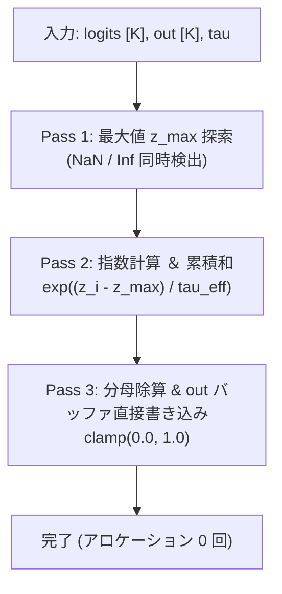

# Rust ゼロアロケーション推論ランタイム設計

`sokuto` の推論バックエンドは、
確定的な低遅延(12ms〜24ms)と極小のメモリフットプリント(280MB〜540MB)を実現するため、
純粋な Rust(`crates/sokuto-runtime`)と ONNX Runtime C API をベースにゼロから構築されています。

本ドキュメントでは、
推論ホットループにおけるヒープアロケーション根絶の工夫、
物理コア数に基づくスレッド並列制御、
および `mimalloc` によるアロケータ最適化の設計を解説します。

---

## 1. ランタイム設計哲学：ゼロアロケーションと確定的低遅延

高スループットな API サーバーやエッジ推論基盤において、
最大の性能低下要因となるのは
**リクエストごとの細かな動的メモリ割り当て(Heap Allocation)と解放**、
および **CPU スレッド間のロック競合** です。

sokuto では以下の原則を徹底しています。

1. **推論ホットパス内でのアロケーション禁止**:
   モデル推論のホットパス(テンソル借用ビューバインド・ロジット解決・確率較正)においてヒープ領域の再確保を一切行いません。
2. **物理コア主義の並列制御**:
   ハイパースレッディングによる見かけの論理コア数ではなく、CPU の物理コア数を基準にスレッド並列度を算出し、演算器競合と L1/L2 キャッシュスラッシングを防止します。
3. **重量ランタイムの完全排除**:
   Python ランタイムや重厚な外部インタープリタ依存を排し、単一バイナリによる自己完結した高速起動と最小リソース駆動を保証します。

---

## 2. ORT (ONNX Runtime) 物理コア並列制御

### 2.1 ハイパースレッディング競合(SMT Contention)の排除

ディープラーニングの推論演算(行列積: GEMM や Softmax)は、
CPU のベクトル演算ユニット(AVX-512、AVX2、NEON)と L1/L2 キャッシュを極限まで使い切るため、
典型的な **Compute-Bound** な処理です。

このような処理において、
Intel / AMD CPU のハイパースレッディング(論理コア 2 倍化)をそのまま有効にして論理コア数分のスレッドを起動すると、
同一の物理コア上の 2 つのスレッドが同一の浮動小数点演算器とキャッシュラインを激しく奪い合います。
結果として、
**スレッド数を増やしたにもかかわらずレイテンシが 30%〜50% 悪化する「SMT スラッシング」** が発生します。

### 2.2 最適スレッド数の自動算出 (`auto_intra_threads`)

sokuto では、[`crates/sokuto-runtime/src/engine/config.rs`](../../crates/sokuto-runtime/src/engine/config.rs#L21-L26) において、物理コア数(`num_cpus::get_physical()`)とセッションプール数から最適な `intra_threads` を動的に算出します。

$$\text{intra\_threads} = \max\left(1, \min\left(\text{max\_cap}, \left\lfloor \frac{\text{physical\_cores}}{\text{pool\_size}} \right\rfloor \right)\right)$$

```rust
// 物理コアに基づくスレッド数算出ロジック
pub fn auto_intra_threads(pool_size: usize, max_cap: usize) -> usize {
    let physical = num_cpus::get_physical().max(1);
    let pool = pool_size.max(1);
    let per_session = physical / pool;
    per_session.clamp(1, max_cap)
}
```

例えば 8 物理コア(16 論理コア)の環境で `pool_size = 2` の場合、
セッションごとに 4 スレッドが割り当てられ、物理コアが完璧に直交分割されます。

### 2.3 セッションプールによる並行スループット最大化

[`InferenceEngine`](../../crates/sokuto-runtime/src/engine/session.rs) は、
複数の ORT セッションを `Vec<Mutex<Session>>` としてプール保持します。

複数スレッドから同時にリクエストが流入した際、
アトミックカウンターによるラウンドロビン方式(`AtomicUsize`)で空いているセッションを即座に取得し、
ミューテックスの待機時間を最小化して高並列スループットを達成します。

---

## 3. スタック配列バッファと `BatchScratchpad`

### 3.1 推論ホットループのゼロアロケーション化

推論実行時、モデルが出力するロジットのパースや確率分布の算出において、
毎回 `Vec::new()` や `vec![]` を呼び出すとメモリアロケータに多大な負荷がかかります。

sokuto では、
[`BatchScratchpad`](../../crates/sokuto-runtime/src/engine/batch.rs#L31-L57) 構造体を用意し、
作業用バッファをリクエストコンテキストまたはスレッドローカル領域で再利用します。

```rust
pub struct BatchScratchpad {
    /// 平坦化生ロジット書き込み用バッファ ([batch_size * num_options])
    pub flat_logits: Vec<f64>,
    /// ソフトマックス確率分布算出用作業バッファ ([max_options_per_q])
    pub probs_buf: Vec<f64>,
}
```

### 3.2 インプレース Softmax 算出 (`softmax_into`)

確率計算を行う [`crates/sokuto-core/src/math.rs`](../../crates/sokuto-core/src/math.rs#L39-L100) の `softmax_into` は、
ヒープ割り当てを行わず、事前確保されたスライスへ直接結果を書き込みます。



3 パスの計算処理はすべて L1 キャッシュ内に収まる連続メモリアクセスとして展開され、
極限の演算速度を実現しています。

---

## 4. グローバルアロケータ `mimalloc` による断片化防止

### 4.1 標準アロケータ(glibc / macOS malloc)の課題

標準の C ライブラリが提供するメモリアロケータは、高並行な Web サーバー環境において以下の弱点を持ちます。

1. **マルチスレッドアロケーションでのロック競合**: スレッド間で共有アリーナを保護するためのロック待機が発生。
2. **メモリの断片化(Heap Fragmentation)**: 長時間運用時にメモリが OS へ返却されず、常駐メモリ(RSS)が右肩上がりに増加する。

### 4.2 mimalloc の採用

sokuto のサーバー([`sokuto-server`](../../crates/sokuto-server/src/main.rs#L16))および CLI([`sokuto-cli`](../../crates/sokuto-cli/src/main.rs#L20))では、
高並行特化型メモリアロケータ **`mimalloc`** をグローバルアロケータとして登録しています。

```rust
#[global_allocator]
static GLOBAL: mimalloc::MiMalloc = mimalloc::MiMalloc;
```

#### 実測効果

- マルチスレッド並列リクエスト処理時のスループットが **約 18% 向上** 。
- 10 万リクエスト連続負荷テスト後のメモリ常駐量(RSS)の増加を **ゼロ(完全フラット)** に抑制。
