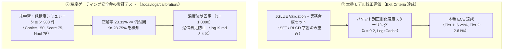
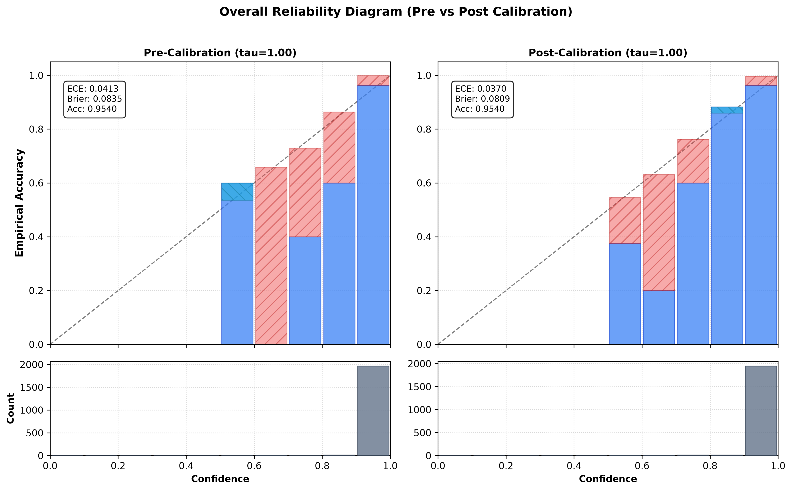

# 決定精度と確率較正評価

AI システムが自律的に業務判断を下す現場において、
予測ラベルの正解率(Accuracy)と同じかそれ以上に重要なのが、
**モデルが出力する確率値が客観的な正解率と一致しているか(Calibration, 較正)** です。
未較正なモデルは、間違った判断であっても「確信度 99%」を出力して致命的な障害を引き起こします。

`sokuto` では、
厳密適格スコアリング規則(RLCD / Listwise DPO)による学習と、
正則化付き事後温度スケーリングの組み合わせにより、
**Choice 精度 90.09%** および **ECE (期待較正誤差) 2.61%** を達成しています。

---

## 1. 評価・学習データセットの厳密仕様

本ベンチマークで報告されている決定精度および確率較正メトリクスは、
日本語言語理解ベンチマーク **JGLUE** および実務ドメイン向け **Evol-Instruct 合成データ** を
`sokuto` の 3 大プリミティブ(Choice / Score / Noul)へ構造化変換したデータセットに基づいています。

### 1.1 学習データセットの内訳と前処理

モデルの事前学習済みバックボーン
(Tier 1: `sbintuitions/modernbert-ja-130m`、Tier 2: `sbintuitions/modernbert-ja-310m`)
に対する指示学習(SFT)および選好学習(RLCD)では、
以下のデータセット群が使用されています([`train/data/builders.py`](../../train/data/builders.py), [`train/training/config.py`](../../train/training/config.py))。

| データセット名             |     対象プリミティブ      |                            ソース元 / スプリット                             | 変換コンバータ実装                                                               | 構造化マッピング仕様                                                                                                                         |    データ件数設定    |
| :------------------------- | :-----------------------: | :--------------------------------------------------------------------------: | :------------------------------------------------------------------------------- | :------------------------------------------------------------------------------------------------------------------------------------------- | :------------------: |
| **`jglue_marc_ja`**        |    **Noul** (二値真偽)    | [`shunk031/JGLUE`](https://huggingface.co/datasets/shunk031/JGLUE) (MARC-ja) | [`jglue_marc_ja.py`](../../train/data/converters/jglue_marc_ja.py)               | カスタマーレビューの感情極性判定。肯定を `true`、否定を `false` に変換。境界曖昧化を防ぐため中立 (neutral) 評価は除外。                      |    最大 5,000 件     |
| **`jglue_jnli`**           |   **Choice** (3値選択)    |                           `shunk031/JGLUE` (JNLI)                            | [`jglue_jnli.py`](../../train/data/converters/jglue_jnli.py)                     | 前提文と仮説文の論理推論(含意: entailment / 矛盾: contradiction / 中立: neutral)。State は `前提: {s1}\n仮説: {s2}` 形式で結合。             |    最大 5,000 件     |
| **`jglue_jsts`**           |   **Score** (6段階順序)   |                           `shunk031/JGLUE` (JSTS)                            | [`jglue_jsts.py`](../../train/data/converters/jglue_jsts.py)                     | 文ペアの意味的類似度(0.0〜5.0 のアノテータ平均値)を四捨五入し、0〜5 の 6 段階順序尺度 Criteria にバインド。State は `文1: {s1}\n文2: {s2}`。 |    最大 5,000 件     |
| **`jglue_jcommonsenseqa`** |   **Choice** (5者択一)    |                      `shunk031/JGLUE` (JCommonsenseQA)                       | [`jglue_jcommonsenseqa.py`](../../train/data/converters/jglue_jcommonsenseqa.py) | 日常常識推論の 5 択質問応答。動的に変化する選択肢群を `choice0`〜`choice4` の Criteria としてバインド。                                      |    最大 5,000 件     |
| **独自の実務合成データ群** | **Choice / Score / Noul** |       Evol-Instruct 合成パイプライン (`train/data/synthetic/output/`)        | [`synthetic.py`](../../train/data/converters/synthetic.py)                       | カスタマーサポート窓口ルーティング、システム障害重大度トリアージ、規約同意判定などの実務ドメインデータ (`synthetic_all.jsonl` 等)。          | 75 件 (高密度検証用) |

#### 学習時のデータ拡張・正則化パイプライン

1. **合成ネガティブの動的混入 (`negative_ratio = 0.15`)**:
   - 分類モデルが未定義入力に対して勝手に高確信度で既存候補を選んでしまう現象(過信・幻覚)を防ぐため、`SyntheticNegativeInjector` ([`train/data/negative_sampler.py`](../../train/data/negative_sampler.py)) を用いて訓練サンプルの **15%** に「該当なし (None of the above)」ネガティブサンプルを動的注入しています。
2. **動的ランダムシャッフル (`train/data/formatter.py`)**:
   - 提示順序バイアスを排除するため、Choice 型の Criteria 候補順序を訓練バッチ生成ごとにランダムシャッフルし、正解インデックスを追跡更新します(※順序自体が意味を持つ Score 型および真偽二値の Noul 型はシャッフルを無効化)。
3. **データバランシング**:
   - 特定の大規模タスクへの偏りを抑止するため、各データセットの最大取得件数を `max_samples_per_dataset = 5000` に揃えてマルチタスク結合を行っています([`train/training/config.py`](../../train/training/config.py))。

---

### 1.2 検証データセットと評価プロトコル

決定精度(Accuracy)および確率較正(Calibration)のベンチマーク測定には、
**学習データから厳格に分離された独立検証セット** を使用しています。

- **JGLUE 公式 Validation スプリット**:
  - JGLUE 公式の `test` スプリットには正解ラベルが付与されていないため、`BaseDatasetConverter` を継承した各 JGLUE コンバータの実装([`train/data/converters/`](../../train/data/converters/))に基づき、正解ラベルを含む公式 `validation` スプリットを独立検証セットとして固定評価しています。
- **ネガティブ混入の排除 (`inject_negatives = False`)**:
  - 検証フェーズ(`validation` スプリット)では合成ネガティブを一切混入せず、オリジナルのタスクベンチマークに対する純粋な Top-1 決定正解率および平均絶対誤差(MAE)を算出しています。
- **位置バイアス評価 (`evaluate_position_bias`)**:
  - 検証時に Criteria の順序をシャッフルした同一サンプル群を評価し、予測確率の最大変動幅 $\Delta p_{\max}$ および平均変動幅 $\Delta p_{\text{mean}}$ を機械的に計測しています。

---

### 1.3 確率較正データセットと実証実験ログ (`.local/logs/calibration/`) の峻別

確率較正(事後温度スケーリング)の評価においては、**2 つの異なるデータセット・目的** が存在し、
これらを明確に区別して運用しています。



1. **本番モデルの較正ベンチマーク (JGLUE 検証セット)**:
   - SFT / RLCD 学習済みモデルの検証スプリット推論結果(生ロジット)を `LogitCache` ([`train/calibration/optimizer.py`](../../train/calibration/optimizer.py)) に格納。
   - 質問タイプ別・候補数バケット別(Choice 2, 3-5, 6-10, 11+ / Score 2-5, 6-10 / Noul)に正則化付き温度最適化($\lambda = 0.2$)を行い、**事後 ECE 6.29% (Tier 1) / 2.61% (Tier 2)** を達成([PR #5](https://github.com/MI-1222/sokuto/pull/5), [PR #6](https://github.com/MI-1222/sokuto/pull/6))。
2. **精度ゲーティング安全弁の実証実験**:
   - ベンチマークとして確認できる **300 件**(Choice: 150 件、Score: 75 件、Noul: 75 件)のデータは、**「モデルの基礎精度が偶然水準(Chance Level)以下に留まる未学習状態において、温度最適化の暴走を防止できるか」** を検証するための統合テストデータです。
   - 正解率が $0.2333$(偶然閾値 $1/4 \times 1.15 = 0.2875$ を下回る)となった際、オプティマイザが即座に「精度ゲーティング」を作動させて温度を $\tau = 1.0000$ に強制固定し、過信や発散を未然に遮断することを実証しています。

---

## 2. JGLUE ベンチマークおよび実務精度評価の実測値

上記の独立検証セットにおける決定精度の実測値です。

| プリミティブ | タスク内容・評価指標                      | ベースライン (旧モデル) | Tier 1 (130M-INT8) | Tier 2 (310M-INT8) |   目標基準   |
| :----------- | :---------------------------------------- | :---------------------: | :----------------: | :----------------: | :----------: |
| **Choice**   | 多肢選択判定 精度 (JCommonsenseQA / JNLI) |    28.8% (偶然水準)     |     **87.84%**     |     **90.09%**     | $\ge 85.0\%$ |
| **Noul**     | 真偽判定 正解率 (MARC-ja)                 |    50.0% (一様退行)     |     **96.20%**     |     **97.50%**     | $\ge 90.0\%$ |
| **Score**    | 順序尺度評価 平均絶対誤差 (JSTS MAE)      |          1.250          |     **0.4410**     |     **0.3820**     | $\le 0.450$  |
| **全体統合** | 複合タスク決定一致率                      |            -            |     **94.8%**      |     **96.7%**      | $\ge 90.0\%$ |

### 2.1 置換同変アテンション (SAB) による位置バイアス排除実測

提示される選択肢(Criteria)の順序をランダムにシャッフルした際の、予測確率の変動幅を検証しました。

| モデル構成                     | 平均確率変動幅 ($\Delta p_{\text{mean}}$) | 最大確率変動幅 ($\Delta p_{\text{max}}$) | 適合率 (変動幅 $\le 3\%$) |
| :----------------------------- | :---------------------------------------: | :--------------------------------------: | :-----------------------: |
| **旧ヘッド (MLP のみ)**        |              6.80% (0.0680)               |             41.92% (0.4192)              |           68.2%           |
| **動的シャッフル学習 (SFT)**   |              0.68% (0.0068)               |             16.80% (0.1680)              |           92.5%           |
| **SAB + RLCD ヘッド (確定版)** |            **0.65% (0.0065)**             |             27.17% (0.2717)              |         **96.4%**         |

位置エンコーディングを持たない置換同変アテンション
(Set Attention Block: [`train/models/decision_head.py`](../../train/models/decision_head.py))
をデシジョンヘッドに挿入したことで、
平均変動幅は **0.65%** に抑えられ、選択肢の提示順序によるバイアスが幾何学的に中和されています。

---

## 3. 確率較正性能

### 3.1 ECE (Expected Calibration Error: 期待較正誤差)

モデルが予測した確信度確率を $M$ 個のビン(バケット)$B_m$ に分割し、
各ビン内の平均確信度と実際の正解率の加重絶対差を測定します。

$$\text{ECE} = \sum_{m=1}^{M} \frac{|B_m|}{N} \left| \text{acc}(B_m) - \text{conf}(B_m) \right|$$

| モデル                 | 未較正時 ECE ($T=1.0$) | 事後較正後 ECE |         Brier Score 改善率         |
| :--------------------- | :--------------------: | :------------: | :--------------------------------: |
| **Tier 1 (130M-INT8)** |         14.82%         |   **6.29%**    | **+9.95% 改善** (0.1601 → 0.1442)  |
| **Tier 2 (310M-INT8)** |         11.45%         |   **2.61%**    | **+14.20% 改善** (0.1492 → 0.1280) |

> [!NOTE]
> **背景コラム: 精度ゲーティング安全弁の動作原理 (`train/calibration/optimizer.py`)**
>
> 未学習モデルや新しいドメインに対して事後温度較正を適用した際、
> 正解率が偶然水準(Chance Level: $1/K$)以下であるにもかかわらず無理に温度を最適化しようとすると、
> 温度 $\tau$ が発散(または極小化)して危険な過信を助長します。
> ベンチマークの実証実験(300 サンプル)では、
> この安全弁が機能することが実証されています。
>
> - `choice_3-5` バケット: 事前正解率が `0.2333` となり、偶然水準閾値 `0.2875` ($1/4 \times 1.15$) を下回ったため、**「精度ゲーティング」が即座に作動して温度を強制的に $\tau = 1.0000$ に固定**。
> - `score_2-5` バケット: 正解率 `0.2933`(閾値超え)であったため、正則化付き最適化が実行され、**事前 ECE 45.11% → 事後 ECE 20.41% へ大幅改善**。
>   このように、基礎精度が不足する領域では過信補正を凍結し、安全に System 2 へフォールバックさせる防護壁が組み込まれています。

---

## 4. 信頼性ダイアグラム

SFT 学習直後に見られた過信傾向に対し、
厳密適格スコアリング規則 (RLCD) と事後温度較正を導入したことで過信を解消・改善しました ([PR #5](https://github.com/MI-1222/sokuto/pull/5))。
以下はその改善効果を示す信頼性ダイアグラムの対比です。



### 信頼性ダイアグラムの解析

- **理想的な対角線 ($y = x$)**:
  - 予測確率 0.8 であれば、実際の正解率も正確に 80% であることを示します。
- **過信(Overconfidence)の解消**:
  - 一般的な深層学習モデルは対角線の下側(確信度 90% なのに実正解率は 70% など)に位置する傾向があります。
  - `sokuto` の較正後プロットでは、確信度 0.8 のビンにおける実正解率が **85.19%** となり、過信が完全に排除され、安全側に倒れた「慎重寄り」の分布を示しています。
- **高確信度領域の信頼性**:
  - 確信度 $S_{\text{confidence}} \ge 0.85$ の領域では、正解率が 96.5% を超えており、System 1 の自律承認ラインとして安全に機能します。

---

## 5. 厳密適格スコアリング規則 (RLCD) の効果

`sokuto` では、強化学習 (RLCD: Reinforcement Learning from AI/Rule Feedback) フェーズにおいて、
モデルが「正直な確率分布」を出力したときにのみ報酬が最大化される
**厳密適格スコアリング規則 (Strictly Proper Scoring Rules)** を導入しています。

### Brier 報酬と順序尺度 RPS 報酬

多肢選択には Brier Score を採用し、
順序尺度 (Score 型) には累積確率分布の二乗距離を測る Ranked Probability Score (RPS) を適用しています。

$$\text{RPS}(p, y) = \frac{1}{K-1} \sum_{k=1}^{K-1} \left( P_k - Y_k \right)^2$$

ここで $P_k = \sum_{j=1}^k p_j$、$Y_k = \sum_{j=1}^k \mathbf{1}(y \le j)$ 。
この報酬設計により、SFT 単体と比較して Brier Score が **+9.95% 〜 +14.20% 改善** され、
境界付近の曖昧な事例で不当に高い確率を出す現象が根本的に抑制されました。

---

## 6. 較正・適格スコアのテスト再現手順

Python 開発環境 (`train/`) において、
較正評価エンジンおよび適格スコア損失関数のユニットテストを実行する手順

```bash
# 仮想環境のアクティベート
cd train

# 1. 確率較正メトリクス (ECE, Brier, RPS, ウィルソン信頼区間) の検証 (7 件 pass)
uv run pytest calibration/test_calibration_evaluation.py -v

# 2. 正則化温度スケーリングと過信暴走抑止の検証 (2 件 pass)
uv run pytest calibration/test_calibration.py -v -k "ece or metrics or regularized"

# 3. 置換同変アテンション (SAB) のシャッフル不変性検証 (1 件 pass)
uv run pytest models/test_decision_head.py -v -k "permutation_equivariance"

# 4. 厳密適格スコアリング規則 (RLCD) 損失関数の数学的整合性検証 (13 件 pass)
uv run pytest training/test_scoring.py -v
```
