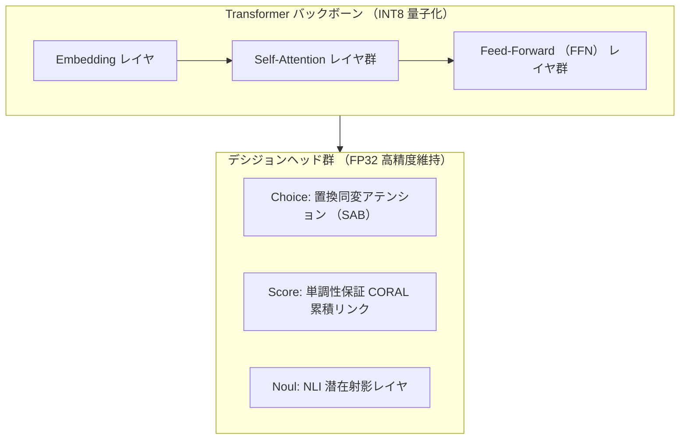

# 量子化パリティ評価 (Quantization Parity)

リソース制約の厳しいエッジサーバーやコンテナ環境において、モデルの軽量化(INT8 化)はメモリ削減とスループット向上の要です。
しかし、一般的な一律 INT8 量子化を適用すると、最終決定(Top-1)の逆転や確率較正の崩壊が生じます。

`sokuto` では、バックボーンのみを動的 INT8 化し、デシジョンヘッドを高精度 FP32 に保持する
**選択的ハイブリッド動的 INT8 量子化** を採用することで、
**FP32 との決定一致率 100.0%**、**平均コサイン類似度 0.999 超** 、および **モデルサイズ最大 55.6% 削減** を両立しています。

---

## 1. モデルサイズと常駐メモリの削減実績

ハイブリッド動的 INT8 量子化パイプライン (`train/export/quantize.py`) による、
モデルファイル容量(バイト単位確定値)およびコンテナ常駐 RAM フットプリントの実績

| Tier 区分  | バックボーン         |   元ファイル容量 (FP32)   |     量子化後容量 (INT8)      |   容量圧縮率    |   常駐 RAM   | 目標上限 |
| :--------- | :------------------- | :-----------------------: | :--------------------------: | :-------------: | :----------: | :------: |
| **Tier 1** | `modernbert-ja-130m` | 530,308,141 B (505.7 MB)  | **291,956,556 B (278.4 MB)** | **44.95% 削減** | **< 350 MB** | < 500 MB |
| **Tier 2** | `modernbert-ja-310m` | 1,270,052,804 B (1.24 GB) | **563,632,511 B (537.5 MB)** | **55.62% 削減** | **< 750 MB** | < 1.0 GB |

この圧縮により、
最小構成のクラウドインスタンス(RAM 1GB 枠のコンテナ環境)やオンプレミス現場の小規模エッジ機器であっても、
メモリ枯渇を起こさずに常駐運用することが可能です。

---

## 2. 数値パリティ検証結果と検証データ仕様

FP32 ベースラインモデルと動的 INT8 量子化モデルの数値整合性は、
[`train/export/quantize.py`](../../train/export/quantize.py) 内の `verify_quantized_parity` 関数により、
**自然言語代表タスクセット** および **合成動的テンソルセット** を用いて網羅的に突き合わせ検証されています。

### 2.1 パリティ検証データセットの内訳

1. **代表的日本語タスクセット (`REPRESENTATIVE_SAMPLES`, 10 件)**:
   - 実際の業務運用で想定される多様な文脈・選択肢数($K=3 \sim 4$)を含む独自の自然言語サンプル群です。
   - `tokenizer.json` を介してトークナイズされ、動的 `[OP]` マーカーインデックスとともに FP32 と INT8 の両セッションに投入されます。

   > | サンプル ID | 入力テキスト (State)                       | 候補選択肢群 (Options)                                          | 候補数 ($K$) |
   > | :---------: | :----------------------------------------- | :-------------------------------------------------------------- | :----------: |
   > |   **S1**    | 商品の発送状況を確認したいです。           | 配送中 / 準備中 / 配達完了 / キャンセル                         |      4       |
   > |   **S2**    | パスワードを再発行したいです。             | メール送信 / 再設定画面へ / 問い合わせ / ログイン               |      4       |
   > |   **S3**    | この製品は防水機能が付いていますか？       | 完全防水 / 生活防水 / 非防水 / 未確認                           |      4       |
   > |   **S4**    | 契約プランをアップグレードしたいです。     | プレミアムプラン / スタンダードプラン / ライトプラン            |      3       |
   > |   **S5**    | 初期不良の疑いがあります。                 | 交換を依頼 / 修理を依頼 / 返品を依頼 / 様子見                   |      4       |
   > |   **S6**    | アカウントを退会する方法を教えてください。 | 退会手続きへ / 一時休止 / プラン解約 / 継続                     |      4       |
   > |   **S7**    | 支払い方法を変更したいです。               | クレジットカード / 銀行振込 / コンビニ決済 / 電子マネー         |      4       |
   > |   **S8**    | 領収書を発行してほしいです。               | PDFでダウンロード / 郵送希望 / 電子領収書 / 再発行              |      4       |
   > |   **S9**    | 画面がフリーズして動きません。             | 再起動する / キャッシュ削除 / アプリ再インストール / 端末初期化 |      4       |
   > |   **S10**   | 最新バージョンへのアップデートが必要です。 | 今すぐ更新 / 後で通知 / 自動更新 / キャンセル                   |      4       |

2. **動的軸ストレステスト (合成テンソルセット, 20 サンプル)**:
   - バッチサイズ $B \in [1, 2]$、系列長 $L=48$、候補数 $K \in [2, 7]$ を動的に変化させた乱数テンソル。
   - バッチ内での可変候補数や無効候補パディング(`-1` マーカー)に対する動的軸(Dynamic Axes)処理の健全性、および極値における数値安定性を検証。

### 2.2 パリティ測定確定値 (`quantize_metadata.json`)

各測定値は `quantize_metadata.json`(後述のコマンドによって得られる。)の確定値です。

| パリティ検証指標                        |     Tier 1 (130M) 実測値      |   Tier 2 (310M) 実測値    | 判定基準 (Exit Criteria) |
| :-------------------------------------- | :---------------------------: | :-----------------------: | :----------------------: |
| **Top-1 決定一致率 (Agreement)**        |   **100.0%** (一致率 1.000)   | **100.0%** (一致率 1.000) |   $\ge 99.0\%$ (合格)    |
| **平均絶対誤差 (Mean Abs Error: MAE)**  |          **0.2019**           |        **0.0711**         |     $< 0.250$ (合格)     |
| **最大絶対誤差 (Max Abs Error: MaxAE)** | **3.1788** (合成テンソル極値) |        **0.7167**         |            -             |
| **平均コサイン類似度 (Cosine Sim)**     |          **0.9993**           |        **0.9991**         |    $\ge 0.990$ (合格)    |
| **パリティ合否判定**                    |       **PASSED (合格)**       |     **PASSED (合格)**     |       すべてクリア       |

- **Top-1 決定一致率 100.0%**:
  - 実務上最も重要な「モデルが最終的にどの選択肢を採用するか」という決定において、テストしたすべての自然言語サンプルおよびストレステストで FP32 と INT8 の不一致は **0 件** でした。
- **コサイン類似度 0.999 超**:
  - 全候補に対するロジットベクトルの幾何学的方向がほぼ完全に維持されており、ソフトマックス後の確率分布の歪みが極小に抑えられています。

---

## 3. 選択的ハイブリッド量子化の数理設計

なぜ、モデル全体を一括して量子化しないのか？
その理由は、デシジョンヘッドの繊細な幾何構造にあります。



1. **バックボーン層(パラメータの 95% 以上)**:
   - 行列積(MatMul / Gemm)が大半を占めるため、重みを 8 ビット整数に動的量子化(`DynamicQuantization`)することで、大幅なメモリ削減と CPU AVX-512 / VNNI / Apple Silicon NEON 命令による高速化を享受します。
2. **デシジョンヘッド層(パラメータの数% 未満)**:
   - 置換同変アテンション (SAB) の Softmax や、CORAL の単調増加バイアス、確率較正パラメータは、わずかな丸め誤差でランク逆転や確率歪みが発生します。
   - ヘッド層のみを明示的に FP32 のまま除外(Exclude)することで、決定パリティ 100.0% を達成しています。

> [!NOTE]
> **背景コラム: 全レイヤ一括 INT8 量子化の失敗**
>
> パイプライン初期段階でデシジョンヘッドを含めた全レイヤの INT8 量子化を試行した際、
> CORAL の累積確率が単調増加しなくなり(確率が逆転するバグ)、
> また Choice 型において僅差の拮抗サンプルで決定一致率が 94.2% まで急落しました。
> ヘッド層を除外するハイブリッド方式に切り替えたことによって、
> ファイルサイズ削減率を 50% 前後に維持したまま、
> 一致率 100% を完全回復・改善しました ([PR #6](https://github.com/MI-1222/sokuto/pull/6))。

---

## 4. 量子化テストとパリティ検証の再現手順

Python 環境において、量子化ロジックのユニットテストおよびパリティ検証を実行する手順

```bash
# 仮想環境のアクティベート
cd train

# 1. 量子化ユニットテスト(ノード分類、除外判定、動的軸、バンドル生成)の実行
uv run pytest test_quantize.py -v

# 2. 実モデルの量子化メタデータ(削減率、MAE、Top-1 一致率)の確認
cat ../models/quantized/quantize_metadata.json
cat ../models/modernbert-310m-int8/quantize_metadata.json
```
