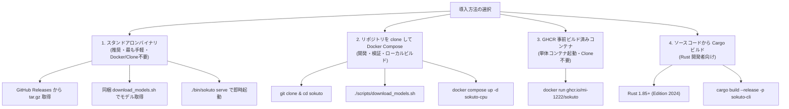

# インストール＆セットアップガイド

`sokuto` は、利用環境や運用方針に応じて以下の方法で導入できます。



---

## 0. 動作環境・システム要件

`sokuto` は純 Rust と ONNX Runtime で実装されており、Python ランタイムや GPU を必要とせず、一般的な CPU サーバーやローカル PC 上で極めて軽量に動作します。

| 項目                   | 最小要件(Tier 1: 130M)                               | 推奨要件(Tier 2: 310M)                               |
| :--------------------- | :--------------------------------------------------- | :--------------------------------------------------- |
| **CPU アーキテクチャ** | x86_64 または aarch64(Apple Silicon / ARM64)         | x86_64 または aarch64(Apple Silicon / ARM64)         |
| **CPU コア数**         | 1 コア以上(2 スレッド割り当て推奨)                   | 2 コア以上(4 スレッド割り当て推奨)                   |
| **メモリ(RAM)**        | 512 MB 以上(常駐 ~280 MB)                            | 1 GB 以上(常駐 ~538 MB)                              |
| **ストレージ容量**     | 500 MB 以上の空き容量                                | 1 GB 以上の空き容量                                  |
| **対応 OS**            | Linux(Ubuntu 22.04+, Debian 12+, RHEL 9+)、macOS 13+ | Linux(Ubuntu 22.04+, Debian 12+, RHEL 9+)、macOS 13+ |
| **外部通信**           | 不要(完全オフライン・エアギャップ環境で動作可能)     | 不要(完全オフライン・エアギャップ環境で動作可能)     |

---

## 1. 方法 1: スタンドアロンバイナリによる導入(推奨・最も手軽・Docker/Clone不要)

Docker や Rust ツールチェーンのインストール、本リポジトリの `git clone` を行わずに、最速でローカルや本番サーバー上でネイティブ起動したい場合に推奨します。

### パターン A: リリース配布アーカイブの利用(推奨)

[GitHub Releases](https://github.com/MI-1222/sokuto/releases) から各プラットフォーム向け(Linux x86_64 / Linux aarch64 / macOS Apple Silicon)の事前ビルド済みパッケージを取得します。
パッケージには実行バイナリ `bin/sokuto`、ONNX Runtime 共有ライブラリ `lib/`、モデル取得スクリプト `download_models.sh` が同梱されています(内部の rpath が設定されているため追加設定不要で即座に動作します)。

```bash
VERSION="vX.Y.Z"
ARCH="aarch64-apple-darwin" # または x86_64-unknown-linux-gnu / aarch64-unknown-linux-gnu

# 1. アーカイブの取得と展開 (git clone 不要)
curl -sSL -O "https://github.com/MI-1222/sokuto/releases/download/${VERSION}/sokuto-${VERSION}-${ARCH}.tar.gz"
tar -xzf "sokuto-${VERSION}-${ARCH}.tar.gz"
cd "sokuto-${VERSION}-${ARCH}"

# 2. モデルの取得 (アーカイブ直下に同梱されたスクリプトを実行)
./download_models.sh tier2

# (macOS でセキュリティ機能 Gatekeeper により未署名バイナリがブロックされる場合)
# xattr -d com.apple.quarantine ./bin/sokuto

# 3. サーバー起動 (ポート 3000)
./bin/sokuto serve --model-dir ./models/modernbert-310m-int8 --port 3000
```

> [!NOTE]
> 配布アーカイブにはコンテナビルド用のファイル(`docker/` ディレクトリなど)は含まれていません。アーカイブ展開ディレクトリ内では `./bin/sokuto serve` を直接実行してください。

---

## 2. 方法 2: 本リポジトリを clone して Docker Compose で起動(開発・検証向け)

本プロジェクトの開発・検証を行う場合や、リポジトリ付属の Dockerfile や Docker Compose 定義を用いてローカルでビルド・起動したい場合の手順です。

### 構成 A: 標準ボリュームマウント構成

リポジトリを clone した後、モデルを取得してコンテナを起動します。

1. **リポジトリのクローンと移動**:

   ```bash
   git clone https://github.com/MI-1222/sokuto.git
   cd sokuto
   ```

2. **モデル成果物の取得**:

   ```bash
   # リポジトリ内 scripts/ 配下のスクリプトを実行
   ./scripts/download_models.sh tier2
   ```

3. **コンテナ起動**:

   ```bash
   # バックグラウンド起動 (ポート 3000)
   docker compose up -d sokuto-cpu
   ```

4. **Tier 1 (130M-INT8: 超低遅延) への切り替え**:
   エッジ環境や極小メモリ環境で動作させたい場合は、Tier 1 プロファイルを指定します。
   ```bash
   ./scripts/download_models.sh tier1
   docker compose --profile tier1 up -d sokuto-tier1
   # ポート 3001 で待機
   ```

### 構成 B: All-in-One 自己完結イメージのローカルビルド

モデルファイルをコンテナイメージ内に内包(Bake-in)し、外部ボリュームマウントなしで単独起動可能なコンテナを作成します(本リポジトリの clone が前提です)。

```bash
# ベースとなる CPU 推論イメージをビルド (Rust のコンパイルが走ります)
docker build -t sokuto:cpu -f docker/Dockerfile.cpu .

# Tier 2 モデルを内包したイメージをビルド
docker build -t sokuto:allinone-tier2 \
  -f docker/Dockerfile.allinone \
  --build-arg MODEL_TIER=tier2 .

# 単一コンテナとして実行
docker run -d --name sokuto-app \
  -p 3000:3000 \
  --restart unless-stopped \
  sokuto:allinone-tier2
```

### 構成 C: オフライン・エアギャップ配備パッケージの生成

インターネットから完全隔離された本番環境へ持ち込むための配布アーカイブを自動生成できます(本リポジトリの clone が前提です)。

```bash
# 配布用アーカイブを生成(dist/sokuto-*-cpu-tier2.tar.gz が生成される)
./scripts/package_release.sh --tier tier2 --flavor cpu

# 隔離サーバー上での展開と起動 (同梱の自動デプロイスクリプトを実行)
tar -xzf sokuto-*-cpu-tier2.tar.gz
cd sokuto-*-cpu-tier2
./deploy.sh
# (手動で行う場合: docker load -i sokuto-*-image.tar.gz && docker compose up -d)
```

---

## 3. 方法 3: GHCR 事前ビルド済み Docker イメージによる導入(Clone不要)

リポジトリのソースコードを clone せず、Docker コンテナとして単体起動したい場合の手順です。

```bash
# 1. 作業ディレクトリの作成と移動
mkdir -p sokuto && cd sokuto

# 2. モデル成果物をホスト側にダウンロード (hfを使用)
hf download MI-1222/sokuto-ja-310m-int8 \
  --local-dir models/modernbert-310m-int8

# 3. GHCR 事前ビルド済みイメージから直接起動 (ポート 3000)
docker run -d \
  --name sokuto \
  -p 3000:3000 \
  -v ./models/modernbert-310m-int8:/models/default:ro \
  -e SOKUTO_MODEL_DIR=/models/default \
  ghcr.io/mi-1222/sokuto:latest
```

---

## 4. 方法 4: ソースコードからビルド(Rust 開発者向け)

本リポジトリを clone し、ローカルの Cargo ツールチェーンを用いてビルドする場合の手順です。

```bash
# 1. リポジトリのクローン
git clone https://github.com/MI-1222/sokuto.git
cd sokuto

# 2. リリースビルド (Rust 1.85+ / Edition 2024)
cargo build --release -p sokuto-cli

# 3. モデル成果物の取得
./scripts/download_models.sh tier2

# 4. ビルド済みバイナリで起動
./target/release/sokuto serve --model-dir ./models/modernbert-310m-int8 --port 3000
```

### (任意) システム全体へのバイナリ配置

ビルドしたバイナリ `sokuto` と ONNX Runtime 共有ライブラリをシステムのパスへ配置して運用する場合の手順です。

#### Linux の場合

```bash
# バイナリの配置
sudo cp target/release/sokuto /usr/local/bin/
sudo chmod +x /usr/local/bin/sokuto

# 共有ライブラリ (.so) の配置とキャッシュ更新
sudo cp target/release/libonnxruntime*.so* /usr/local/lib/ 2>/dev/null || true
sudo ldconfig

# (非標準パスに配置した場合のみ)
export LD_LIBRARY_PATH="/usr/local/lib:${LD_LIBRARY_PATH:-}"
```

#### macOS の場合

macOS では ONNX Runtime および CoreML がバイナリ内に**静的リンク**されるため、バイナリ単体を配置するだけで動作します。

```bash
# バイナリの配置
sudo cp target/release/sokuto /usr/local/bin/
sudo chmod +x /usr/local/bin/sokuto
```

#### サーバーの直接起動

```bash
sokuto serve \
  --host 0.0.0.0 \
  --port 3000 \
  --model-dir ./models/modernbert-310m-int8 \
  --pool-size 2 \
  --intra-threads 4 \
  --inter-threads 1
```

#### 主要な CLI 引数

| 引数              | デフォルト値     | 説明                                                            |
| :---------------- | :--------------- | :-------------------------------------------------------------- |
| `--host`          | `0.0.0.0`        | バインド先 IP アドレス                                          |
| `--port`          | `3000`           | バインド先ポート番号                                            |
| `--model-dir`     | `models/default` | `model.onnx`, `tokenizer.json` が格納されたパス                 |
| `--pool-size`     | `2`              | セッションプール(並行ワーカー)数                                |
| `--intra-threads` | コア数適応       | オペレータ内の並列スレッド数 (未指定時は物理コア数から自動算出) |
| `--inter-threads` | `1`              | オペレータ間の並列スレッド数                                    |
| `--provider`      | `auto`           | 実行プロバイダ (`cpu`, `cuda`, `tensorrt`, `coreml`, `auto`)    |

---

## 次のステップ(API の詳細スキーマや入力ガードレールの設定)

- [API 共通仕様・エラー構造](../api/index.md)
- [POST /v1/systemone 完全スキーマ](../api/systemone.md)
- [入力サニタイズとガードレール](../api/guardrails.md)
- [Prometheus メトリクスと監視](../api/monitoring.md)
