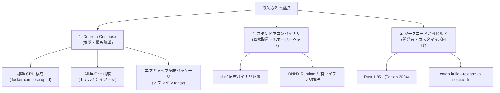

# インストール＆セットアップガイド

`sokuto` は、利用環境やデプロイ方針に応じて以下の 3 つの方法で導入できます。



---

## 1. 動作環境・システム要件

`sokuto` は純 Rust と ONNX Runtime で実装されており、Python ランタイムや GPU を必要とせず、一般的な CPU サーバーやローカル PC 上で極めて軽量に動作します。

| 項目                   | 最小要件(Tier 1: 130M)                                 | 推奨要件(Tier 2: 310M)                                 |
| :--------------------- | :----------------------------------------------------- | :----------------------------------------------------- |
| **CPU アーキテクチャ** | x86_64(AVX2 推奨)または aarch64(Apple Silicon / ARM64) | x86_64(AVX2 推奨)または aarch64(Apple Silicon / ARM64) |
| **CPU コア数**         | 1 コア以上(2 スレッド割り当て推奨)                     | 2 コア以上(4 スレッド割り当て推奨)                     |
| **メモリ(RAM)**        | 512 MB 以上(常駐 ~280 MB)                              | 1 GB 以上(常駐 ~538 MB)                                |
| **ストレージ容量**     | 500 MB 以上の空き容量                                  | 1 GB 以上の空き容量                                    |
| **対応 OS**            | Linux(Ubuntu 22.04+, Debian 12+, RHEL 9+)、macOS 13+   | Linux(Ubuntu 22.04+, Debian 12+, RHEL 9+)、macOS 13+   |
| **外部通信**           | 不要(完全オフライン・エアギャップ環境で動作可能)       | 不要(完全オフライン・エアギャップ環境で動作可能)       |

---

## 2. 方法 1: Docker / Docker Compose による導入(推奨)

Docker を利用することで、ホストマシン側の Rust ツールチェーンや C++ ランタイムに依存せず、数コマンドでセキュアに起動できます。

### 構成 A: 標準ボリュームマウント構成(推奨)

モデル成果物をホスト側の `models/` ディレクトリに配置し、コンテナ内へマウントして動作させます。

1. **モデルの取得**:

   ```bash
   # 標準の Tier 2 (310M-INT8) をダウンロード
   ./scripts/download_models.sh tier2
   ```

2. **コンテナ起動**:

   ```bash
   # バックグラウンド起動(ポート 3000)
   docker compose up -d sokuto-cpu
   ```

3. **Tier 1(130M-INT8: 超低遅延)への切り替え**:
   エッジ環境や極小メモリ環境で動作させたい場合は、Tier 1 プロファイルを指定します。
   ```bash
   ./scripts/download_models.sh tier1
   docker compose --profile tier1 up -d sokuto-tier1
   # ポート 3001 で待機
   ```

### 構成 B: All-in-One 自己完結イメージのビルド

モデルファイルをコンテナイメージ内に内包(Bake-in)し、外部ボリュームマウントなしで単独起動可能なコンテナを作成します。

```bash
# Tier 2 モデルを内包したイメージをビルド
docker build -t sokuto:allinone-tier2 \
  -f docker/Dockerfile.allinone \
  --build-arg MODEL_TIER=tier2 .

# 単一コンテナとして実行
docker run -d --name sokuto-app \
  -p 3000:3000 \
  --restart unless-stopped \
  sokuto:allinone-tier2
```

### 構成 C: オフライン・エアギャップ配備パッケージの利用

インターネットから完全隔離された本番環境へ持ち込むための配布アーカイブを自動生成できます。

```bash
# 配布用アーカイブを生成(dist/sokuto-v0.3.6-cpu-tier2-*.tar.gz が生成される)
./scripts/package_release.sh --tier tier2 --flavor cpu

# 隔離サーバー上での展開とロード
tar -xzf sokuto-v0.3.6-cpu-tier2-linux-amd64.tar.gz
cd sokuto-v0.3.6-cpu-tier2-linux-amd64
docker load -i sokuto-image.tar.gz
docker compose up -d
```

---

## 3. 方法 2: スタンドアロンバイナリによる実行

コンテナのオーバーヘッドを排し、ホスト環境で直接最速のインプロセス推論を行いたい場合に利用します。

### パターン A: リリース配布アーカイブの利用(推奨)

GitHub Releases から各プラットフォーム向け(`x86_64-unknown-linux-gnu`, `aarch64-apple-darwin` 等)の事前ビルド済みパッケージを取得します。
パッケージには実行バイナリ、ONNX Runtime 共有ライブラリ、起動スクリプト、Compose 定義が同梱されています。

```bash
VERSION="v0.3.6"
ARCH="aarch64-apple-darwin" # または x86_64-unknown-linux-gnu

# アーカイブの取得と展開
curl -sSL -O "https://github.com/MI-1222/sokuto/releases/download/${VERSION}/sokuto-${VERSION}-${ARCH}.tar.gz"
tar -xzf "sokuto-${VERSION}-${ARCH}.tar.gz"
cd "sokuto-${VERSION}-${ARCH}"

# モデルの取得 (初回のみ)
./scripts/download_models.sh tier2

# 付属の起動スクリプトで即時起動 (共有ライブラリパスを自動解決)
./deploy.sh

# (または直接バイナリを実行する場合)
./bin/sokuto serve --model-dir ./models/modernbert-310m-int8 --port 3000
```

> [!NOTE]
> **macOS 環境での Gatekeeper による実行ブロックについて**
> macOS では、セキュリティ機能（Gatekeeper）によってインターネットからダウンロードした未署名（未公証）のバイナリ実行がブロックされる場合があります。
> 実行時にブロックされたり終了してしまう場合は、以下のコマンドで隔離属性を解除してください。
>
> ```sh
> xattr -d com.apple.quarantine ./bin/sokuto
> ```

### パターン B: システム全体へのバイナリ配置

バイナリ `sokuto` と ONNX Runtime 共有ライブラリ(`libonnxruntime.so` または `libonnxruntime.dylib`)をシステムのライブラリパスへ配置して運用する場合の手順です。

```bash
# 実行権限の付与とバイナリ配置
sudo cp sokuto /usr/local/bin/
sudo chmod +x /usr/local/bin/sokuto

# 共有ライブラリの配置(例: Linux の場合)
sudo cp libonnxruntime.so /usr/local/lib/
sudo ldconfig
```

#### 環境変数の設定(非標準パスに配置した場合)

```bash
# Linux
export LD_LIBRARY_PATH="/usr/local/lib:${LD_LIBRARY_PATH:-}"

# macOS
export DYLD_LIBRARY_PATH="/usr/local/lib:${DYLD_LIBRARY_PATH:-}"
```

#### サーバーの直接起動

```bash
sokuto serve \
  --host 0.0.0.0 \
  --port 3000 \
  --model-dir ./models/modernbert-310m-int8 \
  --pool-size 2 \
  --intra-threads 4 \
  --inter-threads 1
```

#### 主要な CLI 引数

| 引数              | デフォルト値 | 説明                                            |
| :---------------- | :----------- | :---------------------------------------------- |
| `--host`          | `0.0.0.0`    | バインド先 IP アドレス                          |
| `--port`          | `3000`       | バインド先ポート番号                            |
| `--model-dir`     | (必須)       | `model.onnx`, `tokenizer.json` が格納されたパス |
| `--pool-size`     | CPU コア数   | セッションプール(並行ワーカー)数                |
| `--intra-threads` | コア数適応   | オペレータ内の並列スレッド数(通常 2〜4 推奨)    |
| `--inter-threads` | `1`          | オペレータ間の並列スレッド数                    |
| `--provider`      | `auto`       | 実行プロバイダ(`cpu`, `cuda`, `coreml`, `auto`) |

---

## 次のステップ(API の詳細スキーマや入力ガードレールの設定)

- [API 共通仕様・エラー構造](../api/index.md)
- [POST /v1/systemone 完全スキーマ](../api/systemone.md)
- [入力サニタイズとガードレール](../api/guardrails.md)
- [Prometheus メトリクスと監視](../api/monitoring.md)
