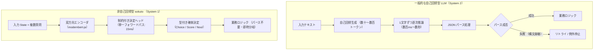

# sokuto の設計思想とローカル運用のメリット

`sokuto`(_即答_)は、[TypeSafe AI](https://typesafe.ai/)が提唱する「Jev」の設計思想をローカル環境で再現し、日本語業務向けに高度化した**非自己回帰型・決定論的判断推論エンジン**です。

自然言語テキストの逐次生成(トークン生成)を完全に排除し、単一のフォワードパス(Single Forward Pass)によって型安全な確率的決定(カテゴリ選択、順序評価、真偽判定)を確定ミリ秒(12ms〜24ms)で返却します。

---

## 1. なぜ「文章生成」を捨てるのか：決定論的バックエンドの必要性

現代のエンタープライズシステムや Web アプリケーションにおいて、
AI モデルに日常的に求められている要件の多くは「長文の丁寧な解説やチャット応答」ではありません。

カスタマーサポートの問い合わせ一次トリアージ、不正トランザクションや異常アクセスの即時検知、利用規約やガイドラインの適合判定など、日夜大量に流入するデータを処理する現場では、以下の 4 つの要件が不可欠です。

1. **確定的な低遅延(Predictable Low Latency)**:
   ユーザー体験を損なわず、同期的な HTTP リクエストやイベント駆動パイプライン内で数万件/時を捌くためのミリ秒単位の応答速度。
2. **物理的・数学的な型安全性(Zero Parsing Error)**:
   構文エラー、Markdown 記法の混入、想定外のフィールド追加などによるエラーのリスクが原理的にゼロ(0%)であること。
3. **信頼できる統計的確率(True Calibration)**:
   モデル自身が「どれほどの確信度を持ってその決定を下したのか」を表す確率値が統計的に較正されており、閾値による自動処理と有人エスカレーションを正しく制御できること。
4. **経済合理性とローカル閉域網での運用性(Privacy & Cost)**:
   高価なクラウド API への従量課金や個人情報・社外秘データの外部送信を行わず、手元の安価な CPU サーバーやオンプレミス環境で完結すること。

自己回帰型 LLM は高度な文章生成や推論能力(いわゆる「System 2」の認知能力)に優れる一方、上記のような定型業務の判断エンジン(「System 1」の直感的・高速な判断)として利用するには、レイテンシ、コスト、確率の未較正、型崩壊の面で過剰かつ不安定でした。

「Jev」や`sokuto` は「文章生成」を完全に捨てることで、決定論的バックエンドに求められる要件を極限まで満たすことに特化しています。

---

## 2. 自己回帰型 LLM との比較

| 比較項目               | 自己回帰型 LLM(ChatGPT, Claude, Llama 等)        | `sokuto`(ローカル Jev 互換エンジン)                        |
| :--------------------- | :----------------------------------------------- | :--------------------------------------------------------- |
| **推論アーキテクチャ** | 自己回帰型トークン逐次生成(Autoregressive)       | **非自己回帰型 単一フォワードパス(Non-autoregressive)**    |
| **推論レイテンシ**     | 500ms 〜 数千ms(生成文字数や混雑度に依存)        | **12.78ms(Tier 1)/ 23.56ms(Tier 2)の低遅延**               |
| **生成トークン数**     | 数十 〜 数百トークン(`completion_tokens > 0`)    | **0 トークン(`completion_tokens = 0`)**                    |
| **型・スキーマ保証**   | 確率的(JSON Mode でも稀に構文破綻や型不正が発生) | **数学的・物理的 100% 保証(専用ヘッドが直接テンソル出力)** |
| **確率較正(ECE)**      | 未較正(過度の確信、ECE 15%〜40% 程度)            | **厳密較正済み(ECE 2.61%〜6.29%、確率＝真の正解率)**       |
| **ハードウェア要件**   | ハイエンド GPU                                   | **汎用 CPU のみで十分動作(Apple Silicon / x86_64)**        |
| **メモリ常駐量**       | 10GB 〜 80GB+                                    | **280MB(Tier 1)/ 538MB(Tier 2)**                           |
| **閉域網・オフライン** | 外部 API 通信依存、または巨大基盤の構築が必要    | **完全自己完結型・エアギャップ配備標準対応**               |

---

## 3. sokuto の 3 つの決定プリミティブ

`sokuto` は、業務上のあらゆる離散判断を以下の 3 つの数学的プリミティブに集約して処理します。
単一のフォワードパスにおいて、
各プリミティブ専用の決定ヘッドが型付きの決定値と統計的に較正された確率値を直接出力します。

### ① Choice(カテゴリ選択)

あらかじめ提示された有限個の選択肢(キーと説明文)の中から、文脈(State)に最も合致する 1 つを選択します。

- **実務例**: 問い合わせの部署ルーティング(`billing`, `tech_support`, `general`)、インシデント種別の分類。
- **出力形式**: 決定されたキー文字列(`answer`)、勝率(`confidence`)、各候補の正規化確率分布(`probabilities`)。

### ② Score(順序尺度評価)

2〜10 段階の順序付けられた評価基準(Criteria)に基づき、連続値としての期待評価値を算出します。

- **実務例**: 緊急度(1〜5)、クレームの深刻度(低・中・高・重大)、ユーザーの満足度。
- **出力形式**: 期待値スコア(`score`: 1.0〜5.0)、勝率(`confidence`)、各段階の確率分布(`distribution`)。

### ③ Noul(真偽確率判定)

提示された言明・仮説が真である確率を直接算出します。

- **実務例**: 「ユーザーは返金を希望しているか？」「アカウント侵害の兆候があるか？」「ガイドライン違反か？」。
- **出力形式**: 真偽決定(`decision`: true / false)、真である確率(`probability`: 0.0〜1.0)、確信度(`confidence`)。

単一の HTTP リクエスト(`POST /v1/systemone`)において、
共通の State に対してこれら 3 種類の質問を任意に組み合わせて渡すことができ、
モデルはたった 1 回の推論フォワードパスですべての質問に一括回答します。

---

## 4. プロジェクトの歩みと方針転換(失敗から得られた教訓)

本プロジェクトは、先行する英語圏の OSS(Laya 等)を起点としてローカル Jev の再現に着手しましたが、
日本語の実務判定モデルとして実用化する過程で数多くの技術的破綻と方針転換を経験しました。

1. **英語/多言語トークナイザの過剰バイト分割**:
   英語中心のモデルでは日本語の文字が細切れのバイト列に分割され、アテンションが希釈されて学習が収束しませんでした。形態素解析器不要で Rust ゼロアロケーション運用が可能な `sbintuitions/modernbert-ja` へ全面移行することで精度が飛躍しました。
   - 詳細は [アーキテクチャ数理](../architecture/index.md) を参照。
2. **未収束モデルへの安易な温度スケーリングの暴走**:
   検証精度が不十分な段階で NLL(負の対数尤度)最小化による温度スケーリングを適用したところ、エントロピーを最大化しようとして温度パラメータが上限($T \to 5.0$)に張り付き、出力確率が一様分布(ランダム予測)に退化する事象に直面しました。これを受け、学習段階からの RLCD(厳密適格スコアリング)と正則化付き較正を確立しました。
   - 詳細は [学習・較正](../training/index.md) を参照。
3. **提示順序バイアスと記号過敏バイアス**:
   実稼働ログにおいて、選択肢の提示順序によって予測がブレる現象や、「緊急度1: 軽微」「緊急度5: 全社停止」と書いた際に頻出数字トークン「1」に引っ張られて誤判定する現象が発生しました。これらは置換同変アテンション(SAB)と前処理サニタイズによって根本解決されました。
   - 詳細は [置換同変アテンション (SAB) 仕様](../architecture/attention-sab.md) を参照。
4. **「わからない」と言えない判別モデルの致命傷**:
   選択肢に正解が存在しないドメイン外(OOD)データが来た際、従来の分類モデルは高確信度で誤った選択肢を選んでしまいます。熱力学の自由エネルギー原理を応用した低温安全弁(Energy-based OOD Gating)を開発し、検知率 92.3% を達成しました。
   - 詳細は [OOD 安全弁の数理仕様](../architecture/ood-safety.md) を参照。

---

## 5. 次に参照すべきドキュメント

- **今すぐ動かしてみたい方**: [クイックスタートチュートリアル](quickstart.md) へ進む
- **本番環境への導入・ビルド要件を確認したい方**: [インストールガイド](installation.md) へ進む
- **API の完全な JSON スキーマを確認したい方**: [API リファレンス](../api/index.md) へ進む
