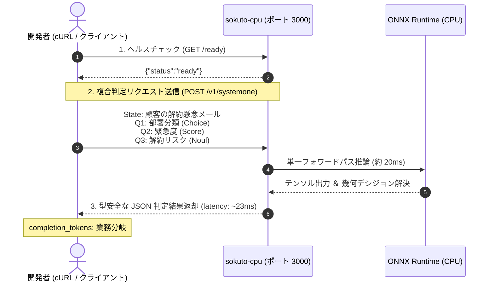

# クイックスタートガイド

このチュートリアルでは、**本リポジトリを clone して Docker Compose を用いて** `sokuto` の推論サーバーを立ち上げ、
3つの決定プリミティブ(Choice, Score, Noul)を一括実行するリクエストを送信して結果を受け取るまでの手順を解説します。

> [!TIP]
> **Docker を使わずに試したい場合**
>
> Docker やソースコードの clone を行わずにネイティブバイナリで即座に動かしたい場合は、[インストールガイド: 方法 1 (スタンドアロンバイナリ)](installation.md#2-方法-1-スタンドアロンバイナリによる導入推奨最も手軽dockerclone不要) をご利用ください。



---

## 前提条件

以下の環境がインストールされていることを確認してください。

- **Docker** および **Docker Compose**(Docker Desktop, OrbStack, または Linux Docker Engine)
- **curl**
- インターネット接続(初回モデル取得時のみ使用)

---

## ステップ 1: リポジトリのクローンと移動

本リポジトリをローカル環境へクローンし、プロジェクトルートへ移動します。

```bash
git clone https://github.com/MI-1222/sokuto.git
cd sokuto
```

---

## ステップ 2: モデル成果物のダウンロード

リポジトリルートで付属のダウンロードスクリプトを実行し、標準の **Tier 2(310M-INT8)** モデル成果物を取得します。

```bash
# 標準の Tier 2 モデル(約 540MB)を自動ダウンロード
./scripts/download_models.sh tier2
```

> [!NOTE]
> スクリプトは Hugging Face Hub(`MI-1222/sokuto-ja-310m-int8`)から `model.onnx`, `tokenizer.json`, `calibration.json`, `config.json` を `models/modernbert-310m-int8/` ディレクトリに自動配置します。

---

## ステップ 3: Docker Compose による起動

ダウンロードしたモデルをマウントして、推論コンテナをバックグラウンドで起動します。

```bash
# コンテナのビルドと起動(ポート 3000)
docker compose up -d sokuto-cpu
```

コンテナログを確認して、モデルのロード完了とサーバー起動を確認します。

```bash
docker compose logs -f sokuto-cpu
```

次のようなログが出力されれば起動成功です。

```text
INFO sokuto_cli::commands::serve: sokuto サーバーを起動します (モデル: /models/default, アドレス: 0.0.0.0:3000, セッションプール数: 2)...
INFO sokuto_cli::commands::serve: 較正温度設定をロードしました: /models/default/calibration.json
INFO sokuto_server: HTTP サーバーを起動します (アドレス: http://0.0.0.0:3000)...
INFO sokuto_server: Swagger UI: http://0.0.0.0:3000/swagger-ui
INFO sokuto_server: OpenAPI JSON: http://0.0.0.0:3000/api-docs/openapi.json
INFO sokuto_server: メトリクス: http://0.0.0.0:3000/metrics
INFO sokuto_server: ヘルスチェック: http://0.0.0.0:3000/health, http://0.0.0.0:3000/ready
```

---

## ステップ 4: ヘルスチェックの確認

`/ready` エンドポイントを叩き、推論プールがリクエストを受付可能な状態にあるか確認します。

```bash
curl -s http://localhost:3000/ready
```

**期待されるレスポンス**:

```json
{
  "status": "ready"
}
```

---

## ステップ 5: 初めての推論リクエスト送信

カスタマーサポートに届いた 1 件の問い合わせ文章(State)に対して、以下の 3 つの判断を**単一フォワードパスで同時に**下すリクエストを送信します。

1. **部署ルーティング(Choice)**: `billing`(請求)、`tech_support`(技術)、`general`(一般)のどこに割り振るべきか？
2. **緊急度評価(Score)**: 1(軽微)〜 5(最重要・事業停止)のどの深刻度か？
3. **解約リスク有無(Noul)**: ユーザーはサービス解約を検討しているか？(真偽確率)

以下の cURL コマンドを実行します(質問種別は `"type"` フィールドで指定します)。

```bash
curl -X POST http://localhost:3000/v1/systemone \
  -H "Content-Type: application/json" \
  -d '{
    "state": "先週からシステムに全くログインできず、月末の締め作業が完全に止まっていて大変困っています。このまま復旧しないなら他社システムへの乗り換えと解約を検討せざるを得ません。早急に調査と返答をお願いします。",
    "questions": {
      "department": {
        "type": "choice",
        "instructions": "問い合わせ内容を担当する最も適切な部署を選択してください。",
        "criteria": {
          "tech_support": "システム障害、ログイン不能、不具合調査",
          "billing": "請求書発行、プラン変更、決済トラブル",
          "general": "一般的な使い方、製品仕様に関する問い合わせ"
        }
      },
      "urgency": {
        "type": "score",
        "instructions": "顧客の業務影響度に基づく緊急度を 1〜5 で評価してください。",
        "criteria": [
          "影響なし・軽微な質問",
          "一部機能の制限・回避策あり",
          "通常業務に支障が出ている",
          "主要業務が停止・期限が迫っている",
          "全社停止・事業継続に関わる致命的障害"
        ]
      },
      "churn_risk": {
        "type": "noul",
        "instructions": "この問い合わせから、顧客が契約解除や他社乗り換えを検討しているリスクが読み取れるか判定してください。"
      }
    }
  }'
```

---

## ステップ 6: レスポンスの読み解き

わずか数十ミリ秒で、以下のような完全構造化 JSON レスポンスが返却されます。

```json
{
  "answers": {
    "department": {
      "choice": "tech_support",
      "probabilities": {
        "tech_support": 0.877199756943916,
        "billing": 0.05786853808215431,
        "general": 0.06493170497392965
      },
      "confidence": 0.4740983076686208
    },
    "urgency": {
      "score": 2.579892660288369,
      "probabilities": {
        "影響なし・軽微な質問": 0.10112104079347421,
        "一部機能の制限・回避策あり": 0.1413368942418665,
        "通常業務に支障が出ている": 0.18880248848102213,
        "主要業務が停止・期限が迫っている": 0.21400751685009053,
        "全社停止・事業継続に関わる致命的障害": 0.35473205963354665
      },
      "confidence": 0.5393796711640704
    },
    "churn_risk": {
      "noul": 0.44588148413442097
    }
  },
  "usage": {
    "prompt_tokens": 244,
    "completion_tokens": 0,
    "total_tokens": 244
  }
}
```

### 結果の注目ポイント

- **型の一致**:
  - `department`: `choice` フィールドに決定された文字列キー `tech_support`(89.3%)が格納されます。
  - `urgency`: `score` フィールドに加重平均値 `2.579892660288369`(「通常業務に支障が出ている」と「全社停止・致命的障害」に確率が集中)として算出され、`probabilities` には各評価基準のラベル文字列をキーとした確率分布が返却されます。
  - `churn_risk`: `noul` フィールドに言明が真である確率 `0.44588148413442097`が直接返却されます。
- **ゼロ生成トークン(`completion_tokens: 0`)**:
  入力トークン数 `prompt_tokens: 244` に対し、テキスト生成を行わないため `completion_tokens` は 0 であり、構文エラーや Markdown の混入は物理的に発生しません。
- **確定レイテンシ**:
  3 つの質問を同時に評価しているにもかかわらず、CPU 上で約 20ms 前後の確定低遅延で完了します。

---

## 発展: All-in-One コンテナによる自己完結起動

モデル成果物を外部ボリュームとしてマウントせず、コンテナイメージ内部にベイクした「単一コンテナ配布型(All-in-One)」として起動することも可能です。

```bash
# モデルをイメージ内に内包してビルド＆起動
docker compose --profile allinone up -d --build sokuto-allinone

# 起動確認 (ポート 3002)
curl -s http://localhost:3002/ready
```

この方式は、外部ファイルストレージへの依存がないため、Kubernetes や AWS ECS などのコンテナ実行基盤へのデプロイに適しています。

---

## 関連ドキュメント(さらに詳しい環境構築や API 仕様)

- **本番インストールとバイナリビルド**: [インストール詳細ガイド](installation.md)
- **API の全スキーマ・エラー定義**: [API リファレンス概要](../api/index.md)
- **OOD 検知と入力ガードレールの仕組み**: [入力ガードレール解説](../api/guardrails.md)
