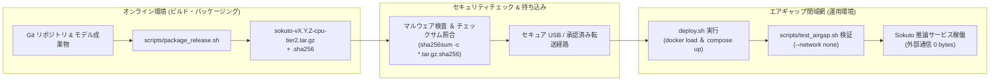
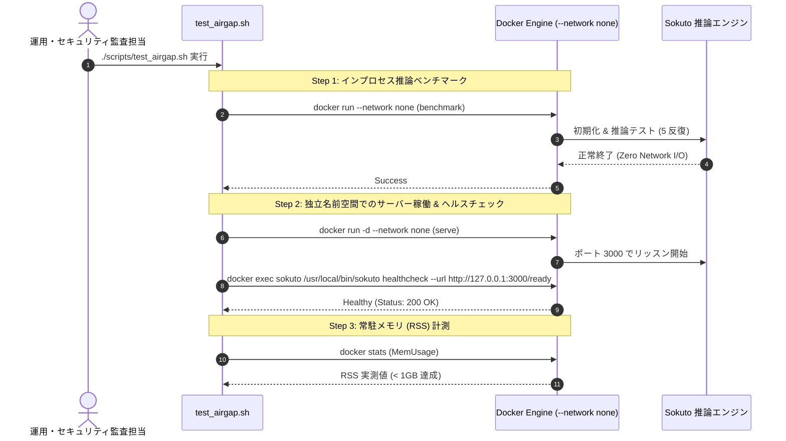

# エアギャップ完全閉域網運用ガイド

本ドキュメントでは、
外部インターネットから物理的・論理的に完全に隔離されたエアギャップ環境に対し、
`sokuto` を安全に持ち込み、配備・検証するための完全な手順を解説します。

---

## 1. エアギャップ運用の設計思想

一般的な LLM や深層学習モデルの運用では、
初期化時に Hugging Face Hub やクラウドストレージから重みや辞書ファイルを暗黙的にダウンロードする挙動が障害となります。
`sokuto` は、以下の原則に基づいてエアギャップ運用を完全保証しています。

1. **外部通信依存ゼロのランタイム**:
   環境変数 `HF_HUB_OFFLINE=1` および `TRANSFORMERS_OFFLINE=1` を強制適用し、外部ネットワークへの DNS 名前解決や HTTP リクエストを一切行いません。
2. **自己完結型配布パッケージ (`package_release.sh`)**:
   Docker イメージ tarball、モデル成果物、Docker Compose 定義、展開スクリプト、SHA256 チェックサムを単一アーカイブに集約します。
3. **客観的な遮断検証 (`test_airgap.sh`)**:
   Docker の `--network none` オプションを用い、ネットワークインターフェースが存在しない過酷な条件下で推論動作とメモリ消費量を自動検証します。



---

## 2. 配布パッケージの生成 (`package_release.sh`)

インターネットに接続されたビルド環境にて、`scripts/package_release.sh` を実行してオフライン配布パッケージを作成します。

### 2.1 スクリプトのオプション仕様

- `--tier <tier1|tier2>`: 採用するモデル Tier を指定 (`tier1`: 130M-INT8、`tier2`: 310M-INT8、デフォルト: `tier2`)
- `--flavor <cpu|cuda|allinone|binary>`: 配布形態・実行環境フレーバー (デフォルト: `cpu`)
  - `cpu`: CPU 最適化 Docker イメージアーカイブ + 外部モデル構成
  - `cuda`: CUDA/TensorRT 対応 Docker イメージアーカイブ + 外部モデル構成
  - `allinone`: モデル成果物をコンテナ内部 (`/models/default`) に焼き込んだAll in One完全自己完結型イメージ構成
  - `binary`: Docker を使用せず直接実行可能なスタンドアロンバイナリ + 共有ライブラリ構成
- `--version <vX.Y.Z>`: バージョン文字列 (デフォルト: `Cargo.toml` のバージョン)
- `--out-dir <path>`: パッケージ出力先ディレクトリ (デフォルト: `dist/`)

### 2.2 パッケージ生成の実行例

```bash
# Tier 2 (310M-INT8) CPU 版のオフラインパッケージを生成 (デフォルト)
# ※ --version を省略すると Cargo.toml の最新バージョンが自動適用されます
./scripts/package_release.sh --tier tier2 --flavor cpu

# 出力先: dist/sokuto-vX.Y.Z-cpu-tier2.tar.gz

# Docker 不要環境向けにスタンドアロンバイナリ版パッケージを生成する場合
./scripts/package_release.sh --tier tier2 --flavor binary
```

### 2.3 パッケージの同梱内容

生成されたアーカイブを展開すると、以下のディレクトリ構造が構築されます。
(GitHub Releases で自動配布されるバイナリパッケージには`models/default/`は存在しません。)

```text
sokuto-vX.Y.Z-cpu-tier2/
├── sokuto-vX.Y.Z-cpu-tier2-image.tar.gz # docker save されたコンテナイメージアーカイブ
├── models/
│   └── default/
│       ├── model.onnx                  # INT8 最適化済み ONNX モデル
│       ├── tokenizer.json              # トークナイザー辞書
│       ├── config.json                 # モデル設定
│       └── calibration.json            # 事後較正パラメータ (温度パラメータ等)
├── scripts/
│   └── download_models.sh              # モデルダウンロードスクリプト
├── docker-compose.yml                  # オフライン起動用 Compose 定義
├── deploy.sh                           # イメージ読み込み & コンテナ起動自動化スクリプト
├── README.md                           # 運用担当者向け導入手順書
└── SHA256SUMS                          # 同梱ファイルの SHA-256 チェックサム
```

---

## 3. 持ち込みとチェックサム検証

エアギャップ環境のホストマシンにアーカイブを持ち込んだ後、改ざんや転送エラーがないことを検証します。

### 3.1 チェックサムの検証

```bash
# アーカイブ自体のチェックサム検証 (オンライン環境で作成した .sha256 と照合)
# Linux:
sha256sum -c sokuto-*-cpu-tier2.tar.gz.sha256
# macOS:
shasum -a 256 -c sokuto-*-cpu-tier2.tar.gz.sha256

# アーカイブの展開
tar -xzf sokuto-*-cpu-tier2.tar.gz
cd sokuto-*-cpu-tier2

# 同梱物全ファイルの完全性検証
# Linux:
sha256sum -c SHA256SUMS
# macOS:
shasum -a 256 -c SHA256SUMS
```

すべてのファイルに対して `OK` と出力されることを確認します。

### 3.2 展開と起動 (`deploy.sh`)

同梱されている `deploy.sh` を実行することで、Docker イメージのロードとサービス起動が自動的に行われます。

```bash
# 実行権限を付与してデプロイを実行
chmod +x deploy.sh
./deploy.sh
```

`deploy.sh` 内部で実行される処理:

1. `docker load -i sokuto-*-image.tar.gz` によるイメージインポート
2. `docker compose up -d` によるサービス立ち上げ (コンテナ内の自己完結ヘルスチェック自動開始)
3. 起動完了の案内と確認用エンドポイント (`http://localhost:3000/ready`) の出力 (オペレーターは `curl` や `docker inspect` で健全性を確認可能)

---

## 4. 完全遮断検証テスト (`test_airgap.sh`)

配備されたコンテナまたはローカル環境が、外部通信を一切行わずに正常稼働することを証明するため、
`scripts/test_airgap.sh` を実行します。

```bash
# エアギャップ検証テストの実行
./scripts/test_airgap.sh --image sokuto:cpu --tier tier2
```

### 4.1 テストの 3 段階検証プロセス



1. **Step 1: `--network none` 下でのインプロセス推論ベンチマーク**:
   外部ネットワークを完全に切断した状態でコンテナを起動し、モデル読み込み、トークナイズ、フォワードパスが単体完結して成功することを確認します。
2. **Step 2: 独立ネットワーク名前空間でのサーバー起動 & ヘルスチェック**:
   バックグラウンドで HTTP サーバーを起動し、コンテナ内部から `sokuto healthcheck --url http://127.0.0.1:3000/ready` を実行してレディネスを確認します (`curl` コマンドがコンテナ内に存在しない状態でも自己完結して稼働)。
3. **Step 3: 常駐メモリ (RSS) の計測**:
   `docker stats` により常駐メモリが要件である 1GB 未満 (実機実測: Tier 1 は 250〜350MB、Tier 2 INT8 でも 450〜750MB 程度) に収まっていることを確認します。

---

## 5. エアギャップ運用のトラブルシューティング

| 事象                                     | 原因                                          | 対処方法                                                                             |
| :--------------------------------------- | :-------------------------------------------- | :----------------------------------------------------------------------------------- |
| **起動時にモデルが見つからない**         | ボリュームマウントパスの不整合                | マウント先がコンテナ内の `/models/default` と一致しているか確認してください。        |
| **`docker load` でディスクフル**         | ホストマシンの `/var/lib/docker` 容量不足     | `docker system prune` を実行するか、データルートを大容量ディスクへ移行してください。 |
| **ヘルスチェックがタイムアウト**         | 初期化中の CPU リソース競合                   | マシンの物理コア数に合わせて `SOKUTO_POOL_SIZE` を 1〜2 に調整してください。         |
| **macOS でバイナリ起動時に `Killed: 9`** | Gatekeeper による未署名バイナリの実行ブロック | `xattr -d com.apple.quarantine ./bin/sokuto` を実行して隔離属性を解除してください。  |

---

## 6. 関連ドキュメント

- [Docker コンテナ運用ガイド](./docker.md): マルチステージビルドと Multi-Arch 配布イメージ
- [パフォーマンス最適化 & リソースチューニング](./optimization.md): CPU コア・スレッド制御と省メモリ運用
- [CI/CD パイプライン & リリース自動化](./cicd.md): GitHub Actions による自動リリース
