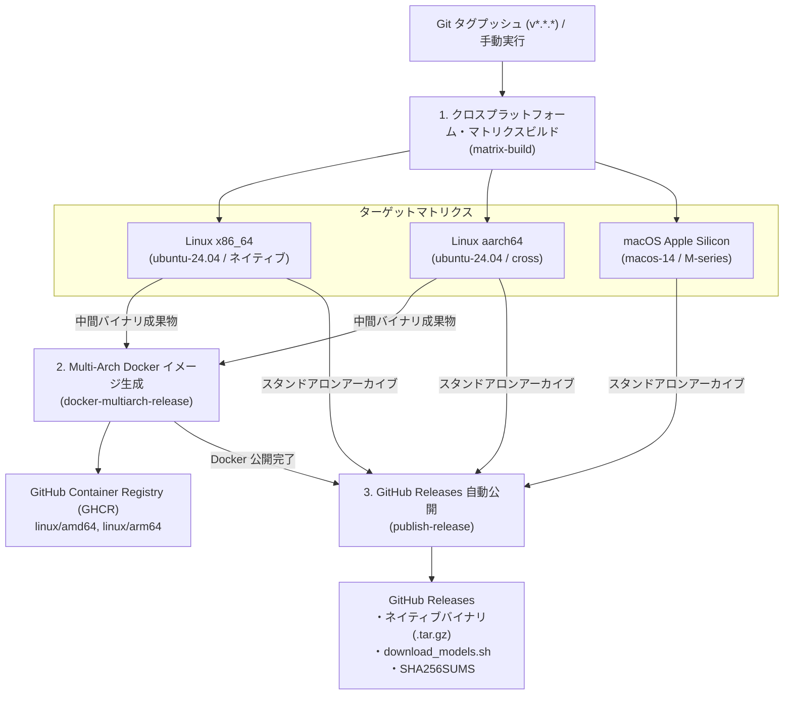
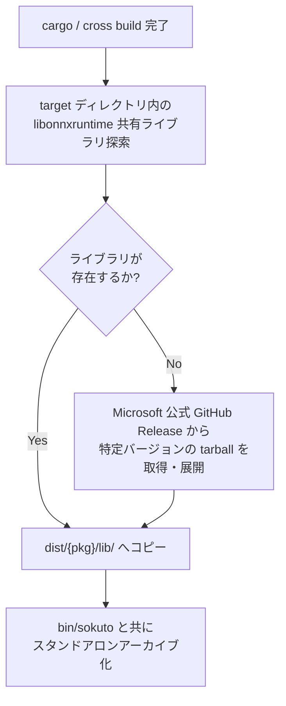

# CI/CD パイプライン & リリース自動化

本ドキュメントでは、
GitHub Actions を用いたクロスプラットフォーム・ネイティブバイナリのビルド、ONNX Runtime 動的リンク解決、
Docker Buildx による高速 Multi-Arch イメージ生成、および GitHub Releases への自動配布の仕組みを解説します。

---

## 1. CI/CD パイプラインの全体構造

ワークフロー定義ファイル `.github/workflows/release.yml` は、
Git タグ (`v*.*.*`) のプッシュ、または手動トリガー (`workflow_dispatch`) を契機に実行されます。
パイプラインは以下の 3 つのジョブで構成されています。



---

## 2. クロスプラットフォーム・マトリクスビルド (`matrix-build`)

ネイティブ環境でのパフォーマンスを最大化するため、各 OS / アーキテクチャ向けに最適化されたバイナリを並列ビルドします。

### 2.1 ビルドマトリクス仕様

| ターゲットトリプル          | ランナー OS    | アーキテクチャ | ビルド手法                       | 備考                        |
| :-------------------------- | :------------- | :------------- | :------------------------------- | :-------------------------- |
| `x86_64-unknown-linux-gnu`  | `ubuntu-24.04` | amd64          | ネイティブ `cargo build`         | GCC 14, glibc 2.39          |
| `aarch64-unknown-linux-gnu` | `ubuntu-24.04` | arm64          | コンテナ内クロスビルド (`cross`) | AWS Graviton / Linux ARM64  |
| `aarch64-apple-darwin`      | `macos-14`     | arm64          | ネイティブ `cargo build`         | Apple Silicon (M1/M2/M3/M4) |

### 2.2 キャッシュ戦略

ビルド時間を短縮するため、`Swatinem/rust-cache@v2` を利用して
ターゲットごとに Cargo の依存関係キャッシュを復元・保存します。
依存関係に変更がない場合、コンパイル時間は 1 ターゲットあたり 2〜3 分程度で完了します。

---

## 3. ONNX Runtime 動的リンク解決と自動バンドル

`sokuto` の推論バックエンドである `ort` クレートは、
実行時に ONNX Runtime の共有ライブラリ (`libonnxruntime.so` / `libonnxruntime.dylib`) を要求します。
ユーザー環境での「ライブラリが見つからない」エラーを防止するため、ワークフロー内で以下の自動解決処理を行います。



### 3.1 フォールバックダウンロードロジック

クレートのビルドキャッシュから共有ライブラリが直接取得できない場合、
Microsoft 公式のリリース資産 (例: ONNX Runtime v1.20.1) をターゲットアーキテクチャに合わせて自動取得し、
`dist/lib/` 配下に配置します。

### 3.2 スタンドアロンパッケージの構造

生成された各アーカイブ (`sokuto-${VERSION}-${TARGET}.tar.gz`) は、単体で展開して即座に実行可能な構成となっています。

```text
sokuto-vX.Y.Z-x86_64-unknown-linux-gnu/
├── bin/
│   └── sokuto                  # CLI 実行バイナリ
├── lib/
│   └── libonnxruntime.so.1.20.1# バンドル済み共有ライブラリ
├── download_models.sh          # Hugging Face Hub からのモデル取得スクリプト
└── README.md                   # クイックスタートガイド
```

---

### 3.3 rpath 埋め込みによる動的ライブラリ自動探索

配布バイナリ `bin/sokuto` がユーザー環境で `LD_LIBRARY_PATH` や `DYLD_LIBRARY_PATH` の環境変数設定なしに起動できるよう、
リポジトリルートの [`.cargo/config.toml`](../../.cargo/config.toml) にてリンカフラグ (`rpath`) を埋め込んでいます。

```toml
# .cargo/config.toml
[target.x86_64-unknown-linux-gnu]
rustflags = ["-C", "link-args=-Wl,-rpath,$ORIGIN/../lib:$ORIGIN"]

[target.aarch64-unknown-linux-gnu]
rustflags = ["-C", "link-args=-Wl,-rpath,$ORIGIN/../lib:$ORIGIN"]

[target.aarch64-apple-darwin]
rustflags = ["-C", "link-args=-Wl,-rpath,@executable_path/../lib -Wl,-rpath,@loader_path"]
```

- **Linux**: `$ORIGIN/../lib` により、実行バイナリの親ディレクトリ配下にある `lib/` を最優先で探索します。
- **macOS**: `@executable_path/../lib` により、同一パッケージ内の `lib/` を自動参照します。

---

## 4. Multi-Arch Docker イメージ生成 (`docker-multiarch-release`)

Linux 版のビルド成果物 (amd64 / arm64) を利用し、
[`docker/Dockerfile.dist`](../../docker/Dockerfile.dist) をベースにした Multi-Arch コンテナイメージをビルドします。

### 4.1 アセンブリ方式による高速化

QEMU エミュレータ上で Rust のフルコンパイルを実行すると膨大な CPU 時間を消費しますが、
本ワークフローではネイティブおよび `cross` で事前ビルドしたバイナリをアセンブリする手法を採用しています。
これにより、Multi-Arch イメージ全体の生成と GHCR へのプッシュがわずか 30〜60 秒で完了します。

```bash
# ビルドコンテキストの組み立て (GitHub Actions 内部処理抜粋)
mkdir -p dist/bin/amd64 dist/lib/amd64
mkdir -p dist/bin/arm64 dist/lib/arm64

# 各ジョブでビルドされたバイナリと共有ライブラリを配置
find tmp-amd64 -name "sokuto" -type f -exec cp {} dist/bin/amd64/ \;
find tmp-amd64 -name "libonnxruntime*.so*" -exec cp -a {} dist/lib/amd64/ \;
find tmp-arm64 -name "sokuto" -type f -exec cp {} dist/bin/arm64/ \;
find tmp-arm64 -name "libonnxruntime*.so*" -exec cp -a {} dist/lib/arm64/ \;

# Docker Buildx で Multi-Arch イメージをビルド & プッシュ (docker/build-push-action 相当)
docker buildx build \
  --platform linux/amd64,linux/arm64 \
  --tag ghcr.io/${{ github.repository }}:${{ version }} \
  --tag ghcr.io/${{ github.repository }}:latest \
  --file docker/Dockerfile.dist \
  --push .
```

---

## 5. GitHub Releases への自動公開 (`publish-release`)

すべてのビルドジョブが正常終了した後、GitHub Releases ページへリリース成果物が一括公開されます。

### 添付アセット一覧

GitHub Releases ページには、スタンドアロン実行に必要な最小限のアセットが自動添付されます。

1. **各 OS / アーキテクチャ向けバイナリアーカイブ (`sokuto-*.tar.gz`)**:
   - `x86_64-unknown-linux-gnu`
   - `aarch64-unknown-linux-gnu`
   - `aarch64-apple-darwin`
2. **モデルダウンロードスクリプト (`download_models.sh`)**:
   - Hugging Face Hub より Tier 1 / Tier 2 モデルを取得するスクリプト
3. **統合チェックサムファイル (`SHA256SUMS`)**:
   - 全バイナリアーカイブおよび `download_models.sh` の SHA-256 チェックサム一覧

> [!NOTE]
> 各ターゲットビルド時に生成される個別チェックサム (`.tar.gz.sha256`) は
> GitHub Actions の中間アーティファクトとして保持され、最終リリース時には `SHA256SUMS` に統合されます。
> また、バイナリ利用者が Docker や git clone を行わずに即時実行できるようにする設計(スタンドアロン性の担保)に基づき、
> `docker-compose.yml` はリポジトリ本体管理へ集約されています。

```bash
# リリース資産のチェックサム一括検証 (Linux)
sha256sum -c SHA256SUMS

# リリース資産のチェックサム一括検証 (macOS)
shasum -a 256 -c SHA256SUMS
```

---

## 6. 関連ドキュメント

- [Docker コンテナ運用ガイド](./docker.md): マルチステージビルドと Multi-Arch 配布イメージ
- [エアギャップ完全閉域網運用ガイド](./airgap.md): 自己完結型パッケージの作成と外部遮断検証
- [パフォーマンス最適化 & リソースチューニング](./optimization.md): CPU コア・スレッド制御と省メモリ運用
