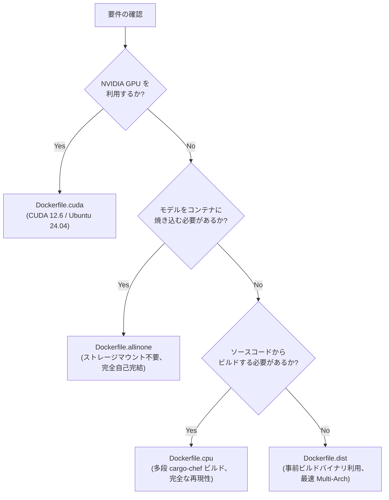

# Docker コンテナ運用ガイド

本ドキュメントでは、
`sokuto` の本番運用向けコンテナイメージの設計思想、各 Dockerfile の使い分け、
Buildx による Multi-Arch ビルド、および Docker Compose によるサービス運用の手順を解説します。

---

## 1. コンテナイメージの選定マトリクス

リポジトリ直下の `docker/` ディレクトリには、
用途と配備要件に応じた 3 種類の主要 Dockerfile (および GPU 向けの `Dockerfile.cuda`) が用意されています。

| イメージ種別               | 対象 Dockerfile              | ビルド方式                                | モデル成果物の扱い                         | 主な用途・ユースケース                                                      |
| :------------------------- | :--------------------------- | :---------------------------------------- | :----------------------------------------- | :-------------------------------------------------------------------------- |
| **CPU 標準ビルド**         | `docker/Dockerfile.cpu`      | ソースコードからフルビルド (`cargo-chef`) | 外部ボリュームマウント (`/models/default`) | ソースからの完全な再現性担保、セキュリティ監査、開発・ステージング環境      |
| **超軽量・Multi-Arch**     | `docker/Dockerfile.dist`     | 事前ビルド済みバイナリのアセンブリ        | 外部ボリュームマウント (`/models/default`) | CI/CD パイプラインでの高速ビルド、本番 Kubernetes クラスタ、Multi-Arch 配布 |
| **自己完結型 (Bake-in)**   | `docker/Dockerfile.allinone` | 既存イメージにモデルを内包                | イメージ内部に静的内包 (`/models/default`) | エアギャップ閉域網配備、ストレージマウント不可環境、エッジデバイス          |
| **GPU アクセラレーション** | `docker/Dockerfile.cuda`     | CUDA/TensorRT マルチステージビルド        | 外部ボリュームマウント (`/models/default`) | 高並列バッチ処理、極限スループット環境                                      |



---

## 2. 各 Dockerfile のアーキテクチャと詳細仕様

### 2.1 `Dockerfile.cpu`: ソースからの完全マルチステージビルド

`Dockerfile.cpu` は、
ホスト環境に Rust や C++ コンパイラが存在しない状態から、
完全な再現性をもってバイナリと共有ライブラリを生成する 4 ステージ構成の定義です。

- **Stage 1 (chef)**: Ubuntu 24.04 (GCC 14 / glibc 2.39) をベースに、Rust stable ツールチェーンと `cargo-chef` を導入
- **Stage 2 (planner)**: ソースコードからクレートの依存関係レシピ (`recipe.json`) を抽出
- **Stage 3 (builder)**: `cargo chef cook --release` によりサードパーティ依存関係のみを先行コンパイルし、Docker キャッシュを活用。その後 `sokuto-cli` をビルドし、ONNX Runtime 動的ライブラリ (`libonnxruntime.so*`) を抽出
- **Stage 4 (runtime)**: 最小限のランタイムパッケージ (`libstdc++6`, `ca-certificates`) のみに絞り込み、非 root ユーザー `jev` (UID: 10001) で実行

#### ビルド手順

```bash
# CPU 標準イメージのビルド
docker build -t sokuto:cpu -f docker/Dockerfile.cpu .
```

#### 実行手順 (モデルをマウントして起動)

デフォルトで `serve --host 0.0.0.0 --port 3000 --model-dir /models/default` が `CMD` として設定されているため、
マウント指定のみで起動可能です。

```bash
# ホスト上の models/modernbert-310m-int8 をマウントして起動
docker run -d \
  --name sokuto-cpu \
  -p 3000:3000 \
  -v $(pwd)/models/modernbert-310m-int8:/models/default:ro \
  sokuto:cpu
```

---

### 2.2 `Dockerfile.dist`: 事前ビルド済みバイナリを用いた超高速 Multi-Arch ビルド

`Dockerfile.dist` は、
GitHub Actions やローカルの `cargo build --release` で生成されたクロスコンパイル済みバイナリをアセンブリする専用イメージです。

#### 特徴と利点

1. **コンパイル遅延の完全排除**:
   QEMU エミュレーションによる ARM64 クロスコンパイルには通常数十分を要しますが、`Dockerfile.dist` では事前ビルド済みバイナリをコピーするのみであるため、数秒で完了します。
2. **Docker Buildx との親和性**:
   `TARGETARCH` 引数に基づき、`dist/bin/${TARGETARCH}/sokuto` および `dist/lib/${TARGETARCH}/libonnxruntime.so*` を自動選択して配置します。
3. **自己完結型ヘルスチェック**:
   外部の `curl` コマンドに依存せず、内包されている `sokuto` バイナリ自身の `healthcheck` サブコマンドで稼働確認を行います。

```dockerfile
# 自己完結型ヘルスチェック (抜粋)
HEALTHCHECK --interval=10s --timeout=3s --start-period=5s --retries=3 \
    CMD ["/usr/local/bin/sokuto", "healthcheck", "--url", "http://127.0.0.1:3000/ready"]
```

#### ビルド手順 (Buildx による Multi-Arch イメージ生成)

```bash
# 事前準備: dist ディレクトリに必要なバイナリが配置されていること
# dist/bin/amd64/sokuto, dist/lib/amd64/libonnxruntime.so*
# dist/bin/arm64/sokuto, dist/lib/arm64/libonnxruntime.so*

docker buildx build \
  --platform linux/amd64,linux/arm64 \
  -t ghcr.io/mi-1222/sokuto:latest \
  -f docker/Dockerfile.dist \
  .
```

---

### 2.3 `Dockerfile.allinone`: 自己完結型 (Bake-in) モデル内包イメージ

`Dockerfile.allinone` は、
推論に必要なモデル成果物 (`model.onnx`, `tokenizer.json`, `config.json` 等) を
コンテナイメージ内部の `/models/default` に焼き込みます。

#### ビルド引数 (ARG)

- `BASE_IMAGE`: ベースとなる Sokuto ランタイムイメージ (デフォルト: `sokuto:cpu`)
- `MODEL_TIER`: 焼き込むモデルの Tier 指定 (`tier1`: 130M-INT8、`tier2`: 310M-INT8、デフォルト: `tier2`)

#### ビルド手順

```bash
# Tier 2 (310M-INT8) モデルを内包した自己完結型イメージの生成
docker build \
  --build-arg BASE_IMAGE=sokuto:cpu \
  --build-arg MODEL_TIER=tier2 \
  -t sokuto:allinone-tier2 \
  -f docker/Dockerfile.allinone \
  .

# Tier 1 (130M-INT8) モデルを内包したイメージの生成
docker build \
  --build-arg BASE_IMAGE=sokuto:cpu \
  --build-arg MODEL_TIER=tier1 \
  -t sokuto:allinone-tier1 \
  -f docker/Dockerfile.allinone \
  .
```

#### 実行手順 (マウント不要で即時起動)

```bash
# ボリュームマウントなしで単体起動
docker run -d \
  --name sokuto-standalone \
  -p 3000:3000 \
  sokuto:allinone-tier2
```

---

## 3. Docker Compose による本番運用

本番環境または開発環境での一括起動のため、
ルートディレクトリに `docker-compose.yml`、`docker/` ディレクトリ配下に
配布用の `docker/docker-compose.dist.yml` が配備されています。

### 3.1 構成概要 (`docker-compose.yml`)

`docker-compose.yml` では、用途に応じた 4 種類のサービス／プロファイルが定義されています。
全コンテナにおいて常駐メモリは 1GB 未満に制限されており、
実機測定でも Tier 1 は 350MB 未満、Tier 2 は 750MB 未満で安定動作します。

| サービス名        | プロファイル          | モデル種別         | 想定リソース制限    | 実測常駐メモリ (RSS) | 主な用途                                            |
| :---------------- | :-------------------- | :----------------- | :------------------ | :------------------- | :-------------------------------------------------- |
| `sokuto-cpu`      | デフォルト (指定不要) | Tier 2 (310M-INT8) | CPU 4.0, Mem 1GB    | 約 350MB 〜 450MB    | 標準高精度 CPU 推論サービス (ポート: 3000)          |
| `sokuto-tier1`    | `tier1`               | Tier 1 (130M-INT8) | CPU 2.0, Mem 512MB  | 約 200MB 〜 280MB    | 低遅延・省リソースエッジ推論 (ポート: 3001)         |
| `sokuto-allinone` | `allinone`            | Tier 2 (内包)      | Mem 1GB             | 約 350MB 〜 450MB    | ボリュームマウント不要の自己完結実行 (ポート: 3002) |
| `sokuto-gpu`      | `gpu`                 | Tier 2 (310M-INT8) | GPU (all), Mem 1GB+ | 約 400MB 〜 600MB    | CUDA アクセラレータ推論 (ポート: 3003)              |

#### `sokuto-cpu` 定義 (抜粋)

```yaml
services:
  sokuto-cpu:
    build:
      context: .
      dockerfile: docker/Dockerfile.cpu
    image: sokuto:cpu
    container_name: sokuto-cpu
    restart: unless-stopped
    ports:
      - '3000:3000'
    environment:
      - SOKUTO_HOST=0.0.0.0
      - SOKUTO_PORT=3000
      - SOKUTO_MODEL_DIR=/models/default
      - SOKUTO_POOL_SIZE=2
      - SOKUTO_INTRA_THREADS=4
      - SOKUTO_INTER_THREADS=1
      - RUST_LOG=sokuto_server=info,sokuto_cli=info,tower_http=info
      - HF_HUB_OFFLINE=1
      - TRANSFORMERS_OFFLINE=1
    volumes:
      - ./models/modernbert-310m-int8:/models/default:ro
    healthcheck:
      test:
        [
          'CMD',
          '/usr/local/bin/sokuto',
          'healthcheck',
          '--url',
          'http://127.0.0.1:3000/ready',
        ]
      interval: 10s
      timeout: 3s
      retries: 3
      start_period: 5s
    deploy:
      resources:
        limits:
          cpus: '4.0'
          memory: 1G
        reservations:
          cpus: '1.0'
          memory: 512M
```

### 3.2 サービス起動コマンド

```bash
# 標準 CPU 版サービスのバックグラウンド起動 (デフォルト)
docker compose up -d sokuto-cpu

# Tier 1 (130M-INT8) エッジ向けサービスの起動
docker compose --profile tier1 up -d sokuto-tier1

# All-in-One 自己完結型サービスの起動
docker compose --profile allinone up -d sokuto-allinone

# GPU (CUDA) 版サービスの起動
docker compose --profile gpu up -d sokuto-gpu

# ログの確認
docker compose logs -f sokuto-cpu

# ヘルスチェック状態の確認
docker inspect --format='{{json .State.Health.Status}}' sokuto-cpu
```

### 3.3 配布用 Compose (`docker/docker-compose.dist.yml`)

GitHub Packages (GHCR) に公開された事前ビルド済み Multi-Arch イメージを使用する場合、
ローカルでのビルドを行わずに即時起動できます。

```bash
# GHCR の事前ビルド済みイメージを用いて起動
docker compose -f docker/docker-compose.dist.yml up -d
```

---

## 4. GPU バリアント (`Dockerfile.cuda`)

NVIDIA GPU 環境 (CUDA / TensorRT) を利用する場合向けに、`docker/Dockerfile.cuda` が提供されています。

- **ビルドベースイメージ**: `nvidia/cuda:12.6.0-devel-ubuntu24.04`
- **ランタイムベースイメージ**: `nvidia/cuda:12.6.0-runtime-ubuntu24.04` (Ubuntu 24.04: GCC 14 / glibc 2.39)
- **ハードウェア要件**: NVIDIA ドライバ (Version >= 525) および NVIDIA Container Toolkit
- **用途**: 高並列バッチ処理や極限スループット環境
- **起動例**:
  ```bash
  docker run -d \
    --gpus all \
    -p 3000:3000 \
    -v $(pwd)/models/modernbert-310m-int8:/models/default:ro \
    sokuto:cuda \
    serve --model-dir /models/default --provider cuda
  ```

---

## 5. 関連ドキュメント

- [エアギャップ完全閉域網運用ガイド](./airgap.md): 自己完結型パッケージの作成と外部遮断検証
- [パフォーマンス最適化 & リソースチューニング](./optimization.md): CPU コア・スレッド制御と省メモリ運用
- [CI/CD パイプライン & リリース自動化](./cicd.md): GitHub Actions による自動リリース
