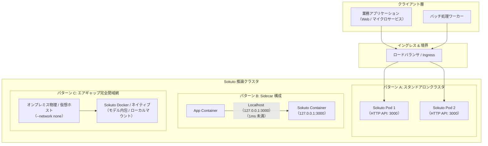
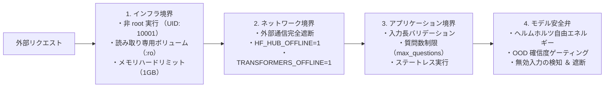

# Operations (本番運用 & インフラ編)

本ドキュメントでは、
System 1 型推論エンジン `sokuto` をエンタープライズ本番環境へ安全かつ高効率に導入・運用するための
デプロイメントパターン、セキュリティ境界、および各運用ガイドラインの体系を解説します。

---

## 1. アーキテクチャと運用設計

`sokuto` は、
自然言語文章生成を排し、
単一フォワードパスで型付き確率・決定を返す超低遅延・高スループットな推論基盤です。
外部通信への依存を完全に排除可能な設計となっており、
パブリッククラウド上のコンテナ基盤からインターネット完全遮断のエアギャップ環境まで、柔軟な設計で配備できます。



---

## 2. 3大デプロイメントパターン

運用の要件(遅延許容量、インフラ規模、セキュリティ基準)に応じて、
以下の 3 つの主要パターンから最適な構成を選択します。

| パターン                           | 主な用途                                 | 通信プロトコル          | 想定レイテンシ                                | メリット / デメリット                                                                                              |
| :--------------------------------- | :--------------------------------------- | :---------------------- | :-------------------------------------------- | :----------------------------------------------------------------------------------------------------------------- |
| **A. スタンドアロンクラスタ**      | 複数マイクロサービスからの共有推論基盤   | HTTP/1.1 (JSON)         | 15〜40ms (ネットワーク往復含む、モデル構成別) | **利点**: リソース集約、柔軟な水平スケーリング<br>**欠点**: ネットワークホップによる遅延オーバーヘッド             |
| **B. Sidecar (同一 Pod / ホスト)** | 超低遅延が要求されるリアルタイム処理     | Localhost (127.0.0.1)   | 12〜35ms (ネットワークオーバーヘッド極小)     | **利点**: 極小遅延、同一ライフサイクル管理<br>**欠点**: Pod ごとのメモリ消費(モデル複製)                           |
| **C. エアギャップ完全閉域網**      | 金融、防衛、機密データ処理、工場内エッジ | 内部通信のみ (外部遮断) | 12〜35ms (外部遮断・モデル構成別)             | **利点**: データ漏洩リスクゼロ、コンプライアンス完全準拠<br>**欠点**: モデルやバイナリの持ち込みに厳格な手順が必要 |

### パターン A: スタンドアロン HTTP API クラスタ

Kubernetes や Amazon ECS 等のコンテナオーケストレータ上で、
`sokuto` を独立した推論サービスとして水平展開する構成です。
ロードバランサの背後に複数レプリカを配置し、
ヘルスチェックエンドポイント (`/ready`, `/health`) を監視してトラフィックを分散します。

### パターン B: Pod 内 Sidecar 構成

同一 Pod 内のメインアプリケーションコンテナと `sokuto` コンテナをペアで配置します。
通信がローカルループバック (`127.0.0.1:3000`) で完結するため、ネットワーク遅延を極小化できます。
アクセス頻度の極めて高いリクエストトリアージや、リアルタイム不正検知に最適です。

### パターン C: エアギャップ完全閉域網

インターネット接続が物理的または論理的に完全に遮断された環境に配備する構成です。
Docker の `--network none` フラグによる外部通信完全遮断下でも、
モデルのロードから推論、ヘルスチェックまで単体で完結して動作します。

---

## 3. セキュリティ境界と多層防御

`sokuto` は、ゼロトラストアーキテクチャおよび企業セキュリティポリシーに適合するよう、
複数の防御層を標準で備えています。



### 3.1 実行権限の最小化 (非 root 実行)

すべてのコンテナイメージ (`Dockerfile.cpu`, `Dockerfile.cuda`, `Dockerfile.dist`, `Dockerfile.allinone`) は、UID 10001、GID 10001 の専用非特権ユーザー `jev` で実行されます。
コンテナブレイクアウトが発生した場合でも、ホストシステムへの特権昇格を防ぎます。

```dockerfile
# 最小権限ユーザーの作成と切り替え (抜粋)
RUN groupadd -g 10001 jev && \
    useradd -u 10001 -g jev -s /bin/false -M jev
USER jev
```

### 3.2 外部通信の完全遮断 (ネットワーク境界)

ランタイム起動時、
Hugging Face Hub や外部リポジトリへの暗黙的な通信試行を防止するため、
環境変数 `HF_HUB_OFFLINE=1` および `TRANSFORMERS_OFFLINE=1` が強制設定されます。
モデルファイル、トークナイザー辞書、較正パラメータはすべてローカルストレージから読み込まれます。
外部ネットワークが遮断された環境でも警告やタイムアウトエラーは発生しません。

### 3.3 リソース保護と入力検証

サービス拒否攻撃 (DoS) やメモリ枯渇を防ぐため、HTTP API レベルで厳密なリクエスト検証を実施します。

- **最大質問数制限**: 単一リクエスト内の質問数を `max_questions` (デフォルト: 128、内部マイクロバッチ `chunk_size`: 16) で制限
- **最大トークン長制限**: `state` および質問文の合計長をトークナイザーの最大長 (ModernBERT: 8192 トークン) 以内に切り詰め
- **ステートレス性**: リクエスト間で一切の状態やキャッシュを共有せず、メモリリークのリスクを排除

### 3.4 モデル層の安全弁 (OOD 確信度ゲーティング)

入力データが学習データの分布から著しく逸脱している場合 (Out-of-Distribution: OOD)、
ヘルムホルツ自由エネルギー $E(x; C)$ に基づく安全弁回路が異常を検知します。
不正な入力や未定義のユースケースに対してモデルが過信判定を下すことを未然に防ぎ、
後続システムへ安全弁フォールバック (`fallback`) または確認・二次検証要求 (`confirm_or_escalate`) を通知します。

---

## 4. 運用ドキュメント一覧

各運用の詳細手順は、以下の個別ドキュメントを参照してください。

- [Docker コンテナ運用ガイド](./docker.md): `Dockerfile.cpu`, `Dockerfile.dist`, `Dockerfile.allinone`, `Dockerfile.cuda` の使い分け、マルチステージビルド、Multi-Arch 配布イメージの運用
- [エアギャップ完全閉域網運用ガイド](./airgap.md): `package_release.sh` による自己完結型配布パッケージの作成、SHA256 チェックサム検証、`test_airgap.sh` による外部遮断検証
- [パフォーマンス最適化 & リソースチューニング](./optimization.md): 物理コア数自動検出 (`auto_intra_threads`)、セッションプール (`SOKUTO_POOL_SIZE`) の最適化、1GB 未満での省メモリ安定運用
- [CI/CD パイプライン & リリース自動化](./cicd.md): GitHub Actions `release.yml` によるクロスプラットフォームビルドマトリクス (Linux/macOS、x86_64/arm64) と自動リリース
