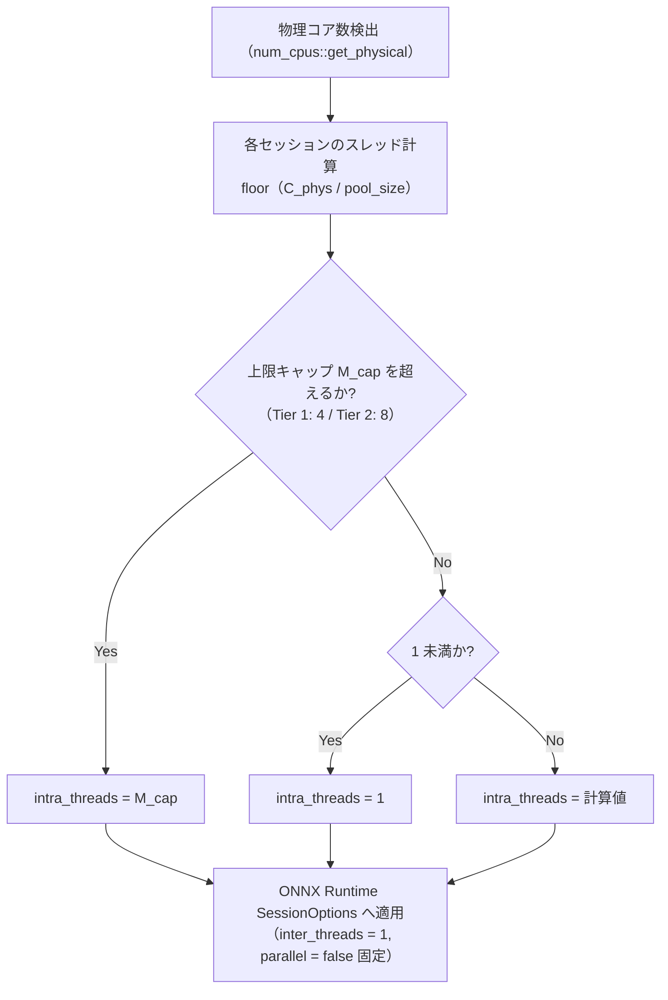
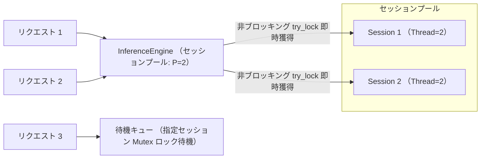

# パフォーマンス最適化 & リソースチューニング

本ドキュメントでは、
`sokuto` を CPU 環境で最大限の推論スループットと極小レイテンシで稼働させ、
同時にメモリ常駐 1GB 未満の制約を厳密に維持するためのチューニング手法を解説します。

---

## 1. CPU コア & スレッド自動最適化

`sokuto` の推論コア (`sokuto-runtime`) は、
ONNX Runtime のスレッドモデルと協調し、OS のコンテキストスイッチやキャッシュスラッシングを最小化するよう設計されています。

### 1.1 `auto_intra_threads` の数理と自動検出ロジック

ONNX Runtime には、演算子内部の並列化を担当する **Intra-op スレッド** と、独立した演算子間の並列化を担当する **Inter-op スレッド** が存在します。
`sokuto` では、単一シーケンス推論において演算子グラフの依存関係が線形（Transformer バックボーンの直列結合）であるため、
Inter-op 並列化を行っても無駄なスレッドプールとコンテキストスイッチのオーバーヘッドを生むだけでした。
そのため `inter_threads = 1` かつ `parallel_execution = false` (Sequential 実行) に固定し、
CPU リソースを Intra-op スレッドに集中させています。

物理コア数 $C_{\text{phys}}$ とセッションプール数 $P$ (`SOKUTO_POOL_SIZE`) が与えられたとき、
各セッションに割り当てられる Intra-op スレッド数 $T_{\text{intra}}$ は
以下の数理モデルで自動決定されます ([`crates/sokuto-runtime/src/engine/config.rs`](../../crates/sokuto-runtime/src/engine/config.rs))。

$$T_{\text{intra}} = \max\left(1, \min\left(M_{\text{cap}}, \left\lfloor \frac{C_{\text{phys}}}{P} \right\rfloor \right)\right)$$

ここで:

- $C_{\text{phys}}$: `num_cpus::get_physical()` により取得される物理コア数 (ハイパースレッディングによる論理コアではなく実コア)
- $P$: 同時実行可能な推論セッション数 (`SOKUTO_POOL_SIZE`、サーバー環境変数デフォルト: `2`、`SessionConfig` 単体デフォルト: `1`)
- $M_{\text{cap}}$: 単一セッションあたりのスレッド上限キャップ値 (Tier 1 推奨: `4`、Tier 2 / デフォルト: `8`)



#### 計算例

- **4 物理コア (8 論理コア)、`SOKUTO_POOL_SIZE = 2` の場合**:
  $T_{\text{intra}} = \lfloor 4 / 2 \rfloor = 2$ スレッド / セッション
  合計で 4 物理コアを均等に占有し、コア間競合を防止します。
- **8 物理コア (16 論理コア)、`SOKUTO_POOL_SIZE = 2` の場合**:
  $T_{\text{intra}} = \lfloor 8 / 2 \rfloor = 4$ スレッド / セッション
- **2 物理コア、`SOKUTO_POOL_SIZE = 4` の場合**:
  $T_{\text{intra}} = \max(1, \lfloor 2 / 4 \rfloor) = 1$ スレッド / セッション

---

## 2. セッションプール (`SOKUTO_POOL_SIZE`) の設計

ONNX Runtime の推論セッション (`Session`) は内部に実行時アロケータや中間バッファを保持するため、
スレッドセーフではありません。
`sokuto` では、推論エンジン内部でセッションをプール化 (`Vec<Mutex<Session>>`) して並行リクエストを安全に処理します。



### セッション獲得アルゴリズム

推論実行時 ([`crates/sokuto-runtime/src/engine/session.rs`](../../crates/sokuto-runtime/src/engine/session.rs)) では、
以下の 2 段階でセッションを獲得します:

1. **非ブロッキング空き探索 (`try_lock`)**:
   ラウンドロビン用カウンター `next_session_idx` を起点に、プール内のセッションを順次 `try_lock()` で走査し、ロックされていない空きセッションがあれば待機時間ゼロで即座に獲得します。
2. **ブロッキング待機へのフォールバック (`lock`)**:
   全セッションが推論中の場合は、起点のセッション Mutex をブロッキング待機し、先行リクエスト完了と同時に実行を開始します。

### プールサイズ選定のトレードオフ

- **プールサイズ大 (例: 4〜8)**:
  ピーク時の並行リクエスト処理能力 (QPS) が向上しますが、セッション数に比例して内部バッファのメモリ消費量が増加します。
- **プールサイズ小 (例: 1〜2)**:
  メモリ消費量を最小限に抑制でき、CPU キャッシュヒット率が最大化されます。低レイテンシ重視の用途に推奨されます。

---

## 3. メモリ常駐 1GB 未満運用の達成

`sokuto` で重視したシステム要件の一つが、**常駐メモリ (Resident Set Size: RSS) 1GB 未満での安定稼働** です。

### 3.1 モデルサイズとメモリ内訳

INT8 量子化 (Dynamic Quantization + Head FP32 保護) を適用したモデル成果物は、
ディスク容量およびメモリ展開サイズが大幅に削減されています。

| モデル Tier       | パラメータ数 | モデルファイルサイズ | 推論時ベース RSS (1 セッション) | プールサイズ 2 時の合計 RSS | コンテナ常駐上限要件                    |
| :---------------- | :----------- | :------------------- | :------------------------------ | :-------------------------- | :-------------------------------------- |
| **Tier 1**        | 130M         | 約 278 MB (278.4 MB) | 約 250 MB                       | **約 380 MB**               | < 350 MB (単体) / < 1 GB (コンテナ全体) |
| **Tier 2 (標準)** | 310M         | 約 538 MB (537.5 MB) | 約 420 MB                       | **約 620 MB**               | < 750 MB (単体) / < 1 GB (コンテナ全体) |

ONNX Runtime の CPU 実行プロバイダは、
重みテンソルを読み取り専用メモリマップ (`mmap`) または共有バッファとして保持するため、
セッションプールを増やしても重み全体が単純に多重複製されることはありません。
このため、Tier 2 モデルを `SOKUTO_POOL_SIZE = 2` で稼働させた場合でも、
定常 RSS は 600〜650MB 前後に留まり、1GB の上限を余裕をもって下回ります。

### 3.2 Docker におけるメモリ制限設定

コンテナ実行時にハードリミットを設定し、
予期せぬメモリリークや OOM Killer によるホスト全体の不安定化を防止します。

```bash
# Docker 実行時のメモリ上限設定 (1GB ハードリミット、スワップ無効化)
docker run -d \
  --name sokuto-production \
  --memory 1g \
  --memory-swap 1g \
  -p 3000:3000 \
  -e SOKUTO_POOL_SIZE=2 \
  -e SOKUTO_INTRA_THREADS=2 \
  -v $(pwd)/models/modernbert-310m-int8:/models/default:ro \
  sokuto:cpu
```

Kubernetes のマニフェストにおけるリソース定義例:

```yaml
resources:
  requests:
    cpu: '2000m'
    memory: '768Mi'
  limits:
    cpu: '4000m'
    memory: '1024Mi'
```

---

## 4. 環境別推奨設定マトリクス

運用環境の vCPU / メモリスペックに応じた推奨パラメータ一覧を以下に示します。

| サーバースペック  | 用途・ワークロード                   | `SOKUTO_POOL_SIZE` | `SOKUTO_INTRA_THREADS` | 推奨モデル Tier | 想定ピーク RSS |
| :---------------- | :----------------------------------- | :----------------- | :--------------------- | :-------------- | :------------- |
| **1 vCPU / 2 GB** | エッジデバイス、軽量マイクロサービス | `1`                | `1`                    | Tier 1 (130M)   | 約 300 MB      |
| **2 vCPU / 4 GB** | Sidecar 構成、低遅延優先 API         | `1`                | `2`                    | Tier 2 (310M)   | 約 450 MB      |
| **4 vCPU / 4 GB** | 標準的なスタンドアロン API (推奨)    | `2`                | `2`                    | Tier 2 (310M)   | 約 620 MB      |
| **8 vCPU / 8 GB** | 高スループットバッチ / 集約 API      | `4`                | `2`                    | Tier 2 (310M)   | 約 850 MB      |

---

## 5. モニタリングとトラブルシューティング

### 5.1 メモリ使用状況の確認

```bash
# コンテナのリアルタイムリソース消費量確認
docker stats --no-stream sokuto-production

# ホスト環境でのプロセス RSS 確認
ps -o pid,user,%cpu,%mem,rss,vsz,command -p $(pgrep sokuto)
```

### 5.2 CPU 使用率が 100% に張り付く場合

`SOKUTO_POOL_SIZE` に対して `SOKUTO_INTRA_THREADS` の積が物理コア数を大幅に超過している可能性があります。
`SOKUTO_INTRA_THREADS` を未設定 (自動検出) に戻すか、明示的にコア数に合わせて調整してください。

---

## 6. 関連ドキュメント

- [Docker コンテナ運用ガイド](./docker.md): マルチステージビルドと Multi-Arch 配布イメージ
- [エアギャップ完全閉域網運用ガイド](./airgap.md): 自己完結型パッケージの作成と外部遮断検証
- [CI/CD パイプライン & リリース自動化](./cicd.md): GitHub Actions による自動リリース
