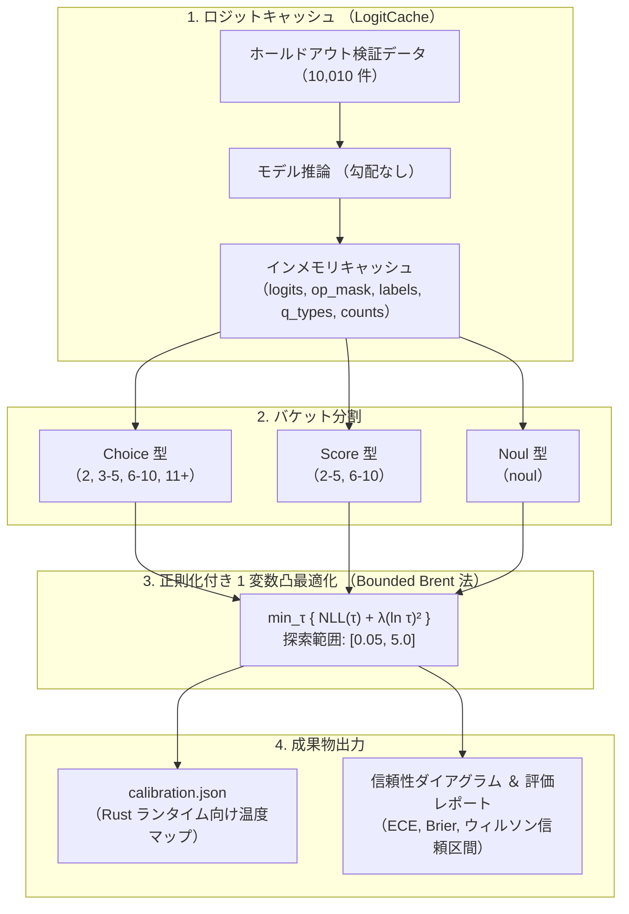

# 事後温度較正 (Calibration) ガイド

`sokuto` が出力する予測確率の信頼性を最大化するため、
ホールドアウト検証データを用いてタスク種別・候補数バケット別に最適温度係数 $\tau^*$ を探索し、
本番推論設定 `calibration.json` を生成する手順を解説します。

---

## 1. 事後温度較正の必要性と目的

モデルの学習(SFT / RLCD)が完了した時点でも、
候補数(2 択、5 択、77 択など)の相違や Softmax の幾何学的性質により、
候補数ごとに確率の歪み度合いが異なります。

事後温度較正では、
**予測順位(Top-1 の正解)を一切変化させることなく** 、
ロジットスケーリング $z_i \leftarrow z_i / \tau$ を適用することで、
期待較正誤差(Expected Calibration Error: ECE)を極小化します。



---

## 2. 候補数バケット分割仕様

候補数の多寡によってロジットの総和およびエントロピーのダイナミクスが異なるため、
以下のバケット定義([`train/calibration/config.py`](../../train/calibration/config.py))に従って独立に温度係数を同定します。
この定義は Rust ランタイム([`crates/sokuto-core/src/contract/calibration.rs`](../../crates/sokuto-core/src/contract/calibration.rs))の判定ロジックと完全に整合しています。

| タスク種別 | バケット名 | 適用条件                    | 最適温度係数 $\tau^*$ (実測値) | 較正状態・判定理由                                                  | 較正理由                            |
| :--------- | :--------- | :-------------------------- | :----------------------------: | :------------------------------------------------------------------ | :---------------------------------- |
| **Choice** | `"2"`      | 候補数 $K = 2$              |            `1.0000`            | ⚠️ サンプル不足 (サンプル数 0 のためデフォルト維持、規定値: 1.05)   | 二者択一における確信度微調整        |
| **Choice** | `"3-5"`    | 候補数 $3 \le K \le 5$      |            `1.0000`            | 🛡️ 精度ゲーティング (正解率 0.2333 $\le$ 閾値 0.2875、規定値: 1.12) | 常識推論・多肢選択の標準領域        |
| **Choice** | `"6-10"`   | 候補数 $6 \le K \le 10$     |            `1.0000`            | ⚠️ サンプル不足 (サンプル数 0 のためデフォルト維持、規定値: 1.20)   | 中規模カテゴリ分類                  |
| **Choice** | `"11+"`    | 候補数 $K \ge 11$           |            `1.0000`            | ⚠️ サンプル不足 (サンプル数 0 のためデフォルト維持、規定値: 1.35)   | Banking77 などの広基数分類          |
| **Score**  | `"2-5"`    | 評価段階数 $2 \le K \le 5$  |            `2.7804`            | ✅ 最適化完了 (事後 ECE: 0.4511 $\to$ 0.2041 へ改善)                | JSTS / 5 段階星評価の累積リンク較正 |
| **Score**  | `"6-10"`   | 評価段階数 $6 \le K \le 10$ |            `1.0000`            | ⚠️ サンプル不足 (サンプル数 0 のためデフォルト維持、規定値: 1.08)   | 詳細順序尺度評価                    |
| **Noul**   | `"noul"`   | 二値真偽判定 ($K = 2$)      |            `1.0000`            | 🛡️ 精度ゲーティング (正解率 0.1733 $\le$ 閾値 0.2875、規定値: 1.00) | 肯定的判断の過信解消                |

> [!NOTE]
> 実測値は、未学習・低精度シミュレーション検証に基づいています。
> サンプル不足時や未収束モデルに対しては安全弁が作動し、
> 初期基準値 $\tau = 1.0000$ (または事前定義値)へフォールバックします。

---

## 3. 正則化付き温度最適化 (Bounded Brent 法)

従来の温度スケーリングでは、負の対数尤度(NLL)のみを最小化するため、
サンプル数が少ないバケットやモデルが未収束の場合に
**温度 $\tau$ が探索上限(5.0)へ張り付き、予測が一様分布(ランダム予測)化する** という重大な失敗が発生していました(PR [#1](https://github.com/MI-1222/sokuto/pull/1), [#2](https://github.com/MI-1222/sokuto/pull/2) での課題)。

`sokuto` では、この問題を防ぐため**二重の安全弁**を導入しています([`train/calibration/optimizer.py`](../../train/calibration/optimizer.py))。

### 3.1 対数温度事前分布ペナルティ

基準温度 $\tau = 1.0$ からの過度な乖離を抑止するため、
幾何学的対称性を持つ対数空間での正則化項を導入した目的関数を採用しています。

$$\min_{\tau \in [0.05, 5.0]} \left\{ \text{NLL}(\tau) + \lambda (\ln \tau)^2 \right\}$$

ここで $\lambda = 0.2$ (デフォルト `reg_lambda`、[`train/calibration/config.py`](../../train/calibration/config.py)) とし、
Scipy の `minimize_scalar(method='bounded')`(Bounded Brent 法)を用いて高速・決定論的に最適解を同定します。

### 3.2 精度ゲーティング安全弁

モデルの予測能力が偶然確率(Chance Level)程度に留まっている状態で温度最適化を行うと、
NLL を下げるために不当に温度が高まり、出力が一様分布化します。

これを遮断するため、各サンプルの有効候補数 $K_i$ から算出される期待偶然確率
$\text{Chance Level} = \frac{1}{N} \sum_{i=1}^N \frac{1}{K_i}$
に対し、ゲーティング倍率(`accuracy_gating_factor = 1.15`)を乗じた閾値を設定しています。

$$\text{閾値} = \text{Chance Level} \times 1.15$$

検証正解率がこの閾値以下の場合は最適化処理を中断し、
ステータス `ACCURACY_GATED` として温度を強制的に $\tau = 1.0000$ に固定します。

---

## 4. `calibration.json` のスキーマ仕様

最適化されたパラメータは、
Python と Rust の契約仕様([`train/contract.py`](../../train/contract.py), [`crates/sokuto-core/src/contract/calibration.rs`](../../crates/sokuto-core/src/contract/calibration.rs))に従い、
以下の JSON フォーマットで保存されます。

```json
{
  "version": "1.0",
  "default_temperature": 1.0,
  "temperature_map": {
    "choice": {
      "2": 1.0,
      "3-5": 1.0,
      "6-10": 1.0,
      "11+": 1.0
    },
    "score": {
      "2-5": 2.7804,
      "6-10": 1.0
    },
    "noul": 1.0
  },
  "gating_thresholds": {
    "high_threshold": 0.7,
    "low_threshold": 0.35,
    "top_margin_threshold": 0.15,
    "ood_enabled": true,
    "energy_threshold": -1.0,
    "energy_temperature": null,
    "loose_energy_threshold": null,
    "ood_min_confidence": null,
    "ood_min_margin": null
  }
}
```

> [!IMPORTANT]
> Rust ランタイム側の型定義において、
> `temperature_map.noul` は辞書型ではなくスカラー浮動小数点数型 (`f64`) です。
> また、ゲーティング閾値フィールドは `"gating_thresholds"` としてシリアライズされます。

---

## 5. 較正の実行手順と評価

### 5.1 一括較正の実行

訓練済みチェックポイントを指定して較正を実行し、成果物を生成

```bash
cd train

# Tier 2 (310M) チェックポイントに対する一括較正の実行
uv run python -m calibration.eval_exit_criteria \
  --checkpoint-dir runs/rlcd_tier2/best_checkpoint \
  --batch-size 64
```

### 5.2 信頼性ダイアグラムの描画

生成された較正結果から、ウィルソン信頼区間付きの信頼性ダイアグラム画像を生成

```bash
cd train

# 較正メトリクスからプロットと判定レポートを生成
uv run python -m calibration.run_eval \
  --metrics runs/calibration/calibration_metrics.json \
  --output-dir runs/calibration/eval_report
```

出力先 `runs/calibration/eval_report/plots/` に、
各バケットの信頼性ダイアグラム画像(PNG)および Markdown 評価レポートが保存されます。

### 5.3 ユニットテストの実行

較正アルゴリズム(適応的 ECE、正則化による発散防止、ウィルソン信頼区間)の数理テスト

```bash
cd train

# 較正エンジンのユニットテスト実行
uv run pytest calibration/test_calibration_evaluation.py -v
uv run pytest calibration/test_calibration.py -v -k "ece or metrics or regularized"
```

本章で生成された `calibration.json` を用いて、
[ONNX エクスポート ＆ INT8 量子化ガイド (quantization.md)](quantization.md) で本番推論バンドルをビルドします。
