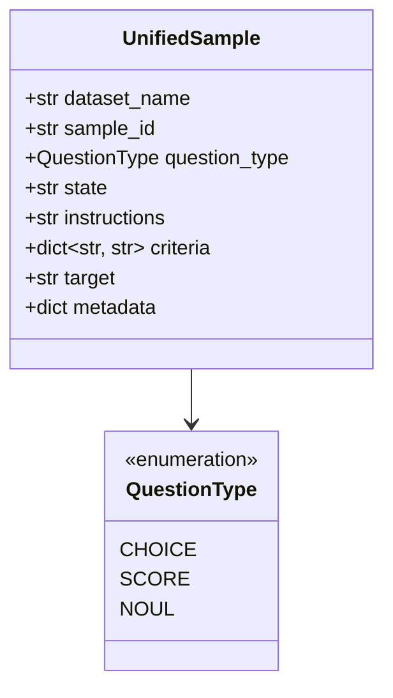
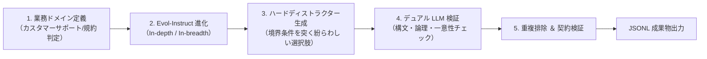

# データセット作成・変換ガイド

`sokuto` のマルチタスク学習(SFT / RLCD)で使用するデータセットの構造、JGLUE 変換パイプライン、Evol-Instruct 合成データ生成、位置バイアスを排除する動的シャッフル機構、および独自業務データの追加手順を解説します。

---

## 1. データ構造と統一スキーマ (`UnifiedSample`)

すべてのデータセットは、タスク種別を問わず単一の統一表現形式 `UnifiedSample` に正規化されます。



### フィールド定義

| フィールド      | 型               | 説明                                                                      | 例                                                       |
| :-------------- | :--------------- | :------------------------------------------------------------------------ | :------------------------------------------------------- |
| `dataset_name`  | `str`            | データセット識別子                                                        | `"jglue_marc_ja_choice"`, `"custom_triage"`              |
| `sample_id`     | `str`            | 一意なサンプル ID                                                         | `"marc_ja-train-00042"`                                  |
| `question_type` | `QuestionType`   | 決定プリミティブ種別 (`choice` / `score` / `noul`)                        | `QuestionType.CHOICE`                                    |
| `state`         | `str`            | 入力非構造化文脈テキスト(メール、ログ、レビュー等)                        | `"商品がまだ届きません。至急発送状況を教えてください。"` |
| `instructions`  | `str`            | モデルへのタスク指示文                                                    | `"顧客の問い合わせ種別を分類してください。"`             |
| `criteria`      | `dict[str, str]` | 候補 ID をキー、説明文を値とする辞書                                      | `{"shipping": "配送・追跡", "billing": "請求・決済"}`    |
| `target`        | `str`            | 正解ラベル(Choice/Score は criteria のキー、Noul は `'true'` / `'false'`) | `"shipping"`                                             |
| `metadata`      | `dict`           | 元データスプリットやドメイン分類タグ                                      | `{"domain": "ec_support"}`                               |

数理的プリミティブ(Choice / Score / Noul)の数理モデル詳細については、[アーキテクチャ: プリミティブ数理 (docs/architecture/primitives.md)](../architecture/primitives.md) を参照してください。

---

## 2. JGLUE および公開コーパス変換器

`train/data/converters/` には、JGLUE および代表的な分類・自然言語推論コーパスを `UnifiedSample` に変換するコンバータが実装されています。

| データセット名          | 対象元コーパス                                                                 | 決定型        | 変換仕様                                                            |
| :---------------------- | :----------------------------------------------------------------------------- | :------------ | :------------------------------------------------------------------ |
| `jglue_marc_ja`         | [JGLUE](https://huggingface.co/datasets/shunk031/JGLUE) MARC-ja (商品レビュー) | Noul          | 肯定的評価 (`true`) か否定的評価 (`false`) かの真偽判定             |
| `jglue_marc_ja_choice`  | JGLUE MARC-ja                                                                  | Choice        | 5 段階星評価を 2 候補選択肢(ポジティブ / ネガティブ)として定義      |
| `jglue_jnli`            | JGLUE JNLI (含意関係認識)                                                      | Choice        | 前提文と仮説文の関係を 3 択(含意 / 矛盾 / 中立)で判定               |
| `jglue_jnli_noul`       | JGLUE JNLI                                                                     | Noul          | 「含意関係が成立するか」の真偽二値判定                              |
| `jglue_jsts`            | JGLUE JSTS (文ペア意味的類似度)                                                | Score         | 2 文の意味的類似度(0.0〜5.0)を 6 段階(0〜5)の順序尺度スコアへ離散化 |
| `jglue_jcommonsenseqa`  | JGLUE JCommonsenseQA                                                           | Choice        | 常識推論質問に対する 5 択の選択肢から正解を選択                     |
| `banking77`             | [Banking77](https://huggingface.co/datasets/mteb/banking77) (金融問い合わせ)   | Choice        | 77 種類の銀行業務意図分類(最大候補数バケットのストレステスト)       |
| `clinc150`              | [CLINC150](https://huggingface.co/datasets/clinc/clinc_oos) (ドメイン意図分類) | Choice        | 10 ドメイン・150 意図の広基数分類                                   |
| `sst5`                  | [Stanford Sentiment Treebank](https://huggingface.co/datasets/SetFit/sst5)     | Score         | 5 段階感情極性評価(0: 非常に否定的 〜 4: 非常に肯定的)              |
| `mnli_choice` / `_noul` | [MultiNLI](https://huggingface.co/datasets/nyu-mll/glue)                       | Choice / Noul | 英語自然言語推論コーパス(3 択含意判定 / 2 値判定)                   |
| `ag_news`               | [AG News](https://huggingface.co/datasets/fancyzhx/ag_news)                    | Choice        | 4 カテゴリニュース分類トピック判定                                  |
| `synthetic_*`           | 独自のEvol-Instruct 合成データ                                                 | All / 各型    | 実務ドメイン(サポート・トリアージ・規約)の合成決定データ            |

---

## 3. Evol-Instruct 合成データ生成パイプライン

実務における境界条件(紛らわしいクレーム、複合問い合わせ、該当なし OOD など)を網羅するため、
LLM を用いた合成データ生成パイプラインが `train/data/synthetic/` に配備されています。



### 3.1 進化戦略 (In-depth / In-breadth)

- **In-depth 進化**: 単純な質問に制約条件(前提条件、例外規定、曖昧な感情表現)を追加し、推論の認知的負荷を高めます。
- **In-breadth 進化**: 同一の判定ロジックに対して、異なる業界ドメイン(SaaS、FinTech、EC、人事労務など)の文脈を水平展開します。
- **ハードディストラクター(Hard Distractors)生成**: 正解に極めて近いが微妙な条件不一致で除外されるべき「もっともらしい誤答選択肢」を動的に生成し、境界付近の判別力を鍛えます。

### 3.2 デュアル LLM 検証と品質フィルタ

生成されたサンプルは、
生成モデルとは異なるプロンプト／検証ロールを持つ Validator LLM により、以下の 4 項目が厳格に検査されます。

1. **一意性(Unambiguity)**: 正解候補がただ 1 つに定まり、他の候補が明確に棄却可能か。
2. **根拠十分性(Sufficient Grounding)**: `state` のテキスト情報のみから結論が論理的に導出できるか。
3. **契約整合性(Contract Validity)**: Choice / Score / Noul の制約(候補数 2〜255、Score の段階順序など)を満たしているか。
4. **意味的重複排除(Semantic Deduplication)**: 既存サンプルと高類似度(Jaccard / 埋め込みコサイン距離)のサンプルを自動破棄。

### 3.3 合成データの生成コマンド

現在はオフライン・決定論的モック(`--mock`)によるテスト・パイプライン検証、および事前生成されたデータ(`train/data/synthetic/output/`)の利用に対応しています。
(※ 外部 LLM API との非同期通信クライアントは現在インターフェースのみの定義となっており、ローカル検証および CI では `--mock` フラグを使用します。)

```bash
cd train

# モックモードによる高速検証 (API キー不要・全ゲート通過テスト)
uv run python -m data.synthetic.run_synthetic \
  --mock \
  --num-samples 30 \
  --output-dir runs/synthetic_test
```

---

## 4. 位置バイアス排除シャッフル & ネガティブ混入

言語モデルは、選択肢の提示順序(「常に先頭(A)を選びやすい」「最後を選びやすい」)に強い偏向(位置バイアス)を持ちます。
`sokuto` では学習データのフォーマット段階(`train/data/formatter.py`)で幾何学的保護を実施しています。

### 4.1 Criteria の動的シャッフル

バッチ生成時に、Choice 型サンプルの `criteria` の提示順序を擬似乱数で動的にシャッフルします。

- **Choice 型**: 選択肢順序を毎回ランダムに入れ替え、正解インデックスを追跡してラベルを再マッピング。
- **Score 型(シャッフル抑止)**: 順序尺度(1: 非常に低い 〜 5: 非常に高い)の幾何構造を破壊しないよう、シャッフルを厳格に無効化。
- **Noul 型(シャッフル抑止)**: 二値判定契約(True / False)の安定性を保つため、順序を固定。

> [!NOTE]
> **改善経緯 ([PR #3](https://github.com/MI-1222/sokuto/pull/3), [PR #5](https://github.com/MI-1222/sokuto/pull/5))**
> 当初、単純な SFT では選択肢シャッフル時の最大確率変動幅が **41.92%** に達していました。
> 動的シャッフル学習の導入(PR #3)により変動幅が **16.80%** へ半減し、
> さらに後述の置換同変アテンション(SAB)の導入(PR #5)により平均変動幅 **0.65%** を達成しました。

### 4.2 該当なし(None of the above)ネガティブ混入 (15%)

未定義の入力や、どの選択肢にも当てはまらない入力が本番環境で投入された際に、
モデルが無理にいずれかの候補を高確信度で選択する「過信」を防ぐため、
訓練データ(train split)の結合時に **15% の割合で合成ネガティブサンプル(`negative_ratio=0.15`)** を注入します(`train/data/negative_sampler.py`)。

- **対象型**: 順序構造・二値契約を保つため **Choice 型のみを対象**とし、Score 型および Noul 型は非対象(無変更)として保持されます。
- **In-Domain 正解欠落(70%)**: 既存の Choice 型サンプルから正解選択肢を取り除き、「上記のいずれにも該当しない (None of the above)」等の未定義カテゴリを正解として置換・注入します。
- **Cross-Domain OOS(30%)**: 異なるデータセットの無関係な State と Criteria を意図的に衝突させ、未対応カテゴリを正解とする負例(Out-of-Scope: OOS)を合成します。
- **スプリット保護**: 検証・テストデータの評価公平性を保つため、`train` スプリット結合時のみに注入され、`validation` / `test` スプリットには混入されません。

---

## 5. 自社独自ドメインデータ(カスタム JSONL)の追加手順

自社の業務ログや社内規約データを `sokuto` に学習させる手順は以下の通りです。

### ステップ 1: JSONL ファイルの準備

各行が `UnifiedSample` のフィールドを持つ JSONL ファイルを作成します。

> [!IMPORTANT]
> **Score 型の Criteria 制約**:
> Score 型(順序尺度)の `criteria` キーは、
> モデルの累積リンク(CORAL)および EMD 損失の順序空間幾何と整合させるため、
> **必ず 0 から始まる昇順連番(`"0"`, `"1"`, ...)** で定義する必要があります(段階数は 2〜10)。

```json
{"dataset_name": "corp_triage", "sample_id": "corp-001", "question_type": "choice", "state": "VPN 接続時にエラーコード 800 が表示され社内ネットワークに入れません。", "instructions": "障害の担当部署を選択してください。", "criteria": {"nw": "ネットワーク基盤グループ", "sec": "セキュリティ推進部", "app": "社内アプリ運用チーム"}, "target": "nw", "metadata": {"priority": "high"}}
{"dataset_name": "corp_triage", "sample_id": "corp-002", "question_type": "score", "state": "全拠点の基幹データベースへの接続がタイムアウトしています。", "instructions": "障害の影響度を 0〜4 の深刻度で評価してください。", "criteria": {"0": "影響なし", "1": "軽微", "2": "一部拠点", "3": "主要拠点", "4": "全社停止"}, "target": "4", "metadata": {"incident": true}}
{"dataset_name": "corp_triage", "sample_id": "corp-003", "question_type": "noul", "state": "パスワードのリセット方法を教えてください。", "instructions": "この問い合わせは緊急対応が必要ですか？", "criteria": {"true": "はい", "false": "いいえ"}, "target": "false", "metadata": {}}
```

ファイルを `train/data/custom/corp_triage.jsonl` に配置します。

### ステップ 2: コンバータの実装 (`BaseDatasetConverter` の継承)

`train/data/converters/custom_corp.py` を作成し、基底クラスを継承します。

```python
"""自社コーパス用コンバータモジュール。"""

import json
from pathlib import Path
from collections.abc import Iterator

from data.converters.base import BaseDatasetConverter
from data.schema import QuestionType, UnifiedSample


class CustomCorpConverter(BaseDatasetConverter):
    """自社コーパスの JSONL ファイルを UnifiedSample に変換するコンバータ。"""

    def __init__(self, jsonl_path: str = "train/data/custom/corp_triage.jsonl", seed: int = 42) -> None:
        super().__init__(seed=seed)
        self.jsonl_path = Path(jsonl_path)

    def convert_split(self, split: str) -> Iterator[UnifiedSample]:
        if not self.jsonl_path.exists():
            return
        with open(self.jsonl_path, "r", encoding="utf-8") as f:
            for line in f:
                data = json.loads(line)
                yield UnifiedSample(
                    dataset_name=data["dataset_name"],
                    sample_id=data["sample_id"],
                    question_type=QuestionType(data["question_type"]),
                    state=data["state"],
                    instructions=data["instructions"],
                    criteria=data["criteria"],
                    target=str(data["target"]),
                    metadata=data.get("metadata", {}),
                )
```

### ステップ 3: `UnifiedDatasetBuilder` への登録

`train/data/builders.py` の `__init__` メソッドに自作コンバータを登録するか、
`register_converter` メソッドを使用します。

```python
from data.converters.custom_corp import CustomCorpConverter

# 方法 A: train/data/builders.py の UnifiedDatasetBuilder.__init__ に追加
self.converters["corp_triage"] = CustomCorpConverter(seed=seed)

# 方法 B: ビルダーインスタンスに対して動的に登録
builder.register_converter("corp_triage", CustomCorpConverter(seed=42))
```

### ステップ 4: データセット変換と動作検証

以下のコマンドを実行して、登録した独自データが正しく読み込まれ、トークナイズ可能であることを検証します。

```bash
cd train

# コンバータの統合テストを実行
uv run pytest data/test_converters.py -v
```

登録完了後、次章 [SFT ガイド (sft.md)](sft.md) の `--dataset-names corp_triage` オプションを指定することで、
自社データを含むモデル学習を開始できます。
