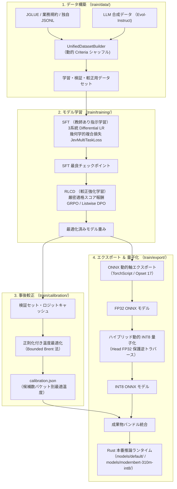

# sokuto モデル学習・量子化ガイド

`sokuto` の非自己回帰型判断エンジンを、
自社ドメインの独自タスクやプライベートコーパスへ適合させるための
学習・事後較正・ONNX エクスポート・動的 INT8 量子化パイプラインの完全再現手順を提供します。

---

## 1. パイプライン全体像

モデル学習・量子化パイプラインは、Python 学習環境(`train/`)で実行され、
最終的に Rust 推論ランタイム(`crates/sokuto-runtime`)が要求する成果物バンドル(`models/`)を出力します。



---

## 2. ディレクトリ構成 (`train/`)

学習基盤はプロジェクトルート直下の `train/` ディレクトリに集約されています。

```txt
train/
├── pyproject.toml              # Python 依存関係定義 (Python >= 3.13)
├── uv.lock                     # 再現性を担保する厳密なロックファイル
├── contract.py                 # Python ↔ Rust ランタイム成果物引き渡し契約
├── main.py                     # SFT 学習の統一エントリーポイント
├── data/                       # データローダー・変換器・合成パイプライン
│   ├── converters/             # JGLUE / OSS コーパス変換器
│   ├── synthetic/              # Evol-Instruct 合成データ生成パイプライン
│   ├── builders.py             # 統一データセットビルダー
│   ├── formatter.py            # [OP] マーカー挿入・動的シャッフル
│   └── schema.py               # データ型スキーマ定義 (Choice / Score / Noul)
├── models/                     # モデルアーキテクチャ定義
│   ├── backbone.py             # ModernBERT 日本語バックボーンローダー
│   └── decision_head.py        # SAB・CORAL・ASL 統合デシジョンヘッド
├── training/                   # 学習ループ・最適化エンジン
│   ├── config.py               # SFT ハイパーパラメータ設定
│   ├── loss.py                 # 幾何学的複合損失エンジン (JevMultiTaskLoss)
│   ├── trainer.py              # SFT トレーナー本体
│   ├── run_sft.py              # SFT 実行スクリプト
│   ├── scoring.py              # 厳密適格スコアリング規則エンジン
│   ├── rlcd_config.py          # RLCD / Listwise DPO 設定
│   ├── rlcd_trainer.py         # RLCD トレーナー本体
│   └── run_rlcd.py             # RLCD 実行スクリプト
├── calibration/                # 事後温度較正エンジン
│   ├── config.py               # 較正バケット定義・設定
│   ├── optimizer.py            # Bounded Brent 法による温度最適化
│   ├── evaluator.py            # ECE・Brier・信頼性ダイアグラム評価
│   └── run_eval.py             # 較正評価・レポート生成 CLI
└── export/                     # ONNX 出力・量子化
    ├── exporter.py             # ONNX 動的軸エクスポート
    ├── quantize.py             # Head FP32 保護ハイブリッド動的 INT8 量子化
    ├── validator.py            # PyTorch ↔ ONNX パリティ検証
    ├── bundle.py               # Rust 配布バンドルパッケージャ
    └── run_export.py           # エクスポート・量子化一括実行 CLI
```

---

## 3. 環境構築手順 (`uv`)

本プロジェクトでは、高速かつ決定論的な環境再現のために [`uv`](https://docs.astral.sh/uv/) を採用しています。
Python 3.13 以上の環境を自動的に管理します。

### 仮想環境の初期化と依存パッケージの同期

リポジトリ直下の `train/` ディレクトリに移動し、`uv sync` を実行します。

```bash
cd train

# 仮想環境の作成と依存関係のインストール
uv sync
```

仮想環境内の健全性を確認するため、ユニットテストを実行します。

```bash
# 基本ユニットテストの実行
uv run pytest -v -m "not slow"
```

すべてのテストが `PASSED` となれば、学習基盤の準備は完了です。

---

## 4. モデル Tier 構成と選択基準

`sokuto` では、
要求レイテンシとタスクの複雑性に応じて 2 つのモデル Tier を提供しています。
本ドキュメントでは本番標準である **Tier 2 (310M)** を主軸に解説します。

| 項目                   | Tier 2 (本番標準)                              | Tier 1 (超低遅延)                                        | 備考                                  |
| :--------------------- | :--------------------------------------------- | :------------------------------------------------------- | :------------------------------------ |
| **バックボーン**       | `sbintuitions/modernbert-ja-310m`              | `sbintuitions/modernbert-ja-130m`                        | 形態素解析器不要の BPE トークナイザー |
| **パラメータ数**       | 約 310M                                        | 約 130M                                                  | デシジョンヘッド含む                  |
| **INT8 モデル容量**    | **552.7 MB** (55.6% 削減)                      | **278.4 MB** (44.9% 削減)                                | (FP32 比)                             |
| **CPU 推論遅延 (p50)** | **23.28 ms**                                   | **12.61 ms**                                             | Single Choice (K=3)                   |
| **学習推奨 VRAM**      | 16 GB 以上 (Batch=8, GradAcc=2)                | 8 GB 以上 (Batch=16, GradAcc=1)                          | mixed_precision: `bf16`               |
| **主な用途**           | 複雑な業務規約判断、長文トリアージ、高精度分類 | 高スループット API、超低遅延エッジ、軽量マイクロサービス |

> [!TIP]
> **Tier の切り替え方法**
>
> SFT 学習 (`training.run_sft` / `main.py`) では、`--model-name-or-path` 引数により Tier を切り替えます。
>
> - Tier 2 (標準): `--model-name-or-path sbintuitions/modernbert-ja-310m`
> - Tier 1 (軽量): `--model-name-or-path sbintuitions/modernbert-ja-130m`
>
> 後続の RLCD 学習 (`training.run_rlcd`) では、
> `--checkpoint-dir` で該当 Tier のチェックポイントを引き継ぎます。
> ONNX エクスポート (`export.run_export`) では、
> チェックポイント同梱の `config.json` からバックボーンが自動判定されます (明示指定時は `--backbone` 引数を使用)。

---

## 5. ドキュメント一覧

学習・量子化ガイドは以下の 5 つのステップで構成されています。

1. **[データセット作成ガイド (datasets.md)](datasets.md)**:
   JGLUE 変換パイプライン、Evol-Instruct 合成データ生成、ネガティブサンプリング、動的シャッフル、および自社独自データの追加手順。
2. **[多重タスク SFT ガイド (sft.md)](sft.md)**:
   3 系統 Differential LR、幾何学的複合損失エンジン(EMD / LS-CE / BCE / CORAL / RPS / ASL)の実装、および SFT 学習実行手順。
3. **[RLCD / Listwise DPO ガイド (rlcd.md)](rlcd.md)**:
   厳密適格スコアリング規則(Log / Spherical / Brier / RPS)に基づく確率較正強化学習と選好アライメント手順。
4. **[事後温度較正ガイド (calibration.md)](calibration.md)**:
   候補数バケット別 Bounded Brent 法による温度最適化と `calibration.json` 生成、信頼性ダイアグラム評価。
5. **[ONNX エクスポート ＆ INT8 量子化ガイド (quantization.md)](quantization.md)**:
   動的軸 ONNX エクスポート、Head FP32 保護ハイブリッド動的 INT8 量子化、パリティ検証、および Rust 向けバンドル生成。
