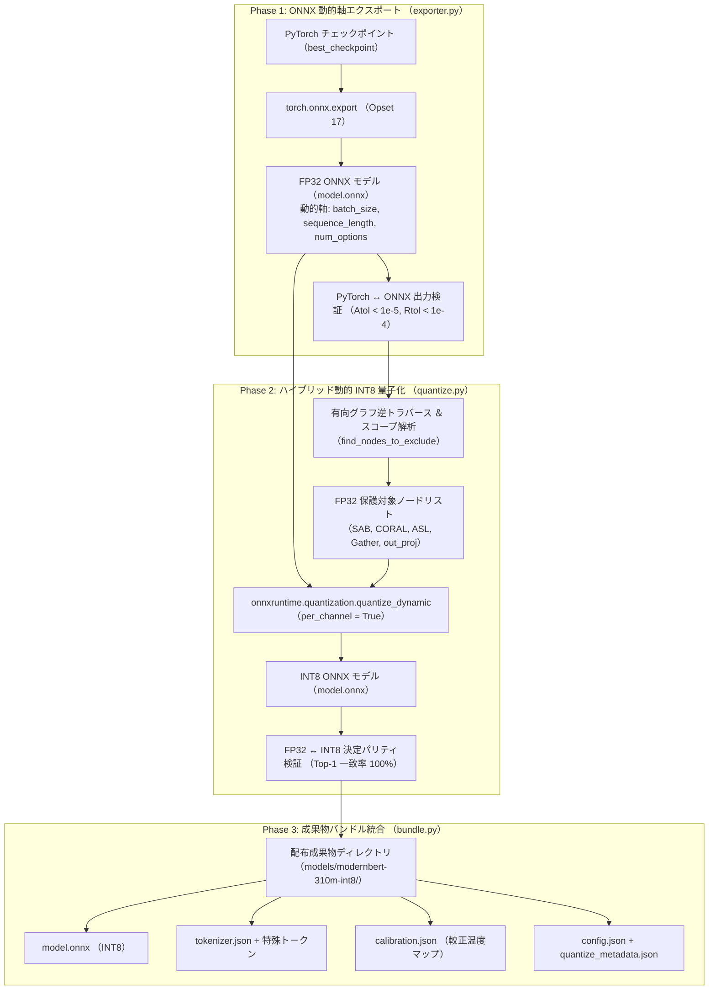

# ONNX エクスポート ＆ INT8 量子化ガイド

学習・較正が完了した PyTorch チェックポイントから、
動的軸対応の ONNX グラフをエクスポートし、デシジョンヘッドを FP32 で保護するハイブリッド動的 INT8 量子化(Post-Training Quantization: PTQ)を適用して、
Rust 推論ランタイム向けの成果物バンドルをビルドする手順を解説します。

---

## 1. パイプライン概要

Rust 本番推論ランタイム(`crates/sokuto-runtime`)でのゼロアロケーション・ミリ秒推論を実現するため、
モデル変換パイプラインは 3 つのフェーズで実行されます。



---

## 2. ONNX 動的軸定義

推論リクエストごとに可変長となるバッチサイズ、文章トークン数、および選択肢候補数を単一のモデルグラフで受け付けるため、
以下の動的軸(Dynamic Axes)を定義してエクスポートします(`train/export/exporter.py`)。

| テンソル名          | 形状 (Shape)                | 動的軸定義 (Dynamic Axes)           | 役割                               |
| :------------------ | :-------------------------- | :---------------------------------- | :--------------------------------- |
| `input_ids`         | `[batch_size, seq_len]`     | `0: batch_size, 1: sequence_length` | 入力トークン ID 列                 |
| `attention_mask`    | `[batch_size, seq_len]`     | `0: batch_size, 1: sequence_length` | 有効トークンマスク                 |
| `op_indices`        | `[batch_size, num_options]` | `0: batch_size, 1: num_options`     | 各候補の `[OP]` トークン出現位置   |
| **`logits`** (出力) | `[batch_size, num_options]` | `0: batch_size, 1: num_options`     | 各候補に対する未正規化出力ロジット |

エクスポート時には Opset 17 を指定し、Advanced Indexing 演算(`Gather`)の展開整合性を担保します。

---

## 3. Head FP32 保護ハイブリッド動的 INT8 量子化

### 3.1 全層 INT8 量子化の弊害と解決策

一般的な全層 INT8 量子化を適用した場合、
バックボーンの言語表現だけでなく、
最終層のデシジョンヘッドや `[OP]` マーカー抽出層(`OptionGatherLayer`)まで整数化されます。

これによりロジットの微細なスケール差が丸め誤差で潰れ、
**事後較正温度 $\tau^\ast$ が機能不全に陥る問題**や、
境界サンプルの逆転が発生します([PR #6](https://github.com/MI-1222/sokuto/pull/6) での課題)。

`sokuto` では、
計算負荷の 95% 以上を占める Transformer エンコーダ層の行列積(Linear / MatMul)のみを INT8 化し、
デシジョンヘッドを高精度 FP32 のまま保護する **Selective Quantization** を採用しています。

### 3.2 保護対象ノードの自動同定ロジック (`find_nodes_to_exclude`)

`train/export/quantize.py` に実装されている保護ノード同定アルゴリズムは、以下の 3 段階で安全に対象を抽出します。

```python
def find_nodes_to_exclude(model_proto: onnx.ModelProto) -> list[str]:
    excluded_names: set[str] = set()

    # 1. テンソル -> 生成元ノードの逆引きマップを構築
    producer_map: dict[str, onnx.NodeProto] = {}
    for node in model_proto.graph.node:
        for out_name in node.output:
            producer_map[out_name] = node

    # 2. 出力テンソル logits からの上流依存ノード探索 (逆トラバース)
    visited_tensors: set[str] = set()
    queue: list[str] = []

    for out in model_proto.graph.output:
        if out.name == TENSOR_LOGITS:
            queue.append(out.name)
            visited_tensors.add(out.name)

    while queue:
        tensor_name = queue.pop(0)
        producer_node = producer_map.get(tensor_name)
        if producer_node is None:
            continue

        # バックボーン境界に到達した場合はそれ以上遡らない
        if is_backbone_node(producer_node.name):
            continue

        if producer_node.name not in excluded_names:
            excluded_names.add(producer_node.name)
            for inp_name in producer_node.input:
                if inp_name not in visited_tensors:
                    visited_tensors.add(inp_name)
                    queue.append(inp_name)

    # 3. スコープ名パターンマッチングおよび Gather 演算子の保護
    head_keywords = [
        "head",
        "gather",
        "decision",
        "choice",
        "score",
        "noul",
        "sab",
        "coral",
        "feature_proj",
        "out_proj",
    ]

    for node in model_proto.graph.node:
        node_name = node.name
        # バックボーン内部ノードは除外しない
        if is_backbone_node(node_name):
            continue

        lower_name = node_name.lower()
        if any(kw in lower_name for kw in head_keywords):
            excluded_names.add(node_name)

        if "Gather" in node.op_type:
            excluded_names.add(node_name)

        if any(out == TENSOR_LOGITS for out in node.output):
            excluded_names.add(node_name)

    return sorted(excluded_names)
```

1. **有向グラフ逆トラバース**: 最終出力 `logits` から入力方向へ依存ノードを遡り、ヘッドを構成するすべての演算ノードを同定。バックボーン境界に達した時点で探索を打ち切ります。
2. **スコープ名フォールバック**: `head`, `sab`, `coral`, `gather`, `feature_proj`, `out_proj` などのキーワードを含むノードを確実に除外リストへ追加。
3. **バックボーン保護境界 (`is_backbone_node`)**: `backbone`, `model.encoder`, `bert` などの層は除外対象から厳格に保護し、確実に INT8 量子化を適用。

---

## 4. パリティ検証と実測削減効果

### 4.1 実機検証実績

| モデル            | FP32 容量                      | INT8 容量                      | 容量削減率     | Top-1 一致率 | 平均絶対誤差 (MAE) | コサイン類似度 |
| :---------------- | :----------------------------- | :----------------------------- | :------------- | :----------- | :----------------- | :------------- |
| **Tier 2 (310M)** | **1,270 MB** (1,270,052,804 B) | **537.5 MB** (563,632,511 B)\* | **55.6% 削減** | **100.0%**   | **0.0711**         | **0.9991**     |
| **Tier 1 (130M)** | **505.7 MB** (530,308,141 B)   | **278.4 MB** (291,956,556 B)   | **44.9% 削減** | **100.0%**   | **0.2019**         | **0.9993**     |

> \* 注: Tier 2 (310M) の INT8 実測ファイル容量は
> 563,632,511 バイト(2進換算 537.5 MiB、ディスク使用量/PR #6 ログ表記 552.7 MB)です。

量子化パリティ評価の完全な比較表および検証プロトコルについては、
[ベンチマーク: 量子化パリティ評価 (docs/benchmarks/quantization-parity.md)](../benchmarks/quantization-parity.md) を参照してください。

---

## 5. エクスポート ＆ 量子化の実行手順

### 5.1 ステップ 1: FP32 ONNX エクスポート

`export.run_export` を実行し、訓練済みチェックポイントと較正設定を ONNX 形式にエクスポートします。

```bash
cd train

# Tier 2 (310M) の FP32 エクスポート (config.json に未記載の場合は --backbone を明示)
uv run python -m export.run_export \
  --checkpoint runs/rlcd_tier2/best_checkpoint \
  --backbone sbintuitions/modernbert-ja-310m \
  --calibration runs/calibration/calibration.json \
  --output-dir ../models/modernbert-310m-fp32

# (参考) Tier 1 (130M) の FP32 エクスポート
uv run python -m export.run_export \
  --checkpoint runs/rlcd_tier1/best_checkpoint \
  --calibration runs/calibration/calibration.json \
  --output-dir ../models/default
```

### 5.2 ステップ 2: ハイブリッド動的 INT8 量子化

エクスポートされた FP32 バンドルに対して `export.quantize` を実行し、
INT8 量子化モデルとパリティ検証メタデータを生成します。

```bash
cd train

# Tier 2 (310M) ハイブリッド動的 INT8 量子化の実行
uv run python -m export.quantize \
  --model-dir ../models/modernbert-310m-fp32 \
  --output-dir ../models/modernbert-310m-int8 \
  --per-channel \
  --verify

# (参考) Tier 1 (130M) ハイブリッド動的 INT8 量子化の実行
uv run python -m export.quantize \
  --model-dir ../models/default \
  --output-dir ../models/quantized \
  --per-channel \
  --verify
```

### 5.3 ステップ 3: 量子化ユニットテストの実行

ヘッド保護ノード同定ロジック、動的軸の許容性、およびバンドル整合性をテストスイートで検証します。

```bash
cd train

# 量子化パイプラインの包括ユニットテスト (4 件すべて PASSED を確認)
uv run pytest test_quantize.py -v
```

生成された `models/modernbert-310m-int8/` ディレクトリは、
そのまま Rust 推論サーバー(`sokuto-server`)または Docker コンテナのマウント先として即座に本番運用可能です。
