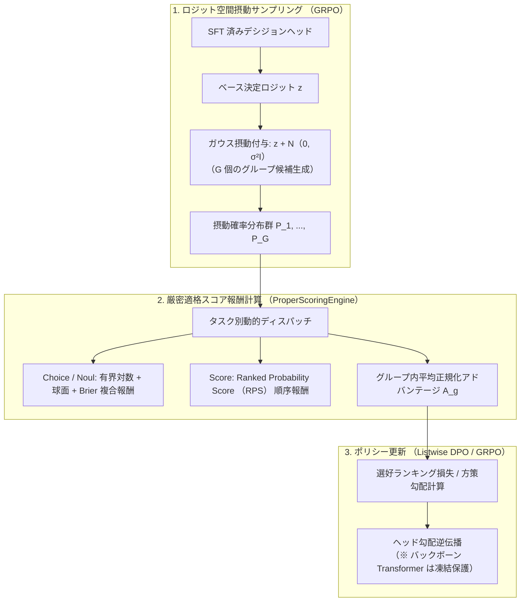

# 厳密適格スコアに基づく RLCD (較正強化学習) ガイド

SFT 後のチェックポイントに対し、
厳密適格スコアリング規則(Strictly Proper Scoring Rules)を報酬関数とした強化学習
(RLCD: Reinforcement Learning from Calibrated Decisions / Listwise DPO)
を適用し、出力確率の過信を解消して確率較正誤差(ECE)を最小化する手順を解説します。

---

## 1. RLCD の目的と設計思想

クロスエントロピー損失を用いた SFT のみでは、
モデルは予測精度(Accuracy)を最大化する一方で、
自らの予測確率を過度に 1.0(確信)に近づける**過信(Overconfidence)傾向**を示します。

本番運用において「確信度 80% と出力された判断は、実際に 80% の確率で正解である」という確率的信頼性を保証するため、
**「正直に真の事後確率を出力したときにのみ期待報酬が最大化される」数理的性質(厳密適格性)** を持つスコアリング規則を報酬としてポリシーをファインチューニングします。



---

## 2. 厳密適格スコアリング規則 (Strictly Proper Scoring Rules)

`train/training/scoring.py` に実装されている 4 種類の適格スコアリング関数を解説します。
各スコアリング関数の理論的証明については、
[アーキテクチャ: プリミティブ数理 (docs/architecture/primitives.md)](../architecture/primitives.md) を参照してください。

### 2.1 有界対数スコア ($S_{\log}$ / $\tilde{S}_{\log}$)

正解候補 $y$ に対する予測確率 $p_y$ の対数を取り、
下限値(デフォルト: $-10.0$)でクランプして勾配爆発を防ぎます。

$$S_{\log}(p, y) = \max(\ln(p_y), -10.0)$$

$$\tilde{S}_{\log} = 1.0 - \frac{S_{\log}}{-10.0} \in [0, 1]$$

### 2.2 球面スコア ($S_{\text{sph}}$)

確率ベクトルの $L_2$ ノルムで正規化されたスコアであり、大域的な有界性と滑らかな勾配を提供します。

$$S_{\text{sph}}(p, y) = \frac{p_y}{\sqrt{\sum_{k=1}^K p_k^2}} \in [0, 1]$$

### 2.3 Brier スコア ($S_{\text{brier}}$)

予測確率ベクトルと正解ワンホットベクトルの二乗ユークリッド距離に基づくスコアです。

$$S_{\text{brier}}(p, y) = 1.0 - \frac{1}{2} \sum_{k=1}^K (p_k - \mathbb{I}(k = y))^2 \in [0, 1]$$

### 2.4 順位確率スコア ($S_{\text{rps}}$: Score 型専用)

順序尺度における累積分布関数(CDF)の差分二乗和であり、
正解からの離れ度合いに応じた連続的ペナルティを課します。

$$S_{\text{rps}}(p, y) = 1.0 - \frac{1}{K-1} \sum_{m=1}^{K-1} \left( \sum_{k=1}^m p_k - \mathbb{I}(y \le m) \right)^2 \in [0, 1]$$

---

## 3. 最適化方式: GRPO と Listwise DPO

`train/training/rlcd_trainer.py` では 2 種類の最適化方式をサポートしています。

1. **GRPO (Group Relative Policy Optimization)**:
   単一の入力サンプルに対し、ロジット空間でガウス摂動 $\mathcal{N}(0, \sigma^2)$(デフォルト $\sigma=0.10$)を加えた $G$ 個の摂動出力候補を生成。グループ内の平均報酬 $\bar{R}$ と標準偏差 $\sigma_R$ で正規化した相対アドバンテージ $A_g = \frac{R_g - \bar{R}}{\sigma_R}$ を用いて方策勾配更新を行います。
2. **Listwise DPO (Plackett-Luce Ranking Loss)**:
   生成された摂動候補群を適格スコア順にランク付けし、選好確率(Plackett-Luce モデル)に対するクロスエントロピー損失を直接最小化します。

### バックボーン凍結制御

言語バックボーン(ModernBERT)の事前学習重みを破壊しないよう、
RLCD 工程では `--freeze-backbone`(デフォルト: 有効)によりバックボーンの勾配計算を停止し、
デシジョンヘッド(SAB, CORAL, 射影層)のみを最適化します。

---

## 4. 過去の改善実績 (PR #5)

RLCD パイプラインの導入([PR #5](https://github.com/MI-1222/sokuto/pull/5))により、
以下の精度・較正・位置バイアス向上が実証されました。

| 評価指標                   | SFT 完了時点 ([PR #3](https://github.com/MI-1222/sokuto/pull/3)) | RLCD 完了時点 ([PR #5](https://github.com/MI-1222/sokuto/pull/5)) | 改善効果                                      |
| :------------------------- | :--------------------------------------------------------------- | :---------------------------------------------------------------- | :-------------------------------------------- |
| **事後 ECE**               | 約 12.5%                                                         | **6.29%**                                                         | 過信が大幅に解消され、8% 以下の目標をクリア   |
| **Brier Score**            | 0.162 (0.1601)                                                   | **0.146 (0.1442)**                                                | +9.95% の較正性向上                           |
| **位置バイアス平均変動幅** | 0.68% (最大 16.80%)                                              | **0.65% (最大 27.17%)**                                           | 目標($\le 1.0\%$)を達成、適合率 92.5% → 96.4% |
| **Choice 決定精度**        | 87.84%                                                           | **87.84%**                                                        | 精度を犠牲にすることなく較正度を向上          |

---

## 5. RLCD 学習の実行手順

### 5.1 コマンドライン実行

SFT で出力された最良チェックポイントを指定し、`training.run_rlcd` を実行します。

```bash
cd train

# Tier 2 (310M) RLCD (GRPO モード) の実行
uv run python -m training.run_rlcd \
  --checkpoint-dir runs/sft_tier2/best_checkpoint \
  --output-dir runs/rlcd_tier2 \
  --optimization-mode grpo \
  --epochs 2 \
  --batch-size 8 \
  --gradient-accumulation-steps 2 \
  --learning-rate 5.0e-5

# (参考) Listwise DPO モードでの実行
uv run python -m training.run_rlcd \
  --checkpoint-dir runs/sft_tier2/best_checkpoint \
  --output-dir runs/rlcd_tier2_dpo \
  --optimization-mode listwise_dpo \
  --epochs 2 \
  --batch-size 8
```

### 5.2 ユニットテストによる数理検証

適格スコアリング規則、RLCD 方策勾配、および損失逆伝播の健全性をテストスイートで確認できます。

```bash
cd train

# 厳密適格スコア関数のユニットテスト (13 テストすべて PASSED を確認)
uv run pytest training/test_scoring.py -v

# RLCD パイプライン・損失関数のユニットテスト (15 テストすべて PASSED を確認)
uv run pytest training/test_rlcd.py -v
```

RLCD 完了後、
得られた最適化重みを用いて次章 [事後温度較正ガイド (calibration.md)](calibration.md) に進みます。
