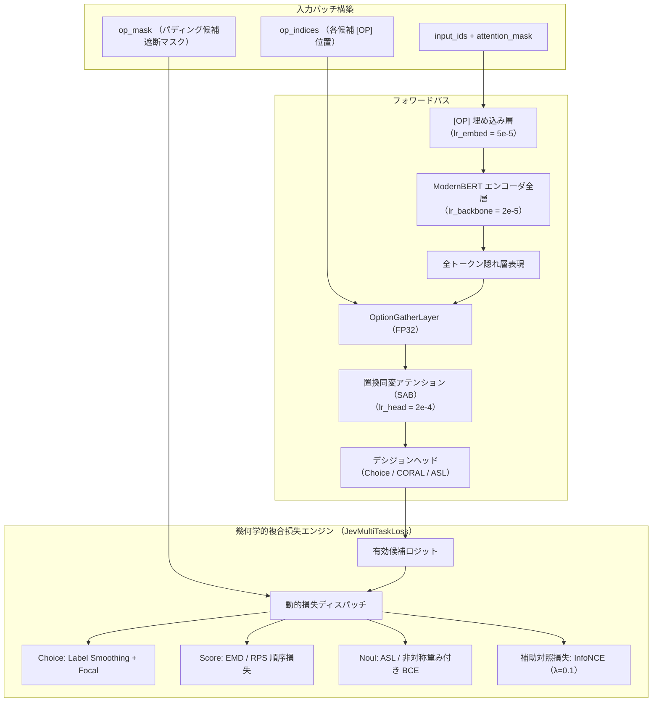

# 多重タスク SFT (教師あり指示学習) ガイド

`sokuto` のデシジョンヘッドおよび ModernBERT バックボーンを、Choice(選択)、Score(順序評価)、Noul(真偽判定)
の 3 大プリミティブに適合させる教師あり指示学習(Supervised Fine-Tuning: SFT)の手順と設計仕様を解説します。

---

## 1. SFT パイプラインの概要

SFT の目的は、事前学習済み双方向エンコーダに対し、
動的オプションマーカー `[OP]` の表現学習と、
提示順序に惑わされない安定した確率決定境界を形成することです。



---

## 2. 3 系統 Differential LR (層別学習率制御)

モデルの各層は初期状態と役割が大きく異なるため、
単一の学習率ではなく 3 系統の Differential Learning Rate を設定しています([`train/training/trainer.py`](../../train/training/trainer.py))。

| パラメータグループ | 推奨学習率 | 主な対象層                                     | 設計意図・過去の改善理由                                                                                          |
| :----------------- | :--------- | :--------------------------------------------- | :---------------------------------------------------------------------------------------------------------------- |
| **`lr_backbone`**  | `2.0e-5`   | ModernBERT Transformer エンコーダ全層          | 事前学習済みの豊かな日本語言語表現・文脈理解能力の破滅的忘却(Catastrophic Forgetting)を防止。                     |
| **`lr_embed`**     | `5.0e-5`   | `embeddings.word_embeddings`                   | 語彙に追加された特殊トークン `[OP]` のセントロイド初期化ベクトルを、既存語彙空間と調和させつつ素早く適合。        |
| **`lr_head`**      | `2.0e-4`   | `OptionGatherLayer`, `SAB`, `head`, `out_proj` | ランダム初期化されたデシジョンヘッド(SAB・CORAL・ASL)を迅速に収束させ、バックボーンへ適切な勾配をフィードバック。 |

また、バイアス項および正規化層(`LayerNorm.weight`, `norm.weight`)は重み減衰率 `weight_decay = 0.0` とし、
デシジョンヘッドの線形層には `head_weight_decay = 0.001`、
バックボーンには `weight_decay = 0.01` をグループ分離して適用します。

---

## 3. 幾何学的複合損失エンジン (`JevMultiTaskLoss`)

可変候補数に対応するバッチにおいて、
パディング領域への確率漏洩を遮断しつつ、各決定タスクの幾何学的空間特性に適合した複合損失を計算します([`train/training/loss.py`](../../train/training/loss.py))。

各プリミティブの理論的数理背景については、
[アーキテクチャ: プリミティブ数理 (docs/architecture/primitives.md)](../architecture/primitives.md) を参照してください。

### 3.1 Choice 型: Label Smoothing + Multi-class Focal Loss

選択肢の過信(Overconfidence)を抑制し、境界付近の難解サンプルの識別性を引き上げます。

- **ラベル平滑化 ($\epsilon = 0.05 \sim 0.10$)**: 正解ワンホットベクトル $y_k$ を $(1 - \epsilon)y_k + \frac{\epsilon}{K}$ へ緩和し、ロジットの無限大発散を抑制。
- **Focal Loss 変調係数 ($\gamma = 1.0 \sim 2.0$)**: 容易に識別可能なサンプルの損失寄与を $(1 - p_t)^\gamma$ で減衰させ、境界サンプルの勾配を強調。

### 3.2 Score 型: EMD (Earth Mover's Distance / Wasserstein-1) & RPS 順序損失

従来の多クラス Softmax / クロスエントロピーでは、
「正解 1 に対する誤答 2」と「正解 1 に対する誤答 5」が同一のペナルティとして扱われ、
順序関係が学習できませんでした([PR #3](https://github.com/MI-1222/sokuto/pull/3) での課題)。

`sokuto` では、
累積分布関数(CDF)の差分絶対値を積分する **Earth Mover's Distance(Wasserstein-1 距離)損失**、
および順位確率スコア **Ranked Probability Score (RPS) 損失**、
単調性保証バイアスを持つ **CORAL 順序回帰累積リンク** を採用しています。

$$\mathcal{L}_{\text{EMD}} = \sum_{k=1}^{K-1} |P(Y \le k) - \hat{P}(Y \le k)|$$

これにより、正解から離れた段階を予測するほど幾何学的に大きなペナルティが課され、
Score の MAE が大幅に改善します。

### 3.3 Noul 型: 非対称重み付き BCE & ASL (Asymmetric BCE / ASL)

真偽判定において、負例(偽・異常)の見逃しリスクと誤検知リスクが非対称である実務要件に応えるため、
正例重み係数 $\alpha_{\text{pos}}$ を含む二値クロスエントロピー(`AsymmetricBCELoss`)、
および負例に対する動的マージン減衰を備えた非対称損失(`AsymmetricLoss: ASL`)を適用します。

### 3.4 補助対照損失 (State-[OP] InfoNCE)

State の文脈埋め込み $h_{\text{state}}$ と、
正解の $[OP]$ 候補埋め込み $h_{[OP]}^*$ のコサイン類似度を直接高める補助対照損失($\lambda_c = 0.1$)を統合し、
エンコーダ中層における意味的アライメントを促進します。

---

## 4. 過去の課題と方針転換(PR #1 〜 PR #5)

`sokuto` の SFT 学習パイプラインは、以下の失敗と改善を経て現在の構造に到達しました。

1. **英語 ModernBERT による日本語破綻 (PR [#1](https://github.com/MI-1222/sokuto/pull/1), [#2](https://github.com/MI-1222/sokuto/pull/2))**:
   当初検証した英語 ModernBERT では、日本語が UTF-8 バイト単位で過剰分割(1 文字あたり 2〜3 トークン)され、系列長が肥大化。検証精度が 28.8% に低迷しました。形態素解析器不要で Rust ゼロアロケーション推論と親和性の高い `sbintuitions/modernbert-ja` へ全面換装して解決しました。
2. **位置バイアスと手戻りの回避 (PR [#3](https://github.com/MI-1222/sokuto/pull/3), [#5](https://github.com/MI-1222/sokuto/pull/5))**:
   初期の線形射影ヘッドでは、選択肢の提示順序によるバイアス(変動幅 41.9%)が残存していました。動的シャッフル学習に加え、位置埋め込みを持たない **Set Attention Block (SAB)** をヘッドに挿入することで、平均変動幅 0.65% へ抑制しました。

---

## 5. SFT 学習の実行手順

### 5.1 設定ファイル (`config.yaml`)

基本設定は [`train/training/config.py`](../../train/training/config.py) に定義されていますが、
パラメータを一括カスタマイズしたい場合は、
以下のような YAML ファイルを作成して `--config <設定ファイルパス>` で読み込ませることができます。

```yaml
# 本番標準 Tier 2 (310M) 設定例
model_name_or_path: 'sbintuitions/modernbert-ja-310m'
max_sequence_length: 8192
dataset_names:
  - 'jglue_marc_ja'
  - 'jglue_jnli'
  - 'jglue_jsts'
  - 'jglue_jcommonsenseqa'
  - 'synthetic_all'
negative_ratio: 0.15
max_samples_per_dataset: 20000
batch_size: 8
gradient_accumulation_steps: 2
learning_rate_backbone: 2.0e-5
learning_rate_embed: 5.0e-5
learning_rate_head: 2.0e-4
weight_decay: 0.01
num_epochs: 3
warmup_ratio: 0.1
mixed_precision: 'bf16'
eval_metric: 'composite_metric'
evaluate_position_bias: true
seed: 42
output_dir: 'train/runs/sft'
```

### 5.2 コマンドライン実行

`train/` ディレクトリに移動し、`main.py` または `training.run_sft` を実行します。

```bash
cd train

# Tier 2 (310M) 本番標準学習の実行
uv run python main.py \
  --model-name-or-path sbintuitions/modernbert-ja-310m \
  --dataset-names jglue_marc_ja jglue_jnli jglue_jsts jglue_jcommonsenseqa synthetic_all \
  --batch-size 8 \
  --gradient-accumulation-steps 2 \
  --num-epochs 3 \
  --mixed-precision bf16 \
  --output-dir runs/sft_tier2

# (参考) Tier 1 (130M) 軽量版での実行
uv run python main.py \
  --model-name-or-path sbintuitions/modernbert-ja-130m \
  --batch-size 16 \
  --gradient-accumulation-steps 1 \
  --num-epochs 3 \
  --output-dir runs/sft_tier1
```

### 5.3 検証メトリクスと最良モデルの選定

検証フェーズでは、各エポック終了時に Choice(50%)、Score(25%)、Noul(25%)の加重平均からなる複合メトリクス `composite_metric` を算出し、
最良チェックポイント(`best_checkpoint/`)を自動保存します([`train/training/metrics.py`](../../train/training/metrics.py))。

$$\text{composite\_metric} = 0.50 \times \text{Acc}_{\text{choice}} + 0.25 \times \max(0.0, 1.0 - \min(\text{MAE}_{\text{score}}, 1.0)) + 0.25 \times \text{Acc}_{\text{noul}}$$

※ なお、選択肢順序シャッフルに対する位置バイアス(変動幅 $\Delta p_{\max}$ や合格率 Pass Rate)は、`evaluate_position_bias: true` 設定時に独立して自動計測・追跡されます。

SFT 完了後、出力された最良チェックポイントを
次章 [RLCD ガイド (rlcd.md)](rlcd.md) の強化学習初期重みとして使用します。
